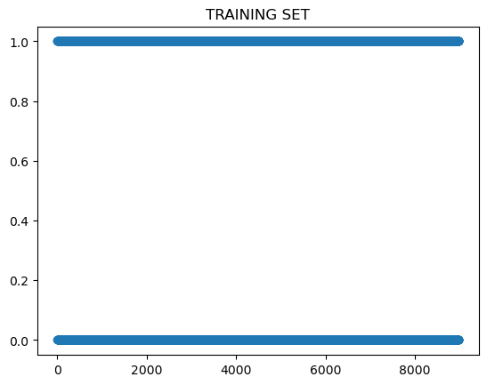
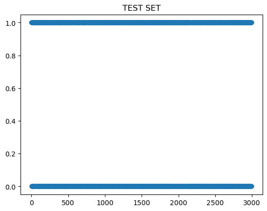

# # Classifiers comparison on texts with naive Bayes assumption

In this session of laboratory we compare two models for categorical data probabilistic modeling: 
1. multivariate Bernoulli 
2. multinomial on a dataset 

We adopt a dataset on Twitter messages labelled with emotions (Joy vs Sadness).

The following program shows the loading of the data from a file.

The following program reads the data file and loads in a sparse way the matrix using the scipy.sparse library


```python
import json

def getInitParams(): return {
    "n_features": 11288, # number of features (distinct elements in the documents)
    "n_rows": 11981, # number rows of the matrix
    "n_elements": 71474, # number of the existing values in the matrix (not empty, to be loaded in the matrix in a sparse way)7
    "path_dataset": "dataset/joy_sadness6000.txt",
}
params = getInitParams()
```


```python
# declare the row and col arrays with the indexes of the matrix cells (non empty) to be loaded from file
# they are needed because the matrix is sparse and we load in the matrix only the elements which are present
row = np.empty(params["n_elements"], dtype=int)
col = np.empty(params["n_elements"], dtype=int)
data = np.empty(params["n_elements"], dtype=int)

print(row)
print(col)
print(data)
```

    [ -410181616         277  -393609088 ...         277 -1133418224
             277]
    [-410181616        277 -393609088 ...      11986      11986      11986]
    [-410181616        277 -393609088 ...         42         43         44]
    


```python
row_n = 0 # number of current row to be read and managed
current_element = 0 # position in the three arrays: row, col and data
twitter_labels = [] # list of class labels (target array) of the documents (twitter) that will be read from the input file
twitter_target = [] # list of 0/1 for class labels
```

# Dataset: open joy_sadness6000 
contains the description of the content of a collection of 11981 messages from Twitter.
Each message belongs to a class (either Joy or Sadness) 
representing the sentiment that is supposed to be expressed by the words in that message.

First, in the file, we have the description of the messages of the first class (Joy) and then Sadness: 
classLabel can be either the string Joy or Sadness.

There are 5988 messages of Joy and 5994 of Sadness.

Each line of the file represents a single message.

The format of each line is a sequence of pairs <wordID, count> followed by the class label, separated by commas.
An example of a line is: 38,3,264,1,635,1,2780,1,Joy
- where 38 is the identifier of the first word occurring in that message,
- and 3 is the number of times (frequency count) in which that word is present in that message.
- <wordID, count>
- pairs <38,3>, <264,1>, <635,1>, <2780,1>, CLASS = JOY
- 38, 264, 635, 2780 are the identifiers of the words and 3, 1, 1, 1 are the respective frequencies in that message.


```python
from numpy import ndarray, zeros
import numpy as np
import scipy
from scipy.sparse import csr_matrix

with open(params["path_dataset"], "r") as dataset_file:
    for line in dataset_file:
        
        # LINE TO ARRAY
        element_list = line.split(',')  # e.g. [38,3,264,1,635,1,2780,1,Joy]
        length = len(element_list) # array length = 8
        
        # GET CLASS OF MESSAGE
        last_element = element_list[length-1] # GET CLASS: Joy or Sadness (LAST ELEMENT)
        class_name = last_element.strip() # clean CLASS value eliminate the '\n'
        
        # twitter_labels contains the labels (Joy/Sadness);
        twitter_labels.append(class_name) 
        # twitter_target contains 0/1 for the respective labels
        # 0 = Joy, 1 = Sadness
        if (class_name == "Joy"):
           twitter_target.append(0)
        else:
           twitter_target.append(1)
        
        # reading all the doc elements from the beginning of the list
        i=0 
        while(i < (length-1)):
            # identifier of the element in the document equivalent to the column index
            # e.g. 1,1,2,1,3,1,4,1,Joy
            element_id = int(element_list[i]) # ID = 1
            element_id = element_id - 1 # the index starts from 0 (the read id starts from 1)
            i = i + 1
            # frequecy: make access to the following value in the file which
            # is the count of the element in the document 
            value_cell = int(element_list[i])
            
            i = i + 1
            # load the data in the three arrays: 
            # the first two are the row and col indexes; 
            # the last one is the matrix cell value
            row[current_element] = row_n 
            col[current_element] = element_id
            data[current_element] = value_cell
            
            current_element = current_element + 1
        row_n = row_n+1
        
dataset_file.close

print(row_n)
print(row)
print(col)
print(data)
```

    11981
    [          0           0           0 ...         277 -1133418224
             277]
    [    0     1     2 ... 11986 11986 11986]
    [ 1  1  1 ... 42 43 44]
    


```python
# RESULTS
# loads the matrix by means of the indexes and the values in the three arrays just filled
twitter_data = csr_matrix((data, (row, col)), shape=(params["n_rows"], params["n_features"])).toarray()
print(twitter_data)
```

    [[1 1 1 ... 0 0 0]
     [0 0 0 ... 0 0 0]
     [0 0 0 ... 0 0 0]
     ...
     [0 0 0 ... 0 0 1]
     [0 0 0 ... 0 0 0]
     [0 1 0 ... 0 0 0]]
    


```python
# print twitter labels array
print(twitter_labels)
```

    ['Joy', 'Joy', 'Joy', 'Joy', 'Joy', 'Joy', 'Joy', 'Joy', 'Joy', 'Joy', 'Joy', 'Joy', 'Joy', 'Joy', 'Joy', 'Joy', 'Joy', 'Joy', 'Joy', 'Joy', 'Joy', 'Joy', 'Joy', 'Joy', 'Joy', 'Joy', 'Joy', 'Joy', 'Joy', 'Joy', 'Joy', 'Joy', 'Joy', 'Joy', 'Joy', 'Joy', 'Joy', 'Joy', 'Joy', 'Joy', 'Joy', 'Joy', 'Joy', 'Joy', 'Joy', 'Joy', 'Joy', 'Joy', 'Joy', 'Joy', 'Joy', 'Joy', 'Joy', 'Joy', 'Joy', 'Joy', 'Joy', 'Joy', 'Joy', 'Joy', 'Joy', 'Joy', 'Joy', 'Joy', 'Joy', 'Joy', 'Joy', 'Joy', 'Joy', 'Joy', 'Joy', 'Joy', 'Joy', 'Joy', 'Joy', 'Joy', 'Joy', 'Joy', 'Joy', 'Joy', 'Joy', 'Joy', 'Joy', 'Joy', 'Joy', 'Joy', 'Joy', 'Joy', 'Joy', 'Joy', 'Joy', 'Joy', 'Joy', 'Joy', 'Joy', 'Joy', 'Joy', 'Joy', 'Joy', 'Joy', 'Joy', 'Joy', 'Joy', 'Joy', 'Joy', 'Joy', 'Joy', 'Joy', 'Joy', 'Joy', 'Joy', 'Joy', 'Joy', 'Joy', 'Joy', 'Joy', 'Joy', 'Joy', 'Joy', 'Joy', 'Joy', 'Joy', 'Joy', 'Joy', 'Joy', 'Joy', 'Joy', 'Joy', 'Joy', 'Joy', 'Joy', 'Joy', 'Joy', 'Joy', 'Joy', 'Joy', 'Joy', 'Joy', 'Joy', 'Joy', 'Joy', 'Joy', 'Joy', 'Joy', 'Joy', 'Joy', 'Joy', 'Joy', 'Joy', 'Joy', 'Joy', 'Joy', 'Joy', 'Joy', 'Joy', 'Joy', 'Joy', 'Joy', 'Joy', 'Joy', 'Joy', 'Joy', 'Joy', 'Joy', 'Joy', 'Joy', 'Joy', 'Joy', 'Joy', 'Joy', 'Joy', 'Joy', 'Joy', 'Joy', 'Joy', 'Joy', 'Joy', 'Joy', 'Joy', 'Joy', 'Joy', 'Joy', 'Joy', 'Joy', 'Joy', 'Joy', 'Joy', 'Joy', 'Joy', 'Joy', 'Joy', 'Joy', 'Joy', 'Joy', 'Joy', 'Joy', 'Joy', 'Joy', 'Joy', 'Joy', 'Joy', 'Joy', 'Joy', 'Joy', 'Joy', 'Joy', 'Joy', 'Joy', 'Joy', 'Joy', 'Joy', 'Joy', 'Joy', 'Joy', 'Joy', 'Joy', 'Joy', 'Joy', 'Joy', 'Joy', 'Joy', 'Joy', 'Joy', 'Joy', 'Joy', 'Joy', 'Joy', 'Joy', 'Joy', 'Joy', 'Joy', 'Joy', 'Joy', 'Joy', 'Joy', 'Joy', 'Joy', 'Joy', 'Joy', 'Joy', 'Joy', 'Joy', 'Joy', 'Joy', 'Joy', 'Joy', 'Joy', 'Joy', 'Joy', 'Joy', 'Joy', 'Joy', 'Joy', 'Joy', 'Joy', 'Joy', 'Joy', 'Joy', 'Joy', 'Joy', 'Joy', 'Joy', 'Joy', 'Joy', 'Joy', 'Joy', 'Joy', 'Joy', 'Joy', 'Joy', 'Joy', 'Joy', 'Joy', 'Joy', 'Joy', 'Joy', 'Joy', 'Joy', 'Joy', 'Joy', 'Joy', 'Joy', 'Joy', 'Joy', 'Joy', 'Joy', 'Joy', 'Joy', 'Joy', 'Joy', 'Joy', 'Joy', 'Joy', 'Joy', 'Joy', 'Joy', 'Joy', 'Joy', 'Joy', 'Joy', 'Joy', 'Joy', 'Joy', 'Joy', 'Joy', 'Joy', 'Joy', 'Joy', 'Joy', 'Joy', 'Joy', 'Joy', 'Joy', 'Joy', 'Joy', 'Joy', 'Joy', 'Joy', 'Joy', 'Joy', 'Joy', 'Joy', 'Joy', 'Joy', 'Joy', 'Joy', 'Joy', 'Joy', 'Joy', 'Joy', 'Joy', 'Joy', 'Joy', 'Joy', 'Joy', 'Joy', 'Joy', 'Joy', 'Joy', 'Joy', 'Joy', 'Joy', 'Joy', 'Joy', 'Joy', 'Joy', 'Joy', 'Joy', 'Joy', 'Joy', 'Joy', 'Joy', 'Joy', 'Joy', 'Joy', 'Joy', 'Joy', 'Joy', 'Joy', 'Joy', 'Joy', 'Joy', 'Joy', 'Joy', 'Joy', 'Joy', 'Joy', 'Joy', 'Joy', 'Joy', 'Joy', 'Joy', 'Joy', 'Joy', 'Joy', 'Joy', 'Joy', 'Joy', 'Joy', 'Joy', 'Joy', 'Joy', 'Joy', 'Joy', 'Joy', 'Joy', 'Joy', 'Joy', 'Joy', 'Joy', 'Joy', 'Joy', 'Joy', 'Joy', 'Joy', 'Joy', 'Joy', 'Joy', 'Joy', 'Joy', 'Joy', 'Joy', 'Joy', 'Joy', 'Joy', 'Joy', 'Joy', 'Joy', 'Joy', 'Joy', 'Joy', 'Joy', 'Joy', 'Joy', 'Joy', 'Joy', 'Joy', 'Joy', 'Joy', 'Joy', 'Joy', 'Joy', 'Joy', 'Joy', 'Joy', 'Joy', 'Joy', 'Joy', 'Joy', 'Joy', 'Joy', 'Joy', 'Joy', 'Joy', 'Joy', 'Joy', 'Joy', 'Joy', 'Joy', 'Joy', 'Joy', 'Joy', 'Joy', 'Joy', 'Joy', 'Joy', 'Joy', 'Joy', 'Joy', 'Joy', 'Joy', 'Joy', 'Joy', 'Joy', 'Joy', 'Joy', 'Joy', 'Joy', 'Joy', 'Joy', 'Joy', 'Joy', 'Joy', 'Joy', 'Joy', 'Joy', 'Joy', 'Joy', 'Joy', 'Joy', 'Joy', 'Joy', 'Joy', 'Joy', 'Joy', 'Joy', 'Joy', 'Joy', 'Joy', 'Joy', 'Joy', 'Joy', 'Joy', 'Joy', 'Joy', 'Joy', 'Joy', 'Joy', 'Joy', 'Joy', 'Joy', 'Joy', 'Joy', 'Joy', 'Joy', 'Joy', 'Joy', 'Joy', 'Joy', 'Joy', 'Joy', 'Joy', 'Joy', 'Joy', 'Joy', 'Joy', 'Joy', 'Joy', 'Joy', 'Joy', 'Joy', 'Joy', 'Joy', 'Joy', 'Joy', 'Joy', 'Joy', 'Joy', 'Joy', 'Joy', 'Joy', 'Joy', 'Joy', 'Joy', 'Joy', 'Joy', 'Joy', 'Joy', 'Joy', 'Joy', 'Joy', 'Joy', 'Joy', 'Joy', 'Joy', 'Joy', 'Joy', 'Joy', 'Joy', 'Joy', 'Joy', 'Joy', 'Joy', 'Joy', 'Joy', 'Joy', 'Joy', 'Joy', 'Joy', 'Joy', 'Joy', 'Joy', 'Joy', 'Joy', 'Joy', 'Joy', 'Joy', 'Joy', 'Joy', 'Joy', 'Joy', 'Joy', 'Joy', 'Joy', 'Joy', 'Joy', 'Joy', 'Joy', 'Joy', 'Joy', 'Joy', 'Joy', 'Joy', 'Joy', 'Joy', 'Joy', 'Joy', 'Joy', 'Joy', 'Joy', 'Joy', 'Joy', 'Joy', 'Joy', 'Joy', 'Joy', 'Joy', 'Joy', 'Joy', 'Joy', 'Joy', 'Joy', 'Joy', 'Joy', 'Joy', 'Joy', 'Joy', 'Joy', 'Joy', 'Joy', 'Joy', 'Joy', 'Joy', 'Joy', 'Joy', 'Joy', 'Joy', 'Joy', 'Joy', 'Joy', 'Joy', 'Joy', 'Joy', 'Joy', 'Joy', 'Joy', 'Joy', 'Joy', 'Joy', 'Joy', 'Joy', 'Joy', 'Joy', 'Joy', 'Joy', 'Joy', 'Joy', 'Joy', 'Joy', 'Joy', 'Joy', 'Joy', 'Joy', 'Joy', 'Joy', 'Joy', 'Joy', 'Joy', 'Joy', 'Joy', 'Joy', 'Joy', 'Joy', 'Joy', 'Joy', 'Joy', 'Joy', 'Joy', 'Joy', 'Joy', 'Joy', 'Joy', 'Joy', 'Joy', 'Joy', 'Joy', 'Joy', 'Joy', 'Joy', 'Joy', 'Joy', 'Joy', 'Joy', 'Joy', 'Joy', 'Joy', 'Joy', 'Joy', 'Joy', 'Joy', 'Joy', 'Joy', 'Joy', 'Joy', 'Joy', 'Joy', 'Joy', 'Joy', 'Joy', 'Joy', 'Joy', 'Joy', 'Joy', 'Joy', 'Joy', 'Joy', 'Joy', 'Joy', 'Joy', 'Joy', 'Joy', 'Joy', 'Joy', 'Joy', 'Joy', 'Joy', 'Joy', 'Joy', 'Joy', 'Joy', 'Joy', 'Joy', 'Joy', 'Joy', 'Joy', 'Joy', 'Joy', 'Joy', 'Joy', 'Joy', 'Joy', 'Joy', 'Joy', 'Joy', 'Joy', 'Joy', 'Joy', 'Joy', 'Joy', 'Joy', 'Joy', 'Joy', 'Joy', 'Joy', 'Joy', 'Joy', 'Joy', 'Joy', 'Joy', 'Joy', 'Joy', 'Joy', 'Joy', 'Joy', 'Joy', 'Joy', 'Joy', 'Joy', 'Joy', 'Joy', 'Joy', 'Joy', 'Joy', 'Joy', 'Joy', 'Joy', 'Joy', 'Joy', 'Joy', 'Joy', 'Joy', 'Joy', 'Joy', 'Joy', 'Joy', 'Joy', 'Joy', 'Joy', 'Joy', 'Joy', 'Joy', 'Joy', 'Joy', 'Joy', 'Joy', 'Joy', 'Joy', 'Joy', 'Joy', 'Joy', 'Joy', 'Joy', 'Joy', 'Joy', 'Joy', 'Joy', 'Joy', 'Joy', 'Joy', 'Joy', 'Joy', 'Joy', 'Joy', 'Joy', 'Joy', 'Joy', 'Joy', 'Joy', 'Joy', 'Joy', 'Joy', 'Joy', 'Joy', 'Joy', 'Joy', 'Joy', 'Joy', 'Joy', 'Joy', 'Joy', 'Joy', 'Joy', 'Joy', 'Joy', 'Joy', 'Joy', 'Joy', 'Joy', 'Joy', 'Joy', 'Joy', 'Joy', 'Joy', 'Joy', 'Joy', 'Joy', 'Joy', 'Joy', 'Joy', 'Joy', 'Joy', 'Joy', 'Joy', 'Joy', 'Joy', 'Joy', 'Joy', 'Joy', 'Joy', 'Joy', 'Joy', 'Joy', 'Joy', 'Joy', 'Joy', 'Joy', 'Joy', 'Joy', 'Joy', 'Joy', 'Joy', 'Joy', 'Joy', 'Joy', 'Joy', 'Joy', 'Joy', 'Joy', 'Joy', 'Joy', 'Joy', 'Joy', 'Joy', 'Joy', 'Joy', 'Joy', 'Joy', 'Joy', 'Joy', 'Joy', 'Joy', 'Joy', 'Joy', 'Joy', 'Joy', 'Joy', 'Joy', 'Joy', 'Joy', 'Joy', 'Joy', 'Joy', 'Joy', 'Joy', 'Joy', 'Joy', 'Joy', 'Joy', 'Joy', 'Joy', 'Joy', 'Joy', 'Joy', 'Joy', 'Joy', 'Joy', 'Joy', 'Joy', 'Joy', 'Joy', 'Joy', 'Joy', 'Joy', 'Joy', 'Joy', 'Joy', 'Joy', 'Joy', 'Joy', 'Joy', 'Joy', 'Joy', 'Joy', 'Joy', 'Joy', 'Joy', 'Joy', 'Joy', 'Joy', 'Joy', 'Joy', 'Joy', 'Joy', 'Joy', 'Joy', 'Joy', 'Joy', 'Joy', 'Joy', 'Joy', 'Joy', 'Joy', 'Joy', 'Joy', 'Joy', 'Joy', 'Joy', 'Joy', 'Joy', 'Joy', 'Joy', 'Joy', 'Joy', 'Joy', 'Joy', 'Joy', 'Joy', 'Joy', 'Joy', 'Joy', 'Joy', 'Joy', 'Joy', 'Joy', 'Joy', 'Joy', 'Joy', 'Joy', 'Joy', 'Joy', 'Joy', 'Joy', 'Joy', 'Joy', 'Joy', 'Joy', 'Joy', 'Joy', 'Joy', 'Joy', 'Joy', 'Joy', 'Joy', 'Joy', 'Joy', 'Joy', 'Joy', 'Joy', 'Joy', 'Joy', 'Joy', 'Joy', 'Joy', 'Joy', 'Joy', 'Joy', 'Joy', 'Joy', 'Joy', 'Joy', 'Joy', 'Joy', 'Joy', 'Joy', 'Joy', 'Joy', 'Joy', 'Joy', 'Joy', 'Joy', 'Joy', 'Joy', 'Joy', 'Joy', 'Joy', 'Joy', 'Joy', 'Joy', 'Joy', 'Joy', 'Joy', 'Joy', 'Joy', 'Joy', 'Joy', 'Joy', 'Joy', 'Joy', 'Joy', 'Joy', 'Joy', 'Joy', 'Joy', 'Joy', 'Joy', 'Joy', 'Joy', 'Joy', 'Joy', 'Joy', 'Joy', 'Joy', 'Joy', 'Joy', 'Joy', 'Joy', 'Joy', 'Joy', 'Joy', 'Joy', 'Joy', 'Joy', 'Joy', 'Joy', 'Joy', 'Joy', 'Joy', 'Joy', 'Joy', 'Joy', 'Joy', 'Joy', 'Joy', 'Joy', 'Joy', 'Joy', 'Joy', 'Joy', 'Joy', 'Joy', 'Joy', 'Joy', 'Joy', 'Joy', 'Joy', 'Joy', 'Joy', 'Joy', 'Joy', 'Joy', 'Joy', 'Joy', 'Joy', 'Joy', 'Joy', 'Joy', 'Joy', 'Joy', 'Joy', 'Joy', 'Joy', 'Joy', 'Joy', 'Joy', 'Joy', 'Joy', 'Joy', 'Joy', 'Joy', 'Joy', 'Joy', 'Joy', 'Joy', 'Joy', 'Joy', 'Joy', 'Joy', 'Joy', 'Joy', 'Joy', 'Joy', 'Joy', 'Joy', 'Joy', 'Joy', 'Joy', 'Joy', 'Joy', 'Joy', 'Joy', 'Joy', 'Joy', 'Joy', 'Joy', 'Joy', 'Joy', 'Joy', 'Joy', 'Joy', 'Joy', 'Joy', 'Joy', 'Joy', 'Joy', 'Joy', 'Joy', 'Joy', 'Joy', 'Joy', 'Joy', 'Joy', 'Joy', 'Joy', 'Joy', 'Joy', 'Joy', 'Joy', 'Joy', 'Joy', 'Joy', 'Joy', 'Joy', 'Joy', 'Joy', 'Joy', 'Joy', 'Joy', 'Joy', 'Joy', 'Joy', 'Joy', 'Joy', 'Joy', 'Joy', 'Joy', 'Joy', 'Joy', 'Joy', 'Joy', 'Joy', 'Joy', 'Joy', 'Joy', 'Joy', 'Joy', 'Joy', 'Joy', 'Joy', 'Joy', 'Joy', 'Joy', 'Joy', 'Joy', 'Joy', 'Joy', 'Joy', 'Joy', 'Joy', 'Joy', 'Joy', 'Joy', 'Joy', 'Joy', 'Joy', 'Joy', 'Joy', 'Joy', 'Joy', 'Joy', 'Joy', 'Joy', 'Joy', 'Joy', 'Joy', 'Joy', 'Joy', 'Joy', 'Joy', 'Joy', 'Joy', 'Joy', 'Joy', 'Joy', 'Joy', 'Joy', 'Joy', 'Joy', 'Joy', 'Joy', 'Joy', 'Joy', 'Joy', 'Joy', 'Joy', 'Joy', 'Joy', 'Joy', 'Joy', 'Joy', 'Joy', 'Joy', 'Joy', 'Joy', 'Joy', 'Joy', 'Joy', 'Joy', 'Joy', 'Joy', 'Joy', 'Joy', 'Joy', 'Joy', 'Joy', 'Joy', 'Joy', 'Joy', 'Joy', 'Joy', 'Joy', 'Joy', 'Joy', 'Joy', 'Joy', 'Joy', 'Joy', 'Joy', 'Joy', 'Joy', 'Joy', 'Joy', 'Joy', 'Joy', 'Joy', 'Joy', 'Joy', 'Joy', 'Joy', 'Joy', 'Joy', 'Joy', 'Joy', 'Joy', 'Joy', 'Joy', 'Joy', 'Joy', 'Joy', 'Joy', 'Joy', 'Joy', 'Joy', 'Joy', 'Joy', 'Joy', 'Joy', 'Joy', 'Joy', 'Joy', 'Joy', 'Joy', 'Joy', 'Joy', 'Joy', 'Joy', 'Joy', 'Joy', 'Joy', 'Joy', 'Joy', 'Joy', 'Joy', 'Joy', 'Joy', 'Joy', 'Joy', 'Joy', 'Joy', 'Joy', 'Joy', 'Joy', 'Joy', 'Joy', 'Joy', 'Joy', 'Joy', 'Joy', 'Joy', 'Joy', 'Joy', 'Joy', 'Joy', 'Joy', 'Joy', 'Joy', 'Joy', 'Joy', 'Joy', 'Joy', 'Joy', 'Joy', 'Joy', 'Joy', 'Joy', 'Joy', 'Joy', 'Joy', 'Joy', 'Joy', 'Joy', 'Joy', 'Joy', 'Joy', 'Joy', 'Joy', 'Joy', 'Joy', 'Joy', 'Joy', 'Joy', 'Joy', 'Joy', 'Joy', 'Joy', 'Joy', 'Joy', 'Joy', 'Joy', 'Joy', 'Joy', 'Joy', 'Joy', 'Joy', 'Joy', 'Joy', 'Joy', 'Joy', 'Joy', 'Joy', 'Joy', 'Joy', 'Joy', 'Joy', 'Joy', 'Joy', 'Joy', 'Joy', 'Joy', 'Joy', 'Joy', 'Joy', 'Joy', 'Joy', 'Joy', 'Joy', 'Joy', 'Joy', 'Joy', 'Joy', 'Joy', 'Joy', 'Joy', 'Joy', 'Joy', 'Joy', 'Joy', 'Joy', 'Joy', 'Joy', 'Joy', 'Joy', 'Joy', 'Joy', 'Joy', 'Joy', 'Joy', 'Joy', 'Joy', 'Joy', 'Joy', 'Joy', 'Joy', 'Joy', 'Joy', 'Joy', 'Joy', 'Joy', 'Joy', 'Joy', 'Joy', 'Joy', 'Joy', 'Joy', 'Joy', 'Joy', 'Joy', 'Joy', 'Joy', 'Joy', 'Joy', 'Joy', 'Joy', 'Joy', 'Joy', 'Joy', 'Joy', 'Joy', 'Joy', 'Joy', 'Joy', 'Joy', 'Joy', 'Joy', 'Joy', 'Joy', 'Joy', 'Joy', 'Joy', 'Joy', 'Joy', 'Joy', 'Joy', 'Joy', 'Joy', 'Joy', 'Joy', 'Joy', 'Joy', 'Joy', 'Joy', 'Joy', 'Joy', 'Joy', 'Joy', 'Joy', 'Joy', 'Joy', 'Joy', 'Joy', 'Joy', 'Joy', 'Joy', 'Joy', 'Joy', 'Joy', 'Joy', 'Joy', 'Joy', 'Joy', 'Joy', 'Joy', 'Joy', 'Joy', 'Joy', 'Joy', 'Joy', 'Joy', 'Joy', 'Joy', 'Joy', 'Joy', 'Joy', 'Joy', 'Joy', 'Joy', 'Joy', 'Joy', 'Joy', 'Joy', 'Joy', 'Joy', 'Joy', 'Joy', 'Joy', 'Joy', 'Joy', 'Joy', 'Joy', 'Joy', 'Joy', 'Joy', 'Joy', 'Joy', 'Joy', 'Joy', 'Joy', 'Joy', 'Joy', 'Joy', 'Joy', 'Joy', 'Joy', 'Joy', 'Joy', 'Joy', 'Joy', 'Joy', 'Joy', 'Joy', 'Joy', 'Joy', 'Joy', 'Joy', 'Joy', 'Joy', 'Joy', 'Joy', 'Joy', 'Joy', 'Joy', 'Joy', 'Joy', 'Joy', 'Joy', 'Joy', 'Joy', 'Joy', 'Joy', 'Joy', 'Joy', 'Joy', 'Joy', 'Joy', 'Joy', 'Joy', 'Joy', 'Joy', 'Joy', 'Joy', 'Joy', 'Joy', 'Joy', 'Joy', 'Joy', 'Joy', 'Joy', 'Joy', 'Joy', 'Joy', 'Joy', 'Joy', 'Joy', 'Joy', 'Joy', 'Joy', 'Joy', 'Joy', 'Joy', 'Joy', 'Joy', 'Joy', 'Joy', 'Joy', 'Joy', 'Joy', 'Joy', 'Joy', 'Joy', 'Joy', 'Joy', 'Joy', 'Joy', 'Joy', 'Joy', 'Joy', 'Joy', 'Joy', 'Joy', 'Joy', 'Joy', 'Joy', 'Joy', 'Joy', 'Joy', 'Joy', 'Joy', 'Joy', 'Joy', 'Joy', 'Joy', 'Joy', 'Joy', 'Joy', 'Joy', 'Joy', 'Joy', 'Joy', 'Joy', 'Joy', 'Joy', 'Joy', 'Joy', 'Joy', 'Joy', 'Joy', 'Joy', 'Joy', 'Joy', 'Joy', 'Joy', 'Joy', 'Joy', 'Joy', 'Joy', 'Joy', 'Joy', 'Joy', 'Joy', 'Joy', 'Joy', 'Joy', 'Joy', 'Joy', 'Joy', 'Joy', 'Joy', 'Joy', 'Joy', 'Joy', 'Joy', 'Joy', 'Joy', 'Joy', 'Joy', 'Joy', 'Joy', 'Joy', 'Joy', 'Joy', 'Joy', 'Joy', 'Joy', 'Joy', 'Joy', 'Joy', 'Joy', 'Joy', 'Joy', 'Joy', 'Joy', 'Joy', 'Joy', 'Joy', 'Joy', 'Joy', 'Joy', 'Joy', 'Joy', 'Joy', 'Joy', 'Joy', 'Joy', 'Joy', 'Joy', 'Joy', 'Joy', 'Joy', 'Joy', 'Joy', 'Joy', 'Joy', 'Joy', 'Joy', 'Joy', 'Joy', 'Joy', 'Joy', 'Joy', 'Joy', 'Joy', 'Joy', 'Joy', 'Joy', 'Joy', 'Joy', 'Joy', 'Joy', 'Joy', 'Joy', 'Joy', 'Joy', 'Joy', 'Joy', 'Joy', 'Joy', 'Joy', 'Joy', 'Joy', 'Joy', 'Joy', 'Joy', 'Joy', 'Joy', 'Joy', 'Joy', 'Joy', 'Joy', 'Joy', 'Joy', 'Joy', 'Joy', 'Joy', 'Joy', 'Joy', 'Joy', 'Joy', 'Joy', 'Joy', 'Joy', 'Joy', 'Joy', 'Joy', 'Joy', 'Joy', 'Joy', 'Joy', 'Joy', 'Joy', 'Joy', 'Joy', 'Joy', 'Joy', 'Joy', 'Joy', 'Joy', 'Joy', 'Joy', 'Joy', 'Joy', 'Joy', 'Joy', 'Joy', 'Joy', 'Joy', 'Joy', 'Joy', 'Joy', 'Joy', 'Joy', 'Joy', 'Joy', 'Joy', 'Joy', 'Joy', 'Joy', 'Joy', 'Joy', 'Joy', 'Joy', 'Joy', 'Joy', 'Joy', 'Joy', 'Joy', 'Joy', 'Joy', 'Joy', 'Joy', 'Joy', 'Joy', 'Joy', 'Joy', 'Joy', 'Joy', 'Joy', 'Joy', 'Joy', 'Joy', 'Joy', 'Joy', 'Joy', 'Joy', 'Joy', 'Joy', 'Joy', 'Joy', 'Joy', 'Joy', 'Joy', 'Joy', 'Joy', 'Joy', 'Joy', 'Joy', 'Joy', 'Joy', 'Joy', 'Joy', 'Joy', 'Joy', 'Joy', 'Joy', 'Joy', 'Joy', 'Joy', 'Joy', 'Joy', 'Joy', 'Joy', 'Joy', 'Joy', 'Joy', 'Joy', 'Joy', 'Joy', 'Joy', 'Joy', 'Joy', 'Joy', 'Joy', 'Joy', 'Joy', 'Joy', 'Joy', 'Joy', 'Joy', 'Joy', 'Joy', 'Joy', 'Joy', 'Joy', 'Joy', 'Joy', 'Joy', 'Joy', 'Joy', 'Joy', 'Joy', 'Joy', 'Joy', 'Joy', 'Joy', 'Joy', 'Joy', 'Joy', 'Joy', 'Joy', 'Joy', 'Joy', 'Joy', 'Joy', 'Joy', 'Joy', 'Joy', 'Joy', 'Joy', 'Joy', 'Joy', 'Joy', 'Joy', 'Joy', 'Joy', 'Joy', 'Joy', 'Joy', 'Joy', 'Joy', 'Joy', 'Joy', 'Joy', 'Joy', 'Joy', 'Joy', 'Joy', 'Joy', 'Joy', 'Joy', 'Joy', 'Joy', 'Joy', 'Joy', 'Joy', 'Joy', 'Joy', 'Joy', 'Joy', 'Joy', 'Joy', 'Joy', 'Joy', 'Joy', 'Joy', 'Joy', 'Joy', 'Joy', 'Joy', 'Joy', 'Joy', 'Joy', 'Joy', 'Joy', 'Joy', 'Joy', 'Joy', 'Joy', 'Joy', 'Joy', 'Joy', 'Joy', 'Joy', 'Joy', 'Joy', 'Joy', 'Joy', 'Joy', 'Joy', 'Joy', 'Joy', 'Joy', 'Joy', 'Joy', 'Joy', 'Joy', 'Joy', 'Joy', 'Joy', 'Joy', 'Joy', 'Joy', 'Joy', 'Joy', 'Joy', 'Joy', 'Joy', 'Joy', 'Joy', 'Joy', 'Joy', 'Joy', 'Joy', 'Joy', 'Joy', 'Joy', 'Joy', 'Joy', 'Joy', 'Joy', 'Joy', 'Joy', 'Joy', 'Joy', 'Joy', 'Joy', 'Joy', 'Joy', 'Joy', 'Joy', 'Joy', 'Joy', 'Joy', 'Joy', 'Joy', 'Joy', 'Joy', 'Joy', 'Joy', 'Joy', 'Joy', 'Joy', 'Joy', 'Joy', 'Joy', 'Joy', 'Joy', 'Joy', 'Joy', 'Joy', 'Joy', 'Joy', 'Joy', 'Joy', 'Joy', 'Joy', 'Joy', 'Joy', 'Joy', 'Joy', 'Joy', 'Joy', 'Joy', 'Joy', 'Joy', 'Joy', 'Joy', 'Joy', 'Joy', 'Joy', 'Joy', 'Joy', 'Joy', 'Joy', 'Joy', 'Joy', 'Joy', 'Joy', 'Joy', 'Joy', 'Joy', 'Joy', 'Joy', 'Joy', 'Joy', 'Joy', 'Joy', 'Joy', 'Joy', 'Joy', 'Joy', 'Joy', 'Joy', 'Joy', 'Joy', 'Joy', 'Joy', 'Joy', 'Joy', 'Joy', 'Joy', 'Joy', 'Joy', 'Joy', 'Joy', 'Joy', 'Joy', 'Joy', 'Joy', 'Joy', 'Joy', 'Joy', 'Joy', 'Joy', 'Joy', 'Joy', 'Joy', 'Joy', 'Joy', 'Joy', 'Joy', 'Joy', 'Joy', 'Joy', 'Joy', 'Joy', 'Joy', 'Joy', 'Joy', 'Joy', 'Joy', 'Joy', 'Joy', 'Joy', 'Joy', 'Joy', 'Joy', 'Joy', 'Joy', 'Joy', 'Joy', 'Joy', 'Joy', 'Joy', 'Joy', 'Joy', 'Joy', 'Joy', 'Joy', 'Joy', 'Joy', 'Joy', 'Joy', 'Joy', 'Joy', 'Joy', 'Joy', 'Joy', 'Joy', 'Joy', 'Joy', 'Joy', 'Joy', 'Joy', 'Joy', 'Joy', 'Joy', 'Joy', 'Joy', 'Joy', 'Joy', 'Joy', 'Joy', 'Joy', 'Joy', 'Joy', 'Joy', 'Joy', 'Joy', 'Joy', 'Joy', 'Joy', 'Joy', 'Joy', 'Joy', 'Joy', 'Joy', 'Joy', 'Joy', 'Joy', 'Joy', 'Joy', 'Joy', 'Joy', 'Joy', 'Joy', 'Joy', 'Joy', 'Joy', 'Joy', 'Joy', 'Joy', 'Joy', 'Joy', 'Joy', 'Joy', 'Joy', 'Joy', 'Joy', 'Joy', 'Joy', 'Joy', 'Joy', 'Joy', 'Joy', 'Joy', 'Joy', 'Joy', 'Joy', 'Joy', 'Joy', 'Joy', 'Joy', 'Joy', 'Joy', 'Joy', 'Joy', 'Joy', 'Joy', 'Joy', 'Joy', 'Joy', 'Joy', 'Joy', 'Joy', 'Joy', 'Joy', 'Joy', 'Joy', 'Joy', 'Joy', 'Joy', 'Joy', 'Joy', 'Joy', 'Joy', 'Joy', 'Joy', 'Joy', 'Joy', 'Joy', 'Joy', 'Joy', 'Joy', 'Joy', 'Joy', 'Joy', 'Joy', 'Joy', 'Joy', 'Joy', 'Joy', 'Joy', 'Joy', 'Joy', 'Joy', 'Joy', 'Joy', 'Joy', 'Joy', 'Joy', 'Joy', 'Joy', 'Joy', 'Joy', 'Joy', 'Joy', 'Joy', 'Joy', 'Joy', 'Joy', 'Joy', 'Joy', 'Joy', 'Joy', 'Joy', 'Joy', 'Joy', 'Joy', 'Joy', 'Joy', 'Joy', 'Joy', 'Joy', 'Joy', 'Joy', 'Joy', 'Joy', 'Joy', 'Joy', 'Joy', 'Joy', 'Joy', 'Joy', 'Joy', 'Joy', 'Joy', 'Joy', 'Joy', 'Joy', 'Joy', 'Joy', 'Joy', 'Joy', 'Joy', 'Joy', 'Joy', 'Joy', 'Joy', 'Joy', 'Joy', 'Joy', 'Joy', 'Joy', 'Joy', 'Joy', 'Joy', 'Joy', 'Joy', 'Joy', 'Joy', 'Joy', 'Joy', 'Joy', 'Joy', 'Joy', 'Joy', 'Joy', 'Joy', 'Joy', 'Joy', 'Joy', 'Joy', 'Joy', 'Joy', 'Joy', 'Joy', 'Joy', 'Joy', 'Joy', 'Joy', 'Joy', 'Joy', 'Joy', 'Joy', 'Joy', 'Joy', 'Joy', 'Joy', 'Joy', 'Joy', 'Joy', 'Joy', 'Joy', 'Joy', 'Joy', 'Joy', 'Joy', 'Joy', 'Joy', 'Joy', 'Joy', 'Joy', 'Joy', 'Joy', 'Joy', 'Joy', 'Joy', 'Joy', 'Joy', 'Joy', 'Joy', 'Joy', 'Joy', 'Joy', 'Joy', 'Joy', 'Joy', 'Joy', 'Joy', 'Joy', 'Joy', 'Joy', 'Joy', 'Joy', 'Joy', 'Joy', 'Joy', 'Joy', 'Joy', 'Joy', 'Joy', 'Joy', 'Joy', 'Joy', 'Joy', 'Joy', 'Joy', 'Joy', 'Joy', 'Joy', 'Joy', 'Joy', 'Joy', 'Joy', 'Joy', 'Joy', 'Joy', 'Joy', 'Joy', 'Joy', 'Joy', 'Joy', 'Joy', 'Joy', 'Joy', 'Joy', 'Joy', 'Joy', 'Joy', 'Joy', 'Joy', 'Joy', 'Joy', 'Joy', 'Joy', 'Joy', 'Joy', 'Joy', 'Joy', 'Joy', 'Joy', 'Joy', 'Joy', 'Joy', 'Joy', 'Joy', 'Joy', 'Joy', 'Joy', 'Joy', 'Joy', 'Joy', 'Joy', 'Joy', 'Joy', 'Joy', 'Joy', 'Joy', 'Joy', 'Joy', 'Joy', 'Joy', 'Joy', 'Joy', 'Joy', 'Joy', 'Joy', 'Joy', 'Joy', 'Joy', 'Joy', 'Joy', 'Joy', 'Joy', 'Joy', 'Joy', 'Joy', 'Joy', 'Joy', 'Joy', 'Joy', 'Joy', 'Joy', 'Joy', 'Joy', 'Joy', 'Joy', 'Joy', 'Joy', 'Joy', 'Joy', 'Joy', 'Joy', 'Joy', 'Joy', 'Joy', 'Joy', 'Joy', 'Joy', 'Joy', 'Joy', 'Joy', 'Joy', 'Joy', 'Joy', 'Joy', 'Joy', 'Joy', 'Joy', 'Joy', 'Joy', 'Joy', 'Joy', 'Joy', 'Joy', 'Joy', 'Joy', 'Joy', 'Joy', 'Joy', 'Joy', 'Joy', 'Joy', 'Joy', 'Joy', 'Joy', 'Joy', 'Joy', 'Joy', 'Joy', 'Joy', 'Joy', 'Joy', 'Joy', 'Joy', 'Joy', 'Joy', 'Joy', 'Joy', 'Joy', 'Joy', 'Joy', 'Joy', 'Joy', 'Joy', 'Joy', 'Joy', 'Joy', 'Joy', 'Joy', 'Joy', 'Joy', 'Joy', 'Joy', 'Joy', 'Joy', 'Joy', 'Joy', 'Joy', 'Joy', 'Joy', 'Joy', 'Joy', 'Joy', 'Joy', 'Joy', 'Joy', 'Joy', 'Joy', 'Joy', 'Joy', 'Joy', 'Joy', 'Joy', 'Joy', 'Joy', 'Joy', 'Joy', 'Joy', 'Joy', 'Joy', 'Joy', 'Joy', 'Joy', 'Joy', 'Joy', 'Joy', 'Joy', 'Joy', 'Joy', 'Joy', 'Joy', 'Joy', 'Joy', 'Joy', 'Joy', 'Joy', 'Joy', 'Joy', 'Joy', 'Joy', 'Joy', 'Joy', 'Joy', 'Joy', 'Joy', 'Joy', 'Joy', 'Joy', 'Joy', 'Joy', 'Joy', 'Joy', 'Joy', 'Joy', 'Joy', 'Joy', 'Joy', 'Joy', 'Joy', 'Joy', 'Joy', 'Joy', 'Joy', 'Joy', 'Joy', 'Joy', 'Joy', 'Joy', 'Joy', 'Joy', 'Joy', 'Joy', 'Joy', 'Joy', 'Joy', 'Joy', 'Joy', 'Joy', 'Joy', 'Joy', 'Joy', 'Joy', 'Joy', 'Joy', 'Joy', 'Joy', 'Joy', 'Joy', 'Joy', 'Joy', 'Joy', 'Joy', 'Joy', 'Joy', 'Joy', 'Joy', 'Joy', 'Joy', 'Joy', 'Joy', 'Joy', 'Joy', 'Joy', 'Joy', 'Joy', 'Joy', 'Joy', 'Joy', 'Joy', 'Joy', 'Joy', 'Joy', 'Joy', 'Joy', 'Joy', 'Joy', 'Joy', 'Joy', 'Joy', 'Joy', 'Joy', 'Joy', 'Joy', 'Joy', 'Joy', 'Joy', 'Joy', 'Joy', 'Joy', 'Joy', 'Joy', 'Joy', 'Joy', 'Joy', 'Joy', 'Joy', 'Joy', 'Joy', 'Joy', 'Joy', 'Joy', 'Joy', 'Joy', 'Joy', 'Joy', 'Joy', 'Joy', 'Joy', 'Joy', 'Joy', 'Joy', 'Joy', 'Joy', 'Joy', 'Joy', 'Joy', 'Joy', 'Joy', 'Joy', 'Joy', 'Joy', 'Joy', 'Joy', 'Joy', 'Joy', 'Joy', 'Joy', 'Joy', 'Joy', 'Joy', 'Joy', 'Joy', 'Joy', 'Joy', 'Joy', 'Joy', 'Joy', 'Joy', 'Joy', 'Joy', 'Joy', 'Joy', 'Joy', 'Joy', 'Joy', 'Joy', 'Joy', 'Joy', 'Joy', 'Joy', 'Joy', 'Joy', 'Joy', 'Joy', 'Joy', 'Joy', 'Joy', 'Joy', 'Joy', 'Joy', 'Joy', 'Joy', 'Joy', 'Joy', 'Joy', 'Joy', 'Joy', 'Joy', 'Joy', 'Joy', 'Joy', 'Joy', 'Joy', 'Joy', 'Joy', 'Joy', 'Joy', 'Joy', 'Joy', 'Joy', 'Joy', 'Joy', 'Joy', 'Joy', 'Joy', 'Joy', 'Joy', 'Joy', 'Joy', 'Joy', 'Joy', 'Joy', 'Joy', 'Joy', 'Joy', 'Joy', 'Joy', 'Joy', 'Joy', 'Joy', 'Joy', 'Joy', 'Joy', 'Joy', 'Joy', 'Joy', 'Joy', 'Joy', 'Joy', 'Joy', 'Joy', 'Joy', 'Joy', 'Joy', 'Joy', 'Joy', 'Joy', 'Joy', 'Joy', 'Joy', 'Joy', 'Joy', 'Joy', 'Joy', 'Joy', 'Joy', 'Joy', 'Joy', 'Joy', 'Joy', 'Joy', 'Joy', 'Joy', 'Joy', 'Joy', 'Joy', 'Joy', 'Joy', 'Joy', 'Joy', 'Joy', 'Joy', 'Joy', 'Joy', 'Joy', 'Joy', 'Joy', 'Joy', 'Joy', 'Joy', 'Joy', 'Joy', 'Joy', 'Joy', 'Joy', 'Joy', 'Joy', 'Joy', 'Joy', 'Joy', 'Joy', 'Joy', 'Joy', 'Joy', 'Joy', 'Joy', 'Joy', 'Joy', 'Joy', 'Joy', 'Joy', 'Joy', 'Joy', 'Joy', 'Joy', 'Joy', 'Joy', 'Joy', 'Joy', 'Joy', 'Joy', 'Joy', 'Joy', 'Joy', 'Joy', 'Joy', 'Joy', 'Joy', 'Joy', 'Joy', 'Joy', 'Joy', 'Joy', 'Joy', 'Joy', 'Joy', 'Joy', 'Joy', 'Joy', 'Joy', 'Joy', 'Joy', 'Joy', 'Joy', 'Joy', 'Joy', 'Joy', 'Joy', 'Joy', 'Joy', 'Joy', 'Joy', 'Joy', 'Joy', 'Joy', 'Joy', 'Joy', 'Joy', 'Joy', 'Joy', 'Joy', 'Joy', 'Joy', 'Joy', 'Joy', 'Joy', 'Joy', 'Joy', 'Joy', 'Joy', 'Joy', 'Joy', 'Joy', 'Joy', 'Joy', 'Joy', 'Joy', 'Joy', 'Joy', 'Joy', 'Joy', 'Joy', 'Joy', 'Joy', 'Joy', 'Joy', 'Joy', 'Joy', 'Joy', 'Joy', 'Joy', 'Joy', 'Joy', 'Joy', 'Joy', 'Joy', 'Joy', 'Joy', 'Joy', 'Joy', 'Joy', 'Joy', 'Joy', 'Joy', 'Joy', 'Joy', 'Joy', 'Joy', 'Joy', 'Joy', 'Joy', 'Joy', 'Joy', 'Joy', 'Joy', 'Joy', 'Joy', 'Joy', 'Joy', 'Joy', 'Joy', 'Joy', 'Joy', 'Joy', 'Joy', 'Joy', 'Joy', 'Joy', 'Joy', 'Joy', 'Joy', 'Joy', 'Joy', 'Joy', 'Joy', 'Joy', 'Joy', 'Joy', 'Joy', 'Joy', 'Joy', 'Joy', 'Joy', 'Joy', 'Joy', 'Joy', 'Joy', 'Joy', 'Joy', 'Joy', 'Joy', 'Joy', 'Joy', 'Joy', 'Joy', 'Joy', 'Joy', 'Joy', 'Joy', 'Joy', 'Joy', 'Joy', 'Joy', 'Joy', 'Joy', 'Joy', 'Joy', 'Joy', 'Joy', 'Joy', 'Joy', 'Joy', 'Joy', 'Joy', 'Joy', 'Joy', 'Joy', 'Joy', 'Joy', 'Joy', 'Joy', 'Joy', 'Joy', 'Joy', 'Joy', 'Joy', 'Joy', 'Joy', 'Joy', 'Joy', 'Joy', 'Joy', 'Joy', 'Joy', 'Joy', 'Joy', 'Joy', 'Joy', 'Joy', 'Joy', 'Joy', 'Joy', 'Joy', 'Joy', 'Joy', 'Joy', 'Joy', 'Joy', 'Joy', 'Joy', 'Joy', 'Joy', 'Joy', 'Joy', 'Joy', 'Joy', 'Joy', 'Joy', 'Joy', 'Joy', 'Joy', 'Joy', 'Joy', 'Joy', 'Joy', 'Joy', 'Joy', 'Joy', 'Joy', 'Joy', 'Joy', 'Joy', 'Joy', 'Joy', 'Joy', 'Joy', 'Joy', 'Joy', 'Joy', 'Joy', 'Joy', 'Joy', 'Joy', 'Joy', 'Joy', 'Joy', 'Joy', 'Joy', 'Joy', 'Joy', 'Joy', 'Joy', 'Joy', 'Joy', 'Joy', 'Joy', 'Joy', 'Joy', 'Joy', 'Joy', 'Joy', 'Joy', 'Joy', 'Joy', 'Joy', 'Joy', 'Joy', 'Joy', 'Joy', 'Joy', 'Joy', 'Joy', 'Joy', 'Joy', 'Joy', 'Joy', 'Joy', 'Joy', 'Joy', 'Joy', 'Joy', 'Joy', 'Joy', 'Joy', 'Joy', 'Joy', 'Joy', 'Joy', 'Joy', 'Joy', 'Joy', 'Joy', 'Joy', 'Joy', 'Joy', 'Joy', 'Joy', 'Joy', 'Joy', 'Joy', 'Joy', 'Joy', 'Joy', 'Joy', 'Joy', 'Joy', 'Joy', 'Joy', 'Joy', 'Joy', 'Joy', 'Joy', 'Joy', 'Joy', 'Joy', 'Joy', 'Joy', 'Joy', 'Joy', 'Joy', 'Joy', 'Joy', 'Joy', 'Joy', 'Joy', 'Joy', 'Joy', 'Joy', 'Joy', 'Joy', 'Joy', 'Joy', 'Joy', 'Joy', 'Joy', 'Joy', 'Joy', 'Joy', 'Joy', 'Joy', 'Joy', 'Joy', 'Joy', 'Joy', 'Joy', 'Joy', 'Joy', 'Joy', 'Joy', 'Joy', 'Joy', 'Joy', 'Joy', 'Joy', 'Joy', 'Joy', 'Joy', 'Joy', 'Joy', 'Joy', 'Joy', 'Joy', 'Joy', 'Joy', 'Joy', 'Joy', 'Joy', 'Joy', 'Joy', 'Joy', 'Joy', 'Joy', 'Joy', 'Joy', 'Joy', 'Joy', 'Joy', 'Joy', 'Joy', 'Joy', 'Joy', 'Joy', 'Joy', 'Joy', 'Joy', 'Joy', 'Joy', 'Joy', 'Joy', 'Joy', 'Joy', 'Joy', 'Joy', 'Joy', 'Joy', 'Joy', 'Joy', 'Joy', 'Joy', 'Joy', 'Joy', 'Joy', 'Joy', 'Joy', 'Joy', 'Joy', 'Joy', 'Joy', 'Joy', 'Joy', 'Joy', 'Joy', 'Joy', 'Joy', 'Joy', 'Joy', 'Joy', 'Joy', 'Joy', 'Joy', 'Joy', 'Joy', 'Joy', 'Joy', 'Joy', 'Joy', 'Joy', 'Joy', 'Joy', 'Joy', 'Joy', 'Joy', 'Joy', 'Joy', 'Joy', 'Joy', 'Joy', 'Joy', 'Joy', 'Joy', 'Joy', 'Joy', 'Joy', 'Joy', 'Joy', 'Joy', 'Joy', 'Joy', 'Joy', 'Joy', 'Joy', 'Joy', 'Joy', 'Joy', 'Joy', 'Joy', 'Joy', 'Joy', 'Joy', 'Joy', 'Joy', 'Joy', 'Joy', 'Joy', 'Joy', 'Joy', 'Joy', 'Joy', 'Joy', 'Joy', 'Joy', 'Joy', 'Joy', 'Joy', 'Joy', 'Joy', 'Joy', 'Joy', 'Joy', 'Joy', 'Joy', 'Joy', 'Joy', 'Joy', 'Joy', 'Joy', 'Joy', 'Joy', 'Joy', 'Joy', 'Joy', 'Joy', 'Joy', 'Joy', 'Joy', 'Joy', 'Joy', 'Joy', 'Joy', 'Joy', 'Joy', 'Joy', 'Joy', 'Joy', 'Joy', 'Joy', 'Joy', 'Joy', 'Joy', 'Joy', 'Joy', 'Joy', 'Joy', 'Joy', 'Joy', 'Joy', 'Joy', 'Joy', 'Joy', 'Joy', 'Joy', 'Joy', 'Joy', 'Joy', 'Joy', 'Joy', 'Joy', 'Joy', 'Joy', 'Joy', 'Joy', 'Joy', 'Joy', 'Joy', 'Joy', 'Joy', 'Joy', 'Joy', 'Joy', 'Joy', 'Joy', 'Joy', 'Joy', 'Joy', 'Joy', 'Joy', 'Joy', 'Joy', 'Joy', 'Joy', 'Joy', 'Joy', 'Joy', 'Joy', 'Joy', 'Joy', 'Joy', 'Joy', 'Joy', 'Joy', 'Joy', 'Joy', 'Joy', 'Joy', 'Joy', 'Joy', 'Joy', 'Joy', 'Joy', 'Joy', 'Joy', 'Joy', 'Joy', 'Joy', 'Joy', 'Joy', 'Joy', 'Joy', 'Joy', 'Joy', 'Joy', 'Joy', 'Joy', 'Joy', 'Joy', 'Joy', 'Joy', 'Joy', 'Joy', 'Joy', 'Joy', 'Joy', 'Joy', 'Joy', 'Joy', 'Joy', 'Joy', 'Joy', 'Joy', 'Joy', 'Joy', 'Joy', 'Joy', 'Joy', 'Joy', 'Joy', 'Joy', 'Joy', 'Joy', 'Joy', 'Joy', 'Joy', 'Joy', 'Joy', 'Joy', 'Joy', 'Joy', 'Joy', 'Joy', 'Joy', 'Joy', 'Joy', 'Joy', 'Joy', 'Joy', 'Joy', 'Joy', 'Joy', 'Joy', 'Joy', 'Joy', 'Joy', 'Joy', 'Joy', 'Joy', 'Joy', 'Joy', 'Joy', 'Joy', 'Joy', 'Joy', 'Joy', 'Joy', 'Joy', 'Joy', 'Joy', 'Joy', 'Joy', 'Joy', 'Joy', 'Joy', 'Joy', 'Joy', 'Joy', 'Joy', 'Joy', 'Joy', 'Joy', 'Joy', 'Joy', 'Joy', 'Joy', 'Joy', 'Joy', 'Joy', 'Joy', 'Joy', 'Joy', 'Joy', 'Joy', 'Joy', 'Joy', 'Joy', 'Joy', 'Joy', 'Joy', 'Joy', 'Joy', 'Joy', 'Joy', 'Joy', 'Joy', 'Joy', 'Joy', 'Joy', 'Joy', 'Joy', 'Joy', 'Joy', 'Joy', 'Joy', 'Joy', 'Joy', 'Joy', 'Joy', 'Joy', 'Joy', 'Joy', 'Joy', 'Joy', 'Joy', 'Joy', 'Joy', 'Joy', 'Joy', 'Joy', 'Joy', 'Joy', 'Joy', 'Joy', 'Joy', 'Joy', 'Joy', 'Joy', 'Joy', 'Joy', 'Joy', 'Joy', 'Joy', 'Joy', 'Joy', 'Joy', 'Joy', 'Joy', 'Joy', 'Joy', 'Joy', 'Joy', 'Joy', 'Joy', 'Joy', 'Joy', 'Joy', 'Joy', 'Joy', 'Joy', 'Joy', 'Joy', 'Joy', 'Joy', 'Joy', 'Joy', 'Joy', 'Joy', 'Joy', 'Joy', 'Joy', 'Joy', 'Joy', 'Joy', 'Joy', 'Joy', 'Joy', 'Joy', 'Joy', 'Joy', 'Joy', 'Joy', 'Joy', 'Joy', 'Joy', 'Joy', 'Joy', 'Joy', 'Joy', 'Joy', 'Joy', 'Joy', 'Joy', 'Joy', 'Joy', 'Joy', 'Joy', 'Joy', 'Joy', 'Joy', 'Joy', 'Joy', 'Joy', 'Joy', 'Joy', 'Joy', 'Joy', 'Joy', 'Joy', 'Joy', 'Joy', 'Joy', 'Joy', 'Joy', 'Joy', 'Joy', 'Joy', 'Joy', 'Joy', 'Joy', 'Joy', 'Joy', 'Joy', 'Joy', 'Joy', 'Joy', 'Joy', 'Joy', 'Joy', 'Joy', 'Joy', 'Joy', 'Joy', 'Joy', 'Joy', 'Joy', 'Joy', 'Joy', 'Joy', 'Joy', 'Joy', 'Joy', 'Joy', 'Joy', 'Joy', 'Joy', 'Joy', 'Joy', 'Joy', 'Joy', 'Joy', 'Joy', 'Joy', 'Joy', 'Joy', 'Joy', 'Joy', 'Joy', 'Joy', 'Joy', 'Joy', 'Joy', 'Joy', 'Joy', 'Joy', 'Joy', 'Joy', 'Joy', 'Joy', 'Joy', 'Joy', 'Joy', 'Joy', 'Joy', 'Joy', 'Joy', 'Joy', 'Joy', 'Joy', 'Joy', 'Joy', 'Joy', 'Joy', 'Joy', 'Joy', 'Joy', 'Joy', 'Joy', 'Joy', 'Joy', 'Joy', 'Joy', 'Joy', 'Joy', 'Joy', 'Joy', 'Joy', 'Joy', 'Joy', 'Joy', 'Joy', 'Joy', 'Joy', 'Joy', 'Joy', 'Joy', 'Joy', 'Joy', 'Joy', 'Joy', 'Joy', 'Joy', 'Joy', 'Joy', 'Joy', 'Joy', 'Joy', 'Joy', 'Joy', 'Joy', 'Joy', 'Joy', 'Joy', 'Joy', 'Joy', 'Joy', 'Joy', 'Joy', 'Joy', 'Joy', 'Joy', 'Joy', 'Joy', 'Joy', 'Joy', 'Joy', 'Joy', 'Joy', 'Joy', 'Joy', 'Joy', 'Joy', 'Joy', 'Joy', 'Joy', 'Joy', 'Joy', 'Joy', 'Joy', 'Joy', 'Joy', 'Joy', 'Joy', 'Joy', 'Joy', 'Joy', 'Joy', 'Joy', 'Joy', 'Joy', 'Joy', 'Joy', 'Joy', 'Joy', 'Joy', 'Joy', 'Joy', 'Joy', 'Joy', 'Joy', 'Joy', 'Joy', 'Joy', 'Joy', 'Joy', 'Joy', 'Joy', 'Joy', 'Joy', 'Joy', 'Joy', 'Joy', 'Joy', 'Joy', 'Joy', 'Joy', 'Joy', 'Joy', 'Joy', 'Joy', 'Joy', 'Joy', 'Joy', 'Joy', 'Joy', 'Joy', 'Joy', 'Joy', 'Joy', 'Joy', 'Joy', 'Joy', 'Joy', 'Joy', 'Joy', 'Joy', 'Joy', 'Joy', 'Joy', 'Joy', 'Joy', 'Joy', 'Joy', 'Joy', 'Joy', 'Joy', 'Joy', 'Joy', 'Joy', 'Joy', 'Joy', 'Joy', 'Joy', 'Joy', 'Joy', 'Joy', 'Joy', 'Joy', 'Joy', 'Joy', 'Joy', 'Joy', 'Joy', 'Joy', 'Joy', 'Joy', 'Joy', 'Joy', 'Joy', 'Joy', 'Joy', 'Joy', 'Joy', 'Joy', 'Joy', 'Joy', 'Joy', 'Joy', 'Joy', 'Joy', 'Joy', 'Joy', 'Joy', 'Joy', 'Joy', 'Joy', 'Joy', 'Joy', 'Joy', 'Joy', 'Joy', 'Joy', 'Joy', 'Joy', 'Joy', 'Joy', 'Joy', 'Joy', 'Joy', 'Joy', 'Joy', 'Joy', 'Joy', 'Joy', 'Joy', 'Joy', 'Joy', 'Joy', 'Joy', 'Joy', 'Joy', 'Joy', 'Joy', 'Joy', 'Joy', 'Joy', 'Joy', 'Joy', 'Joy', 'Joy', 'Joy', 'Joy', 'Joy', 'Joy', 'Joy', 'Joy', 'Joy', 'Joy', 'Joy', 'Joy', 'Joy', 'Joy', 'Joy', 'Joy', 'Joy', 'Joy', 'Joy', 'Joy', 'Joy', 'Joy', 'Joy', 'Joy', 'Joy', 'Joy', 'Joy', 'Joy', 'Joy', 'Joy', 'Joy', 'Joy', 'Joy', 'Joy', 'Joy', 'Joy', 'Joy', 'Joy', 'Joy', 'Joy', 'Joy', 'Joy', 'Joy', 'Joy', 'Joy', 'Joy', 'Joy', 'Joy', 'Joy', 'Joy', 'Joy', 'Joy', 'Joy', 'Joy', 'Joy', 'Joy', 'Joy', 'Joy', 'Joy', 'Joy', 'Joy', 'Joy', 'Joy', 'Joy', 'Joy', 'Joy', 'Joy', 'Joy', 'Joy', 'Joy', 'Joy', 'Joy', 'Joy', 'Joy', 'Joy', 'Joy', 'Joy', 'Joy', 'Joy', 'Joy', 'Joy', 'Joy', 'Joy', 'Joy', 'Joy', 'Joy', 'Joy', 'Joy', 'Joy', 'Joy', 'Joy', 'Joy', 'Joy', 'Joy', 'Joy', 'Joy', 'Joy', 'Joy', 'Joy', 'Joy', 'Joy', 'Joy', 'Joy', 'Joy', 'Joy', 'Joy', 'Joy', 'Joy', 'Joy', 'Joy', 'Joy', 'Joy', 'Joy', 'Joy', 'Joy', 'Joy', 'Joy', 'Joy', 'Joy', 'Joy', 'Joy', 'Joy', 'Joy', 'Joy', 'Joy', 'Joy', 'Joy', 'Joy', 'Joy', 'Joy', 'Joy', 'Joy', 'Joy', 'Joy', 'Joy', 'Joy', 'Joy', 'Joy', 'Joy', 'Joy', 'Joy', 'Joy', 'Joy', 'Joy', 'Joy', 'Joy', 'Joy', 'Joy', 'Joy', 'Joy', 'Joy', 'Joy', 'Joy', 'Joy', 'Joy', 'Joy', 'Joy', 'Joy', 'Joy', 'Joy', 'Joy', 'Joy', 'Joy', 'Joy', 'Joy', 'Joy', 'Joy', 'Joy', 'Joy', 'Joy', 'Joy', 'Joy', 'Joy', 'Joy', 'Joy', 'Joy', 'Joy', 'Joy', 'Joy', 'Joy', 'Joy', 'Joy', 'Joy', 'Joy', 'Joy', 'Joy', 'Joy', 'Joy', 'Joy', 'Joy', 'Joy', 'Joy', 'Joy', 'Joy', 'Joy', 'Joy', 'Joy', 'Joy', 'Joy', 'Joy', 'Joy', 'Joy', 'Joy', 'Joy', 'Joy', 'Joy', 'Joy', 'Joy', 'Joy', 'Joy', 'Joy', 'Joy', 'Joy', 'Joy', 'Joy', 'Joy', 'Joy', 'Joy', 'Joy', 'Joy', 'Joy', 'Joy', 'Joy', 'Joy', 'Joy', 'Joy', 'Joy', 'Joy', 'Joy', 'Joy', 'Joy', 'Joy', 'Joy', 'Joy', 'Joy', 'Joy', 'Joy', 'Joy', 'Joy', 'Joy', 'Joy', 'Joy', 'Joy', 'Joy', 'Joy', 'Joy', 'Joy', 'Joy', 'Joy', 'Joy', 'Joy', 'Joy', 'Joy', 'Joy', 'Joy', 'Joy', 'Joy', 'Joy', 'Joy', 'Joy', 'Joy', 'Joy', 'Joy', 'Joy', 'Joy', 'Joy', 'Joy', 'Joy', 'Joy', 'Joy', 'Joy', 'Joy', 'Joy', 'Joy', 'Joy', 'Joy', 'Joy', 'Joy', 'Joy', 'Joy', 'Joy', 'Joy', 'Joy', 'Joy', 'Joy', 'Joy', 'Joy', 'Joy', 'Joy', 'Joy', 'Joy', 'Joy', 'Joy', 'Joy', 'Joy', 'Joy', 'Joy', 'Joy', 'Joy', 'Joy', 'Joy', 'Joy', 'Joy', 'Joy', 'Joy', 'Joy', 'Joy', 'Joy', 'Joy', 'Joy', 'Joy', 'Joy', 'Joy', 'Joy', 'Joy', 'Joy', 'Joy', 'Joy', 'Joy', 'Joy', 'Joy', 'Joy', 'Joy', 'Joy', 'Joy', 'Joy', 'Joy', 'Joy', 'Joy', 'Joy', 'Joy', 'Joy', 'Joy', 'Joy', 'Joy', 'Joy', 'Joy', 'Joy', 'Joy', 'Joy', 'Joy', 'Joy', 'Joy', 'Joy', 'Joy', 'Joy', 'Joy', 'Joy', 'Joy', 'Joy', 'Joy', 'Joy', 'Joy', 'Joy', 'Joy', 'Joy', 'Joy', 'Joy', 'Joy', 'Joy', 'Joy', 'Joy', 'Joy', 'Joy', 'Joy', 'Joy', 'Joy', 'Joy', 'Joy', 'Joy', 'Joy', 'Joy', 'Joy', 'Joy', 'Joy', 'Joy', 'Joy', 'Joy', 'Joy', 'Joy', 'Joy', 'Joy', 'Joy', 'Joy', 'Joy', 'Joy', 'Joy', 'Joy', 'Joy', 'Joy', 'Joy', 'Joy', 'Joy', 'Joy', 'Joy', 'Joy', 'Joy', 'Joy', 'Joy', 'Joy', 'Joy', 'Joy', 'Joy', 'Joy', 'Joy', 'Joy', 'Joy', 'Joy', 'Joy', 'Joy', 'Joy', 'Joy', 'Joy', 'Joy', 'Joy', 'Joy', 'Joy', 'Joy', 'Joy', 'Joy', 'Joy', 'Joy', 'Joy', 'Joy', 'Joy', 'Joy', 'Joy', 'Joy', 'Joy', 'Joy', 'Joy', 'Joy', 'Joy', 'Joy', 'Joy', 'Joy', 'Joy', 'Joy', 'Joy', 'Joy', 'Joy', 'Joy', 'Joy', 'Joy', 'Joy', 'Joy', 'Joy', 'Joy', 'Joy', 'Joy', 'Joy', 'Joy', 'Joy', 'Joy', 'Joy', 'Joy', 'Joy', 'Joy', 'Joy', 'Joy', 'Joy', 'Joy', 'Joy', 'Joy', 'Joy', 'Joy', 'Joy', 'Joy', 'Joy', 'Joy', 'Joy', 'Joy', 'Joy', 'Joy', 'Joy', 'Joy', 'Joy', 'Joy', 'Joy', 'Joy', 'Joy', 'Joy', 'Joy', 'Joy', 'Joy', 'Joy', 'Joy', 'Joy', 'Joy', 'Joy', 'Joy', 'Joy', 'Joy', 'Joy', 'Joy', 'Joy', 'Joy', 'Joy', 'Joy', 'Joy', 'Joy', 'Joy', 'Joy', 'Joy', 'Joy', 'Joy', 'Joy', 'Joy', 'Joy', 'Joy', 'Joy', 'Joy', 'Joy', 'Joy', 'Joy', 'Joy', 'Joy', 'Joy', 'Joy', 'Joy', 'Joy', 'Joy', 'Joy', 'Joy', 'Joy', 'Joy', 'Joy', 'Joy', 'Joy', 'Joy', 'Joy', 'Joy', 'Joy', 'Joy', 'Joy', 'Joy', 'Joy', 'Joy', 'Joy', 'Joy', 'Joy', 'Joy', 'Joy', 'Joy', 'Joy', 'Joy', 'Joy', 'Joy', 'Joy', 'Joy', 'Joy', 'Joy', 'Joy', 'Joy', 'Joy', 'Joy', 'Joy', 'Joy', 'Joy', 'Joy', 'Joy', 'Joy', 'Joy', 'Joy', 'Joy', 'Joy', 'Joy', 'Joy', 'Joy', 'Joy', 'Joy', 'Joy', 'Joy', 'Joy', 'Joy', 'Joy', 'Joy', 'Joy', 'Joy', 'Joy', 'Joy', 'Joy', 'Joy', 'Joy', 'Joy', 'Joy', 'Joy', 'Joy', 'Joy', 'Joy', 'Joy', 'Joy', 'Joy', 'Joy', 'Joy', 'Joy', 'Joy', 'Joy', 'Joy', 'Joy', 'Joy', 'Joy', 'Joy', 'Joy', 'Joy', 'Joy', 'Joy', 'Joy', 'Joy', 'Joy', 'Joy', 'Joy', 'Joy', 'Joy', 'Joy', 'Joy', 'Joy', 'Joy', 'Joy', 'Joy', 'Joy', 'Joy', 'Joy', 'Joy', 'Joy', 'Joy', 'Joy', 'Joy', 'Joy', 'Joy', 'Joy', 'Joy', 'Joy', 'Joy', 'Joy', 'Joy', 'Joy', 'Joy', 'Joy', 'Joy', 'Joy', 'Joy', 'Joy', 'Joy', 'Joy', 'Joy', 'Joy', 'Joy', 'Joy', 'Joy', 'Joy', 'Joy', 'Joy', 'Joy', 'Joy', 'Joy', 'Joy', 'Joy', 'Joy', 'Joy', 'Joy', 'Joy', 'Joy', 'Joy', 'Joy', 'Joy', 'Joy', 'Joy', 'Joy', 'Joy', 'Joy', 'Joy', 'Joy', 'Joy', 'Joy', 'Joy', 'Joy', 'Joy', 'Joy', 'Joy', 'Joy', 'Joy', 'Joy', 'Joy', 'Joy', 'Joy', 'Joy', 'Joy', 'Joy', 'Joy', 'Joy', 'Joy', 'Joy', 'Joy', 'Joy', 'Joy', 'Joy', 'Joy', 'Joy', 'Joy', 'Joy', 'Joy', 'Joy', 'Joy', 'Joy', 'Joy', 'Joy', 'Joy', 'Joy', 'Joy', 'Joy', 'Joy', 'Joy', 'Joy', 'Joy', 'Joy', 'Joy', 'Joy', 'Joy', 'Joy', 'Joy', 'Joy', 'Joy', 'Joy', 'Joy', 'Joy', 'Joy', 'Joy', 'Joy', 'Joy', 'Joy', 'Joy', 'Joy', 'Joy', 'Joy', 'Joy', 'Joy', 'Joy', 'Joy', 'Joy', 'Joy', 'Joy', 'Joy', 'Joy', 'Joy', 'Joy', 'Joy', 'Joy', 'Joy', 'Joy', 'Joy', 'Joy', 'Joy', 'Joy', 'Joy', 'Joy', 'Joy', 'Joy', 'Joy', 'Joy', 'Joy', 'Joy', 'Joy', 'Joy', 'Joy', 'Joy', 'Joy', 'Joy', 'Joy', 'Joy', 'Joy', 'Joy', 'Joy', 'Joy', 'Joy', 'Joy', 'Joy', 'Joy', 'Joy', 'Joy', 'Joy', 'Joy', 'Joy', 'Joy', 'Joy', 'Joy', 'Joy', 'Joy', 'Joy', 'Joy', 'Joy', 'Joy', 'Joy', 'Joy', 'Joy', 'Joy', 'Joy', 'Joy', 'Joy', 'Joy', 'Joy', 'Joy', 'Joy', 'Joy', 'Joy', 'Joy', 'Joy', 'Joy', 'Joy', 'Joy', 'Joy', 'Joy', 'Joy', 'Joy', 'Joy', 'Joy', 'Joy', 'Joy', 'Joy', 'Joy', 'Joy', 'Joy', 'Joy', 'Joy', 'Joy', 'Joy', 'Joy', 'Joy', 'Joy', 'Joy', 'Joy', 'Joy', 'Joy', 'Joy', 'Joy', 'Joy', 'Joy', 'Joy', 'Joy', 'Joy', 'Joy', 'Joy', 'Joy', 'Joy', 'Joy', 'Joy', 'Joy', 'Joy', 'Joy', 'Joy', 'Joy', 'Joy', 'Joy', 'Joy', 'Joy', 'Joy', 'Joy', 'Joy', 'Joy', 'Joy', 'Joy', 'Joy', 'Joy', 'Joy', 'Joy', 'Joy', 'Joy', 'Joy', 'Joy', 'Joy', 'Joy', 'Joy', 'Joy', 'Joy', 'Joy', 'Joy', 'Joy', 'Joy', 'Joy', 'Joy', 'Joy', 'Joy', 'Joy', 'Joy', 'Joy', 'Joy', 'Joy', 'Joy', 'Joy', 'Joy', 'Joy', 'Joy', 'Joy', 'Joy', 'Joy', 'Joy', 'Joy', 'Joy', 'Joy', 'Joy', 'Joy', 'Joy', 'Joy', 'Joy', 'Joy', 'Joy', 'Joy', 'Joy', 'Joy', 'Joy', 'Joy', 'Joy', 'Joy', 'Joy', 'Joy', 'Joy', 'Joy', 'Joy', 'Joy', 'Joy', 'Joy', 'Joy', 'Joy', 'Joy', 'Joy', 'Joy', 'Joy', 'Joy', 'Joy', 'Joy', 'Joy', 'Joy', 'Joy', 'Joy', 'Joy', 'Joy', 'Joy', 'Joy', 'Joy', 'Joy', 'Joy', 'Joy', 'Joy', 'Joy', 'Joy', 'Joy', 'Joy', 'Joy', 'Joy', 'Joy', 'Joy', 'Joy', 'Joy', 'Joy', 'Joy', 'Joy', 'Joy', 'Joy', 'Joy', 'Joy', 'Joy', 'Joy', 'Joy', 'Joy', 'Joy', 'Joy', 'Joy', 'Joy', 'Joy', 'Joy', 'Joy', 'Joy', 'Joy', 'Joy', 'Joy', 'Joy', 'Joy', 'Joy', 'Joy', 'Joy', 'Joy', 'Joy', 'Joy', 'Joy', 'Joy', 'Joy', 'Joy', 'Joy', 'Joy', 'Joy', 'Joy', 'Joy', 'Joy', 'Joy', 'Joy', 'Joy', 'Joy', 'Joy', 'Joy', 'Joy', 'Joy', 'Joy', 'Joy', 'Joy', 'Joy', 'Joy', 'Joy', 'Joy', 'Joy', 'Joy', 'Joy', 'Joy', 'Joy', 'Joy', 'Joy', 'Joy', 'Joy', 'Joy', 'Joy', 'Joy', 'Joy', 'Joy', 'Joy', 'Joy', 'Joy', 'Joy', 'Joy', 'Joy', 'Joy', 'Joy', 'Joy', 'Joy', 'Joy', 'Joy', 'Joy', 'Joy', 'Joy', 'Joy', 'Joy', 'Joy', 'Joy', 'Joy', 'Joy', 'Joy', 'Joy', 'Joy', 'Joy', 'Joy', 'Joy', 'Joy', 'Joy', 'Joy', 'Joy', 'Joy', 'Joy', 'Joy', 'Joy', 'Joy', 'Joy', 'Joy', 'Joy', 'Joy', 'Joy', 'Joy', 'Joy', 'Joy', 'Joy', 'Joy', 'Joy', 'Joy', 'Joy', 'Joy', 'Joy', 'Joy', 'Joy', 'Joy', 'Joy', 'Joy', 'Joy', 'Joy', 'Joy', 'Joy', 'Joy', 'Joy', 'Joy', 'Joy', 'Joy', 'Joy', 'Joy', 'Joy', 'Joy', 'Joy', 'Joy', 'Joy', 'Joy', 'Joy', 'Joy', 'Joy', 'Joy', 'Joy', 'Joy', 'Joy', 'Joy', 'Joy', 'Joy', 'Joy', 'Joy', 'Joy', 'Joy', 'Joy', 'Joy', 'Joy', 'Joy', 'Joy', 'Joy', 'Joy', 'Joy', 'Joy', 'Joy', 'Joy', 'Joy', 'Joy', 'Joy', 'Joy', 'Joy', 'Joy', 'Joy', 'Joy', 'Joy', 'Joy', 'Joy', 'Joy', 'Joy', 'Joy', 'Joy', 'Joy', 'Joy', 'Joy', 'Joy', 'Joy', 'Joy', 'Joy', 'Joy', 'Joy', 'Joy', 'Joy', 'Joy', 'Joy', 'Joy', 'Joy', 'Joy', 'Joy', 'Joy', 'Joy', 'Joy', 'Joy', 'Joy', 'Joy', 'Joy', 'Joy', 'Joy', 'Joy', 'Joy', 'Joy', 'Joy', 'Joy', 'Joy', 'Joy', 'Joy', 'Joy', 'Joy', 'Joy', 'Joy', 'Joy', 'Joy', 'Joy', 'Joy', 'Joy', 'Joy', 'Joy', 'Joy', 'Joy', 'Joy', 'Joy', 'Joy', 'Joy', 'Joy', 'Joy', 'Joy', 'Joy', 'Joy', 'Joy', 'Joy', 'Joy', 'Joy', 'Joy', 'Joy', 'Joy', 'Joy', 'Joy', 'Joy', 'Joy', 'Joy', 'Joy', 'Joy', 'Joy', 'Joy', 'Joy', 'Joy', 'Joy', 'Joy', 'Joy', 'Joy', 'Joy', 'Joy', 'Joy', 'Joy', 'Joy', 'Joy', 'Joy', 'Joy', 'Joy', 'Joy', 'Joy', 'Joy', 'Joy', 'Joy', 'Joy', 'Joy', 'Joy', 'Joy', 'Joy', 'Joy', 'Joy', 'Joy', 'Joy', 'Joy', 'Joy', 'Joy', 'Joy', 'Joy', 'Joy', 'Joy', 'Joy', 'Joy', 'Joy', 'Joy', 'Joy', 'Joy', 'Joy', 'Joy', 'Joy', 'Joy', 'Joy', 'Joy', 'Joy', 'Joy', 'Joy', 'Joy', 'Joy', 'Joy', 'Joy', 'Joy', 'Joy', 'Joy', 'Joy', 'Joy', 'Joy', 'Joy', 'Joy', 'Joy', 'Joy', 'Joy', 'Joy', 'Joy', 'Joy', 'Joy', 'Joy', 'Joy', 'Joy', 'Joy', 'Joy', 'Joy', 'Joy', 'Joy', 'Joy', 'Joy', 'Joy', 'Joy', 'Joy', 'Joy', 'Joy', 'Joy', 'Joy', 'Joy', 'Joy', 'Joy', 'Joy', 'Joy', 'Joy', 'Joy', 'Joy', 'Joy', 'Joy', 'Joy', 'Joy', 'Joy', 'Joy', 'Joy', 'Joy', 'Joy', 'Joy', 'Joy', 'Joy', 'Joy', 'Joy', 'Joy', 'Joy', 'Joy', 'Joy', 'Joy', 'Joy', 'Joy', 'Joy', 'Joy', 'Joy', 'Joy', 'Joy', 'Joy', 'Joy', 'Joy', 'Joy', 'Joy', 'Joy', 'Joy', 'Joy', 'Joy', 'Joy', 'Joy', 'Joy', 'Joy', 'Joy', 'Joy', 'Joy', 'Joy', 'Joy', 'Joy', 'Joy', 'Joy', 'Joy', 'Joy', 'Joy', 'Joy', 'Joy', 'Joy', 'Joy', 'Joy', 'Joy', 'Joy', 'Joy', 'Joy', 'Joy', 'Joy', 'Joy', 'Joy', 'Joy', 'Joy', 'Joy', 'Joy', 'Joy', 'Joy', 'Joy', 'Joy', 'Joy', 'Joy', 'Joy', 'Joy', 'Joy', 'Joy', 'Joy', 'Joy', 'Joy', 'Joy', 'Joy', 'Joy', 'Joy', 'Joy', 'Joy', 'Joy', 'Joy', 'Joy', 'Joy', 'Joy', 'Joy', 'Joy', 'Joy', 'Joy', 'Joy', 'Joy', 'Joy', 'Joy', 'Joy', 'Joy', 'Joy', 'Joy', 'Joy', 'Joy', 'Joy', 'Joy', 'Joy', 'Joy', 'Joy', 'Joy', 'Joy', 'Joy', 'Joy', 'Joy', 'Joy', 'Joy', 'Joy', 'Joy', 'Joy', 'Joy', 'Joy', 'Joy', 'Joy', 'Joy', 'Joy', 'Joy', 'Joy', 'Joy', 'Joy', 'Joy', 'Joy', 'Joy', 'Joy', 'Joy', 'Joy', 'Joy', 'Joy', 'Joy', 'Joy', 'Joy', 'Joy', 'Joy', 'Joy', 'Joy', 'Joy', 'Joy', 'Joy', 'Joy', 'Joy', 'Joy', 'Joy', 'Joy', 'Joy', 'Joy', 'Joy', 'Joy', 'Joy', 'Joy', 'Joy', 'Joy', 'Joy', 'Joy', 'Joy', 'Joy', 'Joy', 'Joy', 'Joy', 'Joy', 'Joy', 'Joy', 'Joy', 'Joy', 'Joy', 'Joy', 'Joy', 'Joy', 'Joy', 'Joy', 'Joy', 'Joy', 'Joy', 'Joy', 'Joy', 'Joy', 'Joy', 'Joy', 'Joy', 'Joy', 'Joy', 'Joy', 'Joy', 'Joy', 'Joy', 'Joy', 'Joy', 'Joy', 'Joy', 'Joy', 'Joy', 'Joy', 'Joy', 'Joy', 'Joy', 'Joy', 'Joy', 'Joy', 'Joy', 'Joy', 'Joy', 'Joy', 'Joy', 'Joy', 'Joy', 'Joy', 'Joy', 'Joy', 'Joy', 'Joy', 'Joy', 'Joy', 'Joy', 'Joy', 'Joy', 'Joy', 'Joy', 'Joy', 'Joy', 'Joy', 'Joy', 'Joy', 'Joy', 'Joy', 'Joy', 'Joy', 'Joy', 'Joy', 'Joy', 'Joy', 'Joy', 'Joy', 'Joy', 'Joy', 'Joy', 'Joy', 'Joy', 'Joy', 'Joy', 'Joy', 'Joy', 'Joy', 'Joy', 'Joy', 'Joy', 'Joy', 'Joy', 'Joy', 'Joy', 'Joy', 'Joy', 'Joy', 'Joy', 'Joy', 'Joy', 'Joy', 'Joy', 'Joy', 'Joy', 'Joy', 'Joy', 'Joy', 'Joy', 'Joy', 'Joy', 'Joy', 'Joy', 'Joy', 'Joy', 'Joy', 'Joy', 'Joy', 'Joy', 'Joy', 'Joy', 'Joy', 'Joy', 'Joy', 'Joy', 'Joy', 'Joy', 'Joy', 'Joy', 'Joy', 'Joy', 'Joy', 'Joy', 'Joy', 'Joy', 'Joy', 'Joy', 'Joy', 'Joy', 'Joy', 'Joy', 'Joy', 'Joy', 'Joy', 'Joy', 'Joy', 'Joy', 'Joy', 'Joy', 'Joy', 'Joy', 'Joy', 'Joy', 'Joy', 'Joy', 'Joy', 'Joy', 'Joy', 'Joy', 'Joy', 'Joy', 'Joy', 'Joy', 'Joy', 'Joy', 'Joy', 'Joy', 'Joy', 'Joy', 'Joy', 'Joy', 'Joy', 'Joy', 'Joy', 'Joy', 'Joy', 'Joy', 'Joy', 'Joy', 'Joy', 'Joy', 'Joy', 'Joy', 'Joy', 'Joy', 'Joy', 'Joy', 'Joy', 'Joy', 'Joy', 'Joy', 'Joy', 'Joy', 'Joy', 'Joy', 'Joy', 'Joy', 'Joy', 'Joy', 'Joy', 'Joy', 'Joy', 'Joy', 'Joy', 'Joy', 'Joy', 'Joy', 'Joy', 'Joy', 'Joy', 'Joy', 'Joy', 'Joy', 'Joy', 'Joy', 'Joy', 'Joy', 'Joy', 'Joy', 'Joy', 'Joy', 'Joy', 'Joy', 'Joy', 'Joy', 'Joy', 'Joy', 'Joy', 'Joy', 'Joy', 'Joy', 'Joy', 'Joy', 'Joy', 'Joy', 'Joy', 'Joy', 'Joy', 'Joy', 'Joy', 'Joy', 'Joy', 'Joy', 'Joy', 'Joy', 'Joy', 'Joy', 'Joy', 'Joy', 'Joy', 'Joy', 'Joy', 'Joy', 'Joy', 'Joy', 'Joy', 'Joy', 'Joy', 'Joy', 'Joy', 'Joy', 'Joy', 'Joy', 'Joy', 'Joy', 'Joy', 'Joy', 'Joy', 'Joy', 'Joy', 'Joy', 'Joy', 'Joy', 'Joy', 'Joy', 'Joy', 'Joy', 'Joy', 'Joy', 'Joy', 'Joy', 'Joy', 'Joy', 'Joy', 'Joy', 'Joy', 'Joy', 'Joy', 'Joy', 'Joy', 'Joy', 'Joy', 'Joy', 'Joy', 'Joy', 'Joy', 'Joy', 'Joy', 'Joy', 'Joy', 'Joy', 'Joy', 'Joy', 'Joy', 'Joy', 'Joy', 'Joy', 'Joy', 'Joy', 'Joy', 'Joy', 'Joy', 'Joy', 'Joy', 'Joy', 'Joy', 'Joy', 'Joy', 'Joy', 'Joy', 'Joy', 'Joy', 'Joy', 'Joy', 'Joy', 'Joy', 'Joy', 'Joy', 'Joy', 'Joy', 'Joy', 'Joy', 'Joy', 'Joy', 'Joy', 'Joy', 'Joy', 'Joy', 'Joy', 'Joy', 'Joy', 'Joy', 'Joy', 'Joy', 'Joy', 'Joy', 'Joy', 'Joy', 'Joy', 'Joy', 'Joy', 'Joy', 'Joy', 'Joy', 'Joy', 'Joy', 'Joy', 'Joy', 'Joy', 'Joy', 'Joy', 'Joy', 'Joy', 'Joy', 'Joy', 'Joy', 'Joy', 'Joy', 'Joy', 'Joy', 'Joy', 'Joy', 'Joy', 'Joy', 'Joy', 'Joy', 'Joy', 'Joy', 'Joy', 'Joy', 'Joy', 'Joy', 'Joy', 'Joy', 'Joy', 'Joy', 'Joy', 'Joy', 'Joy', 'Joy', 'Joy', 'Joy', 'Joy', 'Joy', 'Joy', 'Joy', 'Joy', 'Joy', 'Joy', 'Joy', 'Joy', 'Joy', 'Joy', 'Joy', 'Joy', 'Joy', 'Joy', 'Joy', 'Joy', 'Joy', 'Joy', 'Joy', 'Joy', 'Joy', 'Joy', 'Joy', 'Joy', 'Joy', 'Joy', 'Joy', 'Joy', 'Joy', 'Joy', 'Joy', 'Joy', 'Joy', 'Joy', 'Joy', 'Joy', 'Joy', 'Joy', 'Joy', 'Joy', 'Joy', 'Joy', 'Joy', 'Joy', 'Joy', 'Joy', 'Joy', 'Joy', 'Joy', 'Joy', 'Joy', 'Joy', 'Joy', 'Joy', 'Joy', 'Joy', 'Joy', 'Joy', 'Joy', 'Joy', 'Joy', 'Joy', 'Joy', 'Joy', 'Joy', 'Joy', 'Joy', 'Joy', 'Joy', 'Joy', 'Joy', 'Joy', 'Joy', 'Joy', 'Joy', 'Joy', 'Joy', 'Joy', 'Joy', 'Joy', 'Joy', 'Joy', 'Joy', 'Joy', 'Joy', 'Joy', 'Joy', 'Joy', 'Joy', 'Joy', 'Joy', 'Joy', 'Joy', 'Joy', 'Joy', 'Joy', 'Joy', 'Joy', 'Joy', 'Joy', 'Joy', 'Joy', 'Joy', 'Joy', 'Joy', 'Joy', 'Joy', 'Joy', 'Joy', 'Joy', 'Joy', 'Joy', 'Joy', 'Joy', 'Joy', 'Joy', 'Joy', 'Joy', 'Joy', 'Joy', 'Joy', 'Joy', 'Joy', 'Joy', 'Joy', 'Joy', 'Joy', 'Joy', 'Joy', 'Joy', 'Joy', 'Joy', 'Joy', 'Joy', 'Joy', 'Joy', 'Joy', 'Joy', 'Joy', 'Joy', 'Joy', 'Joy', 'Joy', 'Joy', 'Joy', 'Joy', 'Joy', 'Joy', 'Joy', 'Joy', 'Joy', 'Joy', 'Joy', 'Joy', 'Joy', 'Joy', 'Joy', 'Joy', 'Joy', 'Joy', 'Joy', 'Joy', 'Joy', 'Joy', 'Joy', 'Joy', 'Joy', 'Joy', 'Joy', 'Joy', 'Joy', 'Joy', 'Joy', 'Joy', 'Joy', 'Joy', 'Joy', 'Joy', 'Joy', 'Joy', 'Joy', 'Joy', 'Joy', 'Joy', 'Joy', 'Joy', 'Joy', 'Joy', 'Joy', 'Joy', 'Joy', 'Joy', 'Joy', 'Joy', 'Joy', 'Joy', 'Joy', 'Joy', 'Joy', 'Joy', 'Joy', 'Joy', 'Joy', 'Joy', 'Joy', 'Joy', 'Joy', 'Joy', 'Joy', 'Joy', 'Joy', 'Joy', 'Joy', 'Joy', 'Joy', 'Joy', 'Joy', 'Joy', 'Joy', 'Joy', 'Joy', 'Joy', 'Joy', 'Joy', 'Joy', 'Joy', 'Joy', 'Joy', 'Joy', 'Joy', 'Joy', 'Joy', 'Joy', 'Joy', 'Joy', 'Joy', 'Joy', 'Joy', 'Joy', 'Joy', 'Joy', 'Joy', 'Joy', 'Joy', 'Joy', 'Joy', 'Joy', 'Joy', 'Joy', 'Joy', 'Joy', 'Joy', 'Joy', 'Joy', 'Joy', 'Joy', 'Joy', 'Joy', 'Joy', 'Joy', 'Joy', 'Joy', 'Joy', 'Joy', 'Joy', 'Joy', 'Joy', 'Joy', 'Joy', 'Joy', 'Joy', 'Joy', 'Joy', 'Joy', 'Joy', 'Joy', 'Joy', 'Sadness', 'Sadness', 'Sadness', 'Sadness', 'Sadness', 'Sadness', 'Sadness', 'Sadness', 'Sadness', 'Sadness', 'Sadness', 'Sadness', 'Sadness', 'Sadness', 'Sadness', 'Sadness', 'Sadness', 'Sadness', 'Sadness', 'Sadness', 'Sadness', 'Sadness', 'Sadness', 'Sadness', 'Sadness', 'Sadness', 'Sadness', 'Sadness', 'Sadness', 'Sadness', 'Sadness', 'Sadness', 'Sadness', 'Sadness', 'Sadness', 'Sadness', 'Sadness', 'Sadness', 'Sadness', 'Sadness', 'Sadness', 'Sadness', 'Sadness', 'Sadness', 'Sadness', 'Sadness', 'Sadness', 'Sadness', 'Sadness', 'Sadness', 'Sadness', 'Sadness', 'Sadness', 'Sadness', 'Sadness', 'Sadness', 'Sadness', 'Sadness', 'Sadness', 'Sadness', 'Sadness', 'Sadness', 'Sadness', 'Sadness', 'Sadness', 'Sadness', 'Sadness', 'Sadness', 'Sadness', 'Sadness', 'Sadness', 'Sadness', 'Sadness', 'Sadness', 'Sadness', 'Sadness', 'Sadness', 'Sadness', 'Sadness', 'Sadness', 'Sadness', 'Sadness', 'Sadness', 'Sadness', 'Sadness', 'Sadness', 'Sadness', 'Sadness', 'Sadness', 'Sadness', 'Sadness', 'Sadness', 'Sadness', 'Sadness', 'Sadness', 'Sadness', 'Sadness', 'Sadness', 'Sadness', 'Sadness', 'Sadness', 'Sadness', 'Sadness', 'Sadness', 'Sadness', 'Sadness', 'Sadness', 'Sadness', 'Sadness', 'Sadness', 'Sadness', 'Sadness', 'Sadness', 'Sadness', 'Sadness', 'Sadness', 'Sadness', 'Sadness', 'Sadness', 'Sadness', 'Sadness', 'Sadness', 'Sadness', 'Sadness', 'Sadness', 'Sadness', 'Sadness', 'Sadness', 'Sadness', 'Sadness', 'Sadness', 'Sadness', 'Sadness', 'Sadness', 'Sadness', 'Sadness', 'Sadness', 'Sadness', 'Sadness', 'Sadness', 'Sadness', 'Sadness', 'Sadness', 'Sadness', 'Sadness', 'Sadness', 'Sadness', 'Sadness', 'Sadness', 'Sadness', 'Sadness', 'Sadness', 'Sadness', 'Sadness', 'Sadness', 'Sadness', 'Sadness', 'Sadness', 'Sadness', 'Sadness', 'Sadness', 'Sadness', 'Sadness', 'Sadness', 'Sadness', 'Sadness', 'Sadness', 'Sadness', 'Sadness', 'Sadness', 'Sadness', 'Sadness', 'Sadness', 'Sadness', 'Sadness', 'Sadness', 'Sadness', 'Sadness', 'Sadness', 'Sadness', 'Sadness', 'Sadness', 'Sadness', 'Sadness', 'Sadness', 'Sadness', 'Sadness', 'Sadness', 'Sadness', 'Sadness', 'Sadness', 'Sadness', 'Sadness', 'Sadness', 'Sadness', 'Sadness', 'Sadness', 'Sadness', 'Sadness', 'Sadness', 'Sadness', 'Sadness', 'Sadness', 'Sadness', 'Sadness', 'Sadness', 'Sadness', 'Sadness', 'Sadness', 'Sadness', 'Sadness', 'Sadness', 'Sadness', 'Sadness', 'Sadness', 'Sadness', 'Sadness', 'Sadness', 'Sadness', 'Sadness', 'Sadness', 'Sadness', 'Sadness', 'Sadness', 'Sadness', 'Sadness', 'Sadness', 'Sadness', 'Sadness', 'Sadness', 'Sadness', 'Sadness', 'Sadness', 'Sadness', 'Sadness', 'Sadness', 'Sadness', 'Sadness', 'Sadness', 'Sadness', 'Sadness', 'Sadness', 'Sadness', 'Sadness', 'Sadness', 'Sadness', 'Sadness', 'Sadness', 'Sadness', 'Sadness', 'Sadness', 'Sadness', 'Sadness', 'Sadness', 'Sadness', 'Sadness', 'Sadness', 'Sadness', 'Sadness', 'Sadness', 'Sadness', 'Sadness', 'Sadness', 'Sadness', 'Sadness', 'Sadness', 'Sadness', 'Sadness', 'Sadness', 'Sadness', 'Sadness', 'Sadness', 'Sadness', 'Sadness', 'Sadness', 'Sadness', 'Sadness', 'Sadness', 'Sadness', 'Sadness', 'Sadness', 'Sadness', 'Sadness', 'Sadness', 'Sadness', 'Sadness', 'Sadness', 'Sadness', 'Sadness', 'Sadness', 'Sadness', 'Sadness', 'Sadness', 'Sadness', 'Sadness', 'Sadness', 'Sadness', 'Sadness', 'Sadness', 'Sadness', 'Sadness', 'Sadness', 'Sadness', 'Sadness', 'Sadness', 'Sadness', 'Sadness', 'Sadness', 'Sadness', 'Sadness', 'Sadness', 'Sadness', 'Sadness', 'Sadness', 'Sadness', 'Sadness', 'Sadness', 'Sadness', 'Sadness', 'Sadness', 'Sadness', 'Sadness', 'Sadness', 'Sadness', 'Sadness', 'Sadness', 'Sadness', 'Sadness', 'Sadness', 'Sadness', 'Sadness', 'Sadness', 'Sadness', 'Sadness', 'Sadness', 'Sadness', 'Sadness', 'Sadness', 'Sadness', 'Sadness', 'Sadness', 'Sadness', 'Sadness', 'Sadness', 'Sadness', 'Sadness', 'Sadness', 'Sadness', 'Sadness', 'Sadness', 'Sadness', 'Sadness', 'Sadness', 'Sadness', 'Sadness', 'Sadness', 'Sadness', 'Sadness', 'Sadness', 'Sadness', 'Sadness', 'Sadness', 'Sadness', 'Sadness', 'Sadness', 'Sadness', 'Sadness', 'Sadness', 'Sadness', 'Sadness', 'Sadness', 'Sadness', 'Sadness', 'Sadness', 'Sadness', 'Sadness', 'Sadness', 'Sadness', 'Sadness', 'Sadness', 'Sadness', 'Sadness', 'Sadness', 'Sadness', 'Sadness', 'Sadness', 'Sadness', 'Sadness', 'Sadness', 'Sadness', 'Sadness', 'Sadness', 'Sadness', 'Sadness', 'Sadness', 'Sadness', 'Sadness', 'Sadness', 'Sadness', 'Sadness', 'Sadness', 'Sadness', 'Sadness', 'Sadness', 'Sadness', 'Sadness', 'Sadness', 'Sadness', 'Sadness', 'Sadness', 'Sadness', 'Sadness', 'Sadness', 'Sadness', 'Sadness', 'Sadness', 'Sadness', 'Sadness', 'Sadness', 'Sadness', 'Sadness', 'Sadness', 'Sadness', 'Sadness', 'Sadness', 'Sadness', 'Sadness', 'Sadness', 'Sadness', 'Sadness', 'Sadness', 'Sadness', 'Sadness', 'Sadness', 'Sadness', 'Sadness', 'Sadness', 'Sadness', 'Sadness', 'Sadness', 'Sadness', 'Sadness', 'Sadness', 'Sadness', 'Sadness', 'Sadness', 'Sadness', 'Sadness', 'Sadness', 'Sadness', 'Sadness', 'Sadness', 'Sadness', 'Sadness', 'Sadness', 'Sadness', 'Sadness', 'Sadness', 'Sadness', 'Sadness', 'Sadness', 'Sadness', 'Sadness', 'Sadness', 'Sadness', 'Sadness', 'Sadness', 'Sadness', 'Sadness', 'Sadness', 'Sadness', 'Sadness', 'Sadness', 'Sadness', 'Sadness', 'Sadness', 'Sadness', 'Sadness', 'Sadness', 'Sadness', 'Sadness', 'Sadness', 'Sadness', 'Sadness', 'Sadness', 'Sadness', 'Sadness', 'Sadness', 'Sadness', 'Sadness', 'Sadness', 'Sadness', 'Sadness', 'Sadness', 'Sadness', 'Sadness', 'Sadness', 'Sadness', 'Sadness', 'Sadness', 'Sadness', 'Sadness', 'Sadness', 'Sadness', 'Sadness', 'Sadness', 'Sadness', 'Sadness', 'Sadness', 'Sadness', 'Sadness', 'Sadness', 'Sadness', 'Sadness', 'Sadness', 'Sadness', 'Sadness', 'Sadness', 'Sadness', 'Sadness', 'Sadness', 'Sadness', 'Sadness', 'Sadness', 'Sadness', 'Sadness', 'Sadness', 'Sadness', 'Sadness', 'Sadness', 'Sadness', 'Sadness', 'Sadness', 'Sadness', 'Sadness', 'Sadness', 'Sadness', 'Sadness', 'Sadness', 'Sadness', 'Sadness', 'Sadness', 'Sadness', 'Sadness', 'Sadness', 'Sadness', 'Sadness', 'Sadness', 'Sadness', 'Sadness', 'Sadness', 'Sadness', 'Sadness', 'Sadness', 'Sadness', 'Sadness', 'Sadness', 'Sadness', 'Sadness', 'Sadness', 'Sadness', 'Sadness', 'Sadness', 'Sadness', 'Sadness', 'Sadness', 'Sadness', 'Sadness', 'Sadness', 'Sadness', 'Sadness', 'Sadness', 'Sadness', 'Sadness', 'Sadness', 'Sadness', 'Sadness', 'Sadness', 'Sadness', 'Sadness', 'Sadness', 'Sadness', 'Sadness', 'Sadness', 'Sadness', 'Sadness', 'Sadness', 'Sadness', 'Sadness', 'Sadness', 'Sadness', 'Sadness', 'Sadness', 'Sadness', 'Sadness', 'Sadness', 'Sadness', 'Sadness', 'Sadness', 'Sadness', 'Sadness', 'Sadness', 'Sadness', 'Sadness', 'Sadness', 'Sadness', 'Sadness', 'Sadness', 'Sadness', 'Sadness', 'Sadness', 'Sadness', 'Sadness', 'Sadness', 'Sadness', 'Sadness', 'Sadness', 'Sadness', 'Sadness', 'Sadness', 'Sadness', 'Sadness', 'Sadness', 'Sadness', 'Sadness', 'Sadness', 'Sadness', 'Sadness', 'Sadness', 'Sadness', 'Sadness', 'Sadness', 'Sadness', 'Sadness', 'Sadness', 'Sadness', 'Sadness', 'Sadness', 'Sadness', 'Sadness', 'Sadness', 'Sadness', 'Sadness', 'Sadness', 'Sadness', 'Sadness', 'Sadness', 'Sadness', 'Sadness', 'Sadness', 'Sadness', 'Sadness', 'Sadness', 'Sadness', 'Sadness', 'Sadness', 'Sadness', 'Sadness', 'Sadness', 'Sadness', 'Sadness', 'Sadness', 'Sadness', 'Sadness', 'Sadness', 'Sadness', 'Sadness', 'Sadness', 'Sadness', 'Sadness', 'Sadness', 'Sadness', 'Sadness', 'Sadness', 'Sadness', 'Sadness', 'Sadness', 'Sadness', 'Sadness', 'Sadness', 'Sadness', 'Sadness', 'Sadness', 'Sadness', 'Sadness', 'Sadness', 'Sadness', 'Sadness', 'Sadness', 'Sadness', 'Sadness', 'Sadness', 'Sadness', 'Sadness', 'Sadness', 'Sadness', 'Sadness', 'Sadness', 'Sadness', 'Sadness', 'Sadness', 'Sadness', 'Sadness', 'Sadness', 'Sadness', 'Sadness', 'Sadness', 'Sadness', 'Sadness', 'Sadness', 'Sadness', 'Sadness', 'Sadness', 'Sadness', 'Sadness', 'Sadness', 'Sadness', 'Sadness', 'Sadness', 'Sadness', 'Sadness', 'Sadness', 'Sadness', 'Sadness', 'Sadness', 'Sadness', 'Sadness', 'Sadness', 'Sadness', 'Sadness', 'Sadness', 'Sadness', 'Sadness', 'Sadness', 'Sadness', 'Sadness', 'Sadness', 'Sadness', 'Sadness', 'Sadness', 'Sadness', 'Sadness', 'Sadness', 'Sadness', 'Sadness', 'Sadness', 'Sadness', 'Sadness', 'Sadness', 'Sadness', 'Sadness', 'Sadness', 'Sadness', 'Sadness', 'Sadness', 'Sadness', 'Sadness', 'Sadness', 'Sadness', 'Sadness', 'Sadness', 'Sadness', 'Sadness', 'Sadness', 'Sadness', 'Sadness', 'Sadness', 'Sadness', 'Sadness', 'Sadness', 'Sadness', 'Sadness', 'Sadness', 'Sadness', 'Sadness', 'Sadness', 'Sadness', 'Sadness', 'Sadness', 'Sadness', 'Sadness', 'Sadness', 'Sadness', 'Sadness', 'Sadness', 'Sadness', 'Sadness', 'Sadness', 'Sadness', 'Sadness', 'Sadness', 'Sadness', 'Sadness', 'Sadness', 'Sadness', 'Sadness', 'Sadness', 'Sadness', 'Sadness', 'Sadness', 'Sadness', 'Sadness', 'Sadness', 'Sadness', 'Sadness', 'Sadness', 'Sadness', 'Sadness', 'Sadness', 'Sadness', 'Sadness', 'Sadness', 'Sadness', 'Sadness', 'Sadness', 'Sadness', 'Sadness', 'Sadness', 'Sadness', 'Sadness', 'Sadness', 'Sadness', 'Sadness', 'Sadness', 'Sadness', 'Sadness', 'Sadness', 'Sadness', 'Sadness', 'Sadness', 'Sadness', 'Sadness', 'Sadness', 'Sadness', 'Sadness', 'Sadness', 'Sadness', 'Sadness', 'Sadness', 'Sadness', 'Sadness', 'Sadness', 'Sadness', 'Sadness', 'Sadness', 'Sadness', 'Sadness', 'Sadness', 'Sadness', 'Sadness', 'Sadness', 'Sadness', 'Sadness', 'Sadness', 'Sadness', 'Sadness', 'Sadness', 'Sadness', 'Sadness', 'Sadness', 'Sadness', 'Sadness', 'Sadness', 'Sadness', 'Sadness', 'Sadness', 'Sadness', 'Sadness', 'Sadness', 'Sadness', 'Sadness', 'Sadness', 'Sadness', 'Sadness', 'Sadness', 'Sadness', 'Sadness', 'Sadness', 'Sadness', 'Sadness', 'Sadness', 'Sadness', 'Sadness', 'Sadness', 'Sadness', 'Sadness', 'Sadness', 'Sadness', 'Sadness', 'Sadness', 'Sadness', 'Sadness', 'Sadness', 'Sadness', 'Sadness', 'Sadness', 'Sadness', 'Sadness', 'Sadness', 'Sadness', 'Sadness', 'Sadness', 'Sadness', 'Sadness', 'Sadness', 'Sadness', 'Sadness', 'Sadness', 'Sadness', 'Sadness', 'Sadness', 'Sadness', 'Sadness', 'Sadness', 'Sadness', 'Sadness', 'Sadness', 'Sadness', 'Sadness', 'Sadness', 'Sadness', 'Sadness', 'Sadness', 'Sadness', 'Sadness', 'Sadness', 'Sadness', 'Sadness', 'Sadness', 'Sadness', 'Sadness', 'Sadness', 'Sadness', 'Sadness', 'Sadness', 'Sadness', 'Sadness', 'Sadness', 'Sadness', 'Sadness', 'Sadness', 'Sadness', 'Sadness', 'Sadness', 'Sadness', 'Sadness', 'Sadness', 'Sadness', 'Sadness', 'Sadness', 'Sadness', 'Sadness', 'Sadness', 'Sadness', 'Sadness', 'Sadness', 'Sadness', 'Sadness', 'Sadness', 'Sadness', 'Sadness', 'Sadness', 'Sadness', 'Sadness', 'Sadness', 'Sadness', 'Sadness', 'Sadness', 'Sadness', 'Sadness', 'Sadness', 'Sadness', 'Sadness', 'Sadness', 'Sadness', 'Sadness', 'Sadness', 'Sadness', 'Sadness', 'Sadness', 'Sadness', 'Sadness', 'Sadness', 'Sadness', 'Sadness', 'Sadness', 'Sadness', 'Sadness', 'Sadness', 'Sadness', 'Sadness', 'Sadness', 'Sadness', 'Sadness', 'Sadness', 'Sadness', 'Sadness', 'Sadness', 'Sadness', 'Sadness', 'Sadness', 'Sadness', 'Sadness', 'Sadness', 'Sadness', 'Sadness', 'Sadness', 'Sadness', 'Sadness', 'Sadness', 'Sadness', 'Sadness', 'Sadness', 'Sadness', 'Sadness', 'Sadness', 'Sadness', 'Sadness', 'Sadness', 'Sadness', 'Sadness', 'Sadness', 'Sadness', 'Sadness', 'Sadness', 'Sadness', 'Sadness', 'Sadness', 'Sadness', 'Sadness', 'Sadness', 'Sadness', 'Sadness', 'Sadness', 'Sadness', 'Sadness', 'Sadness', 'Sadness', 'Sadness', 'Sadness', 'Sadness', 'Sadness', 'Sadness', 'Sadness', 'Sadness', 'Sadness', 'Sadness', 'Sadness', 'Sadness', 'Sadness', 'Sadness', 'Sadness', 'Sadness', 'Sadness', 'Sadness', 'Sadness', 'Sadness', 'Sadness', 'Sadness', 'Sadness', 'Sadness', 'Sadness', 'Sadness', 'Sadness', 'Sadness', 'Sadness', 'Sadness', 'Sadness', 'Sadness', 'Sadness', 'Sadness', 'Sadness', 'Sadness', 'Sadness', 'Sadness', 'Sadness', 'Sadness', 'Sadness', 'Sadness', 'Sadness', 'Sadness', 'Sadness', 'Sadness', 'Sadness', 'Sadness', 'Sadness', 'Sadness', 'Sadness', 'Sadness', 'Sadness', 'Sadness', 'Sadness', 'Sadness', 'Sadness', 'Sadness', 'Sadness', 'Sadness', 'Sadness', 'Sadness', 'Sadness', 'Sadness', 'Sadness', 'Sadness', 'Sadness', 'Sadness', 'Sadness', 'Sadness', 'Sadness', 'Sadness', 'Sadness', 'Sadness', 'Sadness', 'Sadness', 'Sadness', 'Sadness', 'Sadness', 'Sadness', 'Sadness', 'Sadness', 'Sadness', 'Sadness', 'Sadness', 'Sadness', 'Sadness', 'Sadness', 'Sadness', 'Sadness', 'Sadness', 'Sadness', 'Sadness', 'Sadness', 'Sadness', 'Sadness', 'Sadness', 'Sadness', 'Sadness', 'Sadness', 'Sadness', 'Sadness', 'Sadness', 'Sadness', 'Sadness', 'Sadness', 'Sadness', 'Sadness', 'Sadness', 'Sadness', 'Sadness', 'Sadness', 'Sadness', 'Sadness', 'Sadness', 'Sadness', 'Sadness', 'Sadness', 'Sadness', 'Sadness', 'Sadness', 'Sadness', 'Sadness', 'Sadness', 'Sadness', 'Sadness', 'Sadness', 'Sadness', 'Sadness', 'Sadness', 'Sadness', 'Sadness', 'Sadness', 'Sadness', 'Sadness', 'Sadness', 'Sadness', 'Sadness', 'Sadness', 'Sadness', 'Sadness', 'Sadness', 'Sadness', 'Sadness', 'Sadness', 'Sadness', 'Sadness', 'Sadness', 'Sadness', 'Sadness', 'Sadness', 'Sadness', 'Sadness', 'Sadness', 'Sadness', 'Sadness', 'Sadness', 'Sadness', 'Sadness', 'Sadness', 'Sadness', 'Sadness', 'Sadness', 'Sadness', 'Sadness', 'Sadness', 'Sadness', 'Sadness', 'Sadness', 'Sadness', 'Sadness', 'Sadness', 'Sadness', 'Sadness', 'Sadness', 'Sadness', 'Sadness', 'Sadness', 'Sadness', 'Sadness', 'Sadness', 'Sadness', 'Sadness', 'Sadness', 'Sadness', 'Sadness', 'Sadness', 'Sadness', 'Sadness', 'Sadness', 'Sadness', 'Sadness', 'Sadness', 'Sadness', 'Sadness', 'Sadness', 'Sadness', 'Sadness', 'Sadness', 'Sadness', 'Sadness', 'Sadness', 'Sadness', 'Sadness', 'Sadness', 'Sadness', 'Sadness', 'Sadness', 'Sadness', 'Sadness', 'Sadness', 'Sadness', 'Sadness', 'Sadness', 'Sadness', 'Sadness', 'Sadness', 'Sadness', 'Sadness', 'Sadness', 'Sadness', 'Sadness', 'Sadness', 'Sadness', 'Sadness', 'Sadness', 'Sadness', 'Sadness', 'Sadness', 'Sadness', 'Sadness', 'Sadness', 'Sadness', 'Sadness', 'Sadness', 'Sadness', 'Sadness', 'Sadness', 'Sadness', 'Sadness', 'Sadness', 'Sadness', 'Sadness', 'Sadness', 'Sadness', 'Sadness', 'Sadness', 'Sadness', 'Sadness', 'Sadness', 'Sadness', 'Sadness', 'Sadness', 'Sadness', 'Sadness', 'Sadness', 'Sadness', 'Sadness', 'Sadness', 'Sadness', 'Sadness', 'Sadness', 'Sadness', 'Sadness', 'Sadness', 'Sadness', 'Sadness', 'Sadness', 'Sadness', 'Sadness', 'Sadness', 'Sadness', 'Sadness', 'Sadness', 'Sadness', 'Sadness', 'Sadness', 'Sadness', 'Sadness', 'Sadness', 'Sadness', 'Sadness', 'Sadness', 'Sadness', 'Sadness', 'Sadness', 'Sadness', 'Sadness', 'Sadness', 'Sadness', 'Sadness', 'Sadness', 'Sadness', 'Sadness', 'Sadness', 'Sadness', 'Sadness', 'Sadness', 'Sadness', 'Sadness', 'Sadness', 'Sadness', 'Sadness', 'Sadness', 'Sadness', 'Sadness', 'Sadness', 'Sadness', 'Sadness', 'Sadness', 'Sadness', 'Sadness', 'Sadness', 'Sadness', 'Sadness', 'Sadness', 'Sadness', 'Sadness', 'Sadness', 'Sadness', 'Sadness', 'Sadness', 'Sadness', 'Sadness', 'Sadness', 'Sadness', 'Sadness', 'Sadness', 'Sadness', 'Sadness', 'Sadness', 'Sadness', 'Sadness', 'Sadness', 'Sadness', 'Sadness', 'Sadness', 'Sadness', 'Sadness', 'Sadness', 'Sadness', 'Sadness', 'Sadness', 'Sadness', 'Sadness', 'Sadness', 'Sadness', 'Sadness', 'Sadness', 'Sadness', 'Sadness', 'Sadness', 'Sadness', 'Sadness', 'Sadness', 'Sadness', 'Sadness', 'Sadness', 'Sadness', 'Sadness', 'Sadness', 'Sadness', 'Sadness', 'Sadness', 'Sadness', 'Sadness', 'Sadness', 'Sadness', 'Sadness', 'Sadness', 'Sadness', 'Sadness', 'Sadness', 'Sadness', 'Sadness', 'Sadness', 'Sadness', 'Sadness', 'Sadness', 'Sadness', 'Sadness', 'Sadness', 'Sadness', 'Sadness', 'Sadness', 'Sadness', 'Sadness', 'Sadness', 'Sadness', 'Sadness', 'Sadness', 'Sadness', 'Sadness', 'Sadness', 'Sadness', 'Sadness', 'Sadness', 'Sadness', 'Sadness', 'Sadness', 'Sadness', 'Sadness', 'Sadness', 'Sadness', 'Sadness', 'Sadness', 'Sadness', 'Sadness', 'Sadness', 'Sadness', 'Sadness', 'Sadness', 'Sadness', 'Sadness', 'Sadness', 'Sadness', 'Sadness', 'Sadness', 'Sadness', 'Sadness', 'Sadness', 'Sadness', 'Sadness', 'Sadness', 'Sadness', 'Sadness', 'Sadness', 'Sadness', 'Sadness', 'Sadness', 'Sadness', 'Sadness', 'Sadness', 'Sadness', 'Sadness', 'Sadness', 'Sadness', 'Sadness', 'Sadness', 'Sadness', 'Sadness', 'Sadness', 'Sadness', 'Sadness', 'Sadness', 'Sadness', 'Sadness', 'Sadness', 'Sadness', 'Sadness', 'Sadness', 'Sadness', 'Sadness', 'Sadness', 'Sadness', 'Sadness', 'Sadness', 'Sadness', 'Sadness', 'Sadness', 'Sadness', 'Sadness', 'Sadness', 'Sadness', 'Sadness', 'Sadness', 'Sadness', 'Sadness', 'Sadness', 'Sadness', 'Sadness', 'Sadness', 'Sadness', 'Sadness', 'Sadness', 'Sadness', 'Sadness', 'Sadness', 'Sadness', 'Sadness', 'Sadness', 'Sadness', 'Sadness', 'Sadness', 'Sadness', 'Sadness', 'Sadness', 'Sadness', 'Sadness', 'Sadness', 'Sadness', 'Sadness', 'Sadness', 'Sadness', 'Sadness', 'Sadness', 'Sadness', 'Sadness', 'Sadness', 'Sadness', 'Sadness', 'Sadness', 'Sadness', 'Sadness', 'Sadness', 'Sadness', 'Sadness', 'Sadness', 'Sadness', 'Sadness', 'Sadness', 'Sadness', 'Sadness', 'Sadness', 'Sadness', 'Sadness', 'Sadness', 'Sadness', 'Sadness', 'Sadness', 'Sadness', 'Sadness', 'Sadness', 'Sadness', 'Sadness', 'Sadness', 'Sadness', 'Sadness', 'Sadness', 'Sadness', 'Sadness', 'Sadness', 'Sadness', 'Sadness', 'Sadness', 'Sadness', 'Sadness', 'Sadness', 'Sadness', 'Sadness', 'Sadness', 'Sadness', 'Sadness', 'Sadness', 'Sadness', 'Sadness', 'Sadness', 'Sadness', 'Sadness', 'Sadness', 'Sadness', 'Sadness', 'Sadness', 'Sadness', 'Sadness', 'Sadness', 'Sadness', 'Sadness', 'Sadness', 'Sadness', 'Sadness', 'Sadness', 'Sadness', 'Sadness', 'Sadness', 'Sadness', 'Sadness', 'Sadness', 'Sadness', 'Sadness', 'Sadness', 'Sadness', 'Sadness', 'Sadness', 'Sadness', 'Sadness', 'Sadness', 'Sadness', 'Sadness', 'Sadness', 'Sadness', 'Sadness', 'Sadness', 'Sadness', 'Sadness', 'Sadness', 'Sadness', 'Sadness', 'Sadness', 'Sadness', 'Sadness', 'Sadness', 'Sadness', 'Sadness', 'Sadness', 'Sadness', 'Sadness', 'Sadness', 'Sadness', 'Sadness', 'Sadness', 'Sadness', 'Sadness', 'Sadness', 'Sadness', 'Sadness', 'Sadness', 'Sadness', 'Sadness', 'Sadness', 'Sadness', 'Sadness', 'Sadness', 'Sadness', 'Sadness', 'Sadness', 'Sadness', 'Sadness', 'Sadness', 'Sadness', 'Sadness', 'Sadness', 'Sadness', 'Sadness', 'Sadness', 'Sadness', 'Sadness', 'Sadness', 'Sadness', 'Sadness', 'Sadness', 'Sadness', 'Sadness', 'Sadness', 'Sadness', 'Sadness', 'Sadness', 'Sadness', 'Sadness', 'Sadness', 'Sadness', 'Sadness', 'Sadness', 'Sadness', 'Sadness', 'Sadness', 'Sadness', 'Sadness', 'Sadness', 'Sadness', 'Sadness', 'Sadness', 'Sadness', 'Sadness', 'Sadness', 'Sadness', 'Sadness', 'Sadness', 'Sadness', 'Sadness', 'Sadness', 'Sadness', 'Sadness', 'Sadness', 'Sadness', 'Sadness', 'Sadness', 'Sadness', 'Sadness', 'Sadness', 'Sadness', 'Sadness', 'Sadness', 'Sadness', 'Sadness', 'Sadness', 'Sadness', 'Sadness', 'Sadness', 'Sadness', 'Sadness', 'Sadness', 'Sadness', 'Sadness', 'Sadness', 'Sadness', 'Sadness', 'Sadness', 'Sadness', 'Sadness', 'Sadness', 'Sadness', 'Sadness', 'Sadness', 'Sadness', 'Sadness', 'Sadness', 'Sadness', 'Sadness', 'Sadness', 'Sadness', 'Sadness', 'Sadness', 'Sadness', 'Sadness', 'Sadness', 'Sadness', 'Sadness', 'Sadness', 'Sadness', 'Sadness', 'Sadness', 'Sadness', 'Sadness', 'Sadness', 'Sadness', 'Sadness', 'Sadness', 'Sadness', 'Sadness', 'Sadness', 'Sadness', 'Sadness', 'Sadness', 'Sadness', 'Sadness', 'Sadness', 'Sadness', 'Sadness', 'Sadness', 'Sadness', 'Sadness', 'Sadness', 'Sadness', 'Sadness', 'Sadness', 'Sadness', 'Sadness', 'Sadness', 'Sadness', 'Sadness', 'Sadness', 'Sadness', 'Sadness', 'Sadness', 'Sadness', 'Sadness', 'Sadness', 'Sadness', 'Sadness', 'Sadness', 'Sadness', 'Sadness', 'Sadness', 'Sadness', 'Sadness', 'Sadness', 'Sadness', 'Sadness', 'Sadness', 'Sadness', 'Sadness', 'Sadness', 'Sadness', 'Sadness', 'Sadness', 'Sadness', 'Sadness', 'Sadness', 'Sadness', 'Sadness', 'Sadness', 'Sadness', 'Sadness', 'Sadness', 'Sadness', 'Sadness', 'Sadness', 'Sadness', 'Sadness', 'Sadness', 'Sadness', 'Sadness', 'Sadness', 'Sadness', 'Sadness', 'Sadness', 'Sadness', 'Sadness', 'Sadness', 'Sadness', 'Sadness', 'Sadness', 'Sadness', 'Sadness', 'Sadness', 'Sadness', 'Sadness', 'Sadness', 'Sadness', 'Sadness', 'Sadness', 'Sadness', 'Sadness', 'Sadness', 'Sadness', 'Sadness', 'Sadness', 'Sadness', 'Sadness', 'Sadness', 'Sadness', 'Sadness', 'Sadness', 'Sadness', 'Sadness', 'Sadness', 'Sadness', 'Sadness', 'Sadness', 'Sadness', 'Sadness', 'Sadness', 'Sadness', 'Sadness', 'Sadness', 'Sadness', 'Sadness', 'Sadness', 'Sadness', 'Sadness', 'Sadness', 'Sadness', 'Sadness', 'Sadness', 'Sadness', 'Sadness', 'Sadness', 'Sadness', 'Sadness', 'Sadness', 'Sadness', 'Sadness', 'Sadness', 'Sadness', 'Sadness', 'Sadness', 'Sadness', 'Sadness', 'Sadness', 'Sadness', 'Sadness', 'Sadness', 'Sadness', 'Sadness', 'Sadness', 'Sadness', 'Sadness', 'Sadness', 'Sadness', 'Sadness', 'Sadness', 'Sadness', 'Sadness', 'Sadness', 'Sadness', 'Sadness', 'Sadness', 'Sadness', 'Sadness', 'Sadness', 'Sadness', 'Sadness', 'Sadness', 'Sadness', 'Sadness', 'Sadness', 'Sadness', 'Sadness', 'Sadness', 'Sadness', 'Sadness', 'Sadness', 'Sadness', 'Sadness', 'Sadness', 'Sadness', 'Sadness', 'Sadness', 'Sadness', 'Sadness', 'Sadness', 'Sadness', 'Sadness', 'Sadness', 'Sadness', 'Sadness', 'Sadness', 'Sadness', 'Sadness', 'Sadness', 'Sadness', 'Sadness', 'Sadness', 'Sadness', 'Sadness', 'Sadness', 'Sadness', 'Sadness', 'Sadness', 'Sadness', 'Sadness', 'Sadness', 'Sadness', 'Sadness', 'Sadness', 'Sadness', 'Sadness', 'Sadness', 'Sadness', 'Sadness', 'Sadness', 'Sadness', 'Sadness', 'Sadness', 'Sadness', 'Sadness', 'Sadness', 'Sadness', 'Sadness', 'Sadness', 'Sadness', 'Sadness', 'Sadness', 'Sadness', 'Sadness', 'Sadness', 'Sadness', 'Sadness', 'Sadness', 'Sadness', 'Sadness', 'Sadness', 'Sadness', 'Sadness', 'Sadness', 'Sadness', 'Sadness', 'Sadness', 'Sadness', 'Sadness', 'Sadness', 'Sadness', 'Sadness', 'Sadness', 'Sadness', 'Sadness', 'Sadness', 'Sadness', 'Sadness', 'Sadness', 'Sadness', 'Sadness', 'Sadness', 'Sadness', 'Sadness', 'Sadness', 'Sadness', 'Sadness', 'Sadness', 'Sadness', 'Sadness', 'Sadness', 'Sadness', 'Sadness', 'Sadness', 'Sadness', 'Sadness', 'Sadness', 'Sadness', 'Sadness', 'Sadness', 'Sadness', 'Sadness', 'Sadness', 'Sadness', 'Sadness', 'Sadness', 'Sadness', 'Sadness', 'Sadness', 'Sadness', 'Sadness', 'Sadness', 'Sadness', 'Sadness', 'Sadness', 'Sadness', 'Sadness', 'Sadness', 'Sadness', 'Sadness', 'Sadness', 'Sadness', 'Sadness', 'Sadness', 'Sadness', 'Sadness', 'Sadness', 'Sadness', 'Sadness', 'Sadness', 'Sadness', 'Sadness', 'Sadness', 'Sadness', 'Sadness', 'Sadness', 'Sadness', 'Sadness', 'Sadness', 'Sadness', 'Sadness', 'Sadness', 'Sadness', 'Sadness', 'Sadness', 'Sadness', 'Sadness', 'Sadness', 'Sadness', 'Sadness', 'Sadness', 'Sadness', 'Sadness', 'Sadness', 'Sadness', 'Sadness', 'Sadness', 'Sadness', 'Sadness', 'Sadness', 'Sadness', 'Sadness', 'Sadness', 'Sadness', 'Sadness', 'Sadness', 'Sadness', 'Sadness', 'Sadness', 'Sadness', 'Sadness', 'Sadness', 'Sadness', 'Sadness', 'Sadness', 'Sadness', 'Sadness', 'Sadness', 'Sadness', 'Sadness', 'Sadness', 'Sadness', 'Sadness', 'Sadness', 'Sadness', 'Sadness', 'Sadness', 'Sadness', 'Sadness', 'Sadness', 'Sadness', 'Sadness', 'Sadness', 'Sadness', 'Sadness', 'Sadness', 'Sadness', 'Sadness', 'Sadness', 'Sadness', 'Sadness', 'Sadness', 'Sadness', 'Sadness', 'Sadness', 'Sadness', 'Sadness', 'Sadness', 'Sadness', 'Sadness', 'Sadness', 'Sadness', 'Sadness', 'Sadness', 'Sadness', 'Sadness', 'Sadness', 'Sadness', 'Sadness', 'Sadness', 'Sadness', 'Sadness', 'Sadness', 'Sadness', 'Sadness', 'Sadness', 'Sadness', 'Sadness', 'Sadness', 'Sadness', 'Sadness', 'Sadness', 'Sadness', 'Sadness', 'Sadness', 'Sadness', 'Sadness', 'Sadness', 'Sadness', 'Sadness', 'Sadness', 'Sadness', 'Sadness', 'Sadness', 'Sadness', 'Sadness', 'Sadness', 'Sadness', 'Sadness', 'Sadness', 'Sadness', 'Sadness', 'Sadness', 'Sadness', 'Sadness', 'Sadness', 'Sadness', 'Sadness', 'Sadness', 'Sadness', 'Sadness', 'Sadness', 'Sadness', 'Sadness', 'Sadness', 'Sadness', 'Sadness', 'Sadness', 'Sadness', 'Sadness', 'Sadness', 'Sadness', 'Sadness', 'Sadness', 'Sadness', 'Sadness', 'Sadness', 'Sadness', 'Sadness', 'Sadness', 'Sadness', 'Sadness', 'Sadness', 'Sadness', 'Sadness', 'Sadness', 'Sadness', 'Sadness', 'Sadness', 'Sadness', 'Sadness', 'Sadness', 'Sadness', 'Sadness', 'Sadness', 'Sadness', 'Sadness', 'Sadness', 'Sadness', 'Sadness', 'Sadness', 'Sadness', 'Sadness', 'Sadness', 'Sadness', 'Sadness', 'Sadness', 'Sadness', 'Sadness', 'Sadness', 'Sadness', 'Sadness', 'Sadness', 'Sadness', 'Sadness', 'Sadness', 'Sadness', 'Sadness', 'Sadness', 'Sadness', 'Sadness', 'Sadness', 'Sadness', 'Sadness', 'Sadness', 'Sadness', 'Sadness', 'Sadness', 'Sadness', 'Sadness', 'Sadness', 'Sadness', 'Sadness', 'Sadness', 'Sadness', 'Sadness', 'Sadness', 'Sadness', 'Sadness', 'Sadness', 'Sadness', 'Sadness', 'Sadness', 'Sadness', 'Sadness', 'Sadness', 'Sadness', 'Sadness', 'Sadness', 'Sadness', 'Sadness', 'Sadness', 'Sadness', 'Sadness', 'Sadness', 'Sadness', 'Sadness', 'Sadness', 'Sadness', 'Sadness', 'Sadness', 'Sadness', 'Sadness', 'Sadness', 'Sadness', 'Sadness', 'Sadness', 'Sadness', 'Sadness', 'Sadness', 'Sadness', 'Sadness', 'Sadness', 'Sadness', 'Sadness', 'Sadness', 'Sadness', 'Sadness', 'Sadness', 'Sadness', 'Sadness', 'Sadness', 'Sadness', 'Sadness', 'Sadness', 'Sadness', 'Sadness', 'Sadness', 'Sadness', 'Sadness', 'Sadness', 'Sadness', 'Sadness', 'Sadness', 'Sadness', 'Sadness', 'Sadness', 'Sadness', 'Sadness', 'Sadness', 'Sadness', 'Sadness', 'Sadness', 'Sadness', 'Sadness', 'Sadness', 'Sadness', 'Sadness', 'Sadness', 'Sadness', 'Sadness', 'Sadness', 'Sadness', 'Sadness', 'Sadness', 'Sadness', 'Sadness', 'Sadness', 'Sadness', 'Sadness', 'Sadness', 'Sadness', 'Sadness', 'Sadness', 'Sadness', 'Sadness', 'Sadness', 'Sadness', 'Sadness', 'Sadness', 'Sadness', 'Sadness', 'Sadness', 'Sadness', 'Sadness', 'Sadness', 'Sadness', 'Sadness', 'Sadness', 'Sadness', 'Sadness', 'Sadness', 'Sadness', 'Sadness', 'Sadness', 'Sadness', 'Sadness', 'Sadness', 'Sadness', 'Sadness', 'Sadness', 'Sadness', 'Sadness', 'Sadness', 'Sadness', 'Sadness', 'Sadness', 'Sadness', 'Sadness', 'Sadness', 'Sadness', 'Sadness', 'Sadness', 'Sadness', 'Sadness', 'Sadness', 'Sadness', 'Sadness', 'Sadness', 'Sadness', 'Sadness', 'Sadness', 'Sadness', 'Sadness', 'Sadness', 'Sadness', 'Sadness', 'Sadness', 'Sadness', 'Sadness', 'Sadness', 'Sadness', 'Sadness', 'Sadness', 'Sadness', 'Sadness', 'Sadness', 'Sadness', 'Sadness', 'Sadness', 'Sadness', 'Sadness', 'Sadness', 'Sadness', 'Sadness', 'Sadness', 'Sadness', 'Sadness', 'Sadness', 'Sadness', 'Sadness', 'Sadness', 'Sadness', 'Sadness', 'Sadness', 'Sadness', 'Sadness', 'Sadness', 'Sadness', 'Sadness', 'Sadness', 'Sadness', 'Sadness', 'Sadness', 'Sadness', 'Sadness', 'Sadness', 'Sadness', 'Sadness', 'Sadness', 'Sadness', 'Sadness', 'Sadness', 'Sadness', 'Sadness', 'Sadness', 'Sadness', 'Sadness', 'Sadness', 'Sadness', 'Sadness', 'Sadness', 'Sadness', 'Sadness', 'Sadness', 'Sadness', 'Sadness', 'Sadness', 'Sadness', 'Sadness', 'Sadness', 'Sadness', 'Sadness', 'Sadness', 'Sadness', 'Sadness', 'Sadness', 'Sadness', 'Sadness', 'Sadness', 'Sadness', 'Sadness', 'Sadness', 'Sadness', 'Sadness', 'Sadness', 'Sadness', 'Sadness', 'Sadness', 'Sadness', 'Sadness', 'Sadness', 'Sadness', 'Sadness', 'Sadness', 'Sadness', 'Sadness', 'Sadness', 'Sadness', 'Sadness', 'Sadness', 'Sadness', 'Sadness', 'Sadness', 'Sadness', 'Sadness', 'Sadness', 'Sadness', 'Sadness', 'Sadness', 'Sadness', 'Sadness', 'Sadness', 'Sadness', 'Sadness', 'Sadness', 'Sadness', 'Sadness', 'Sadness', 'Sadness', 'Sadness', 'Sadness', 'Sadness', 'Sadness', 'Sadness', 'Sadness', 'Sadness', 'Sadness', 'Sadness', 'Sadness', 'Sadness', 'Sadness', 'Sadness', 'Sadness', 'Sadness', 'Sadness', 'Sadness', 'Sadness', 'Sadness', 'Sadness', 'Sadness', 'Sadness', 'Sadness', 'Sadness', 'Sadness', 'Sadness', 'Sadness', 'Sadness', 'Sadness', 'Sadness', 'Sadness', 'Sadness', 'Sadness', 'Sadness', 'Sadness', 'Sadness', 'Sadness', 'Sadness', 'Sadness', 'Sadness', 'Sadness', 'Sadness', 'Sadness', 'Sadness', 'Sadness', 'Sadness', 'Sadness', 'Sadness', 'Sadness', 'Sadness', 'Sadness', 'Sadness', 'Sadness', 'Sadness', 'Sadness', 'Sadness', 'Sadness', 'Sadness', 'Sadness', 'Sadness', 'Sadness', 'Sadness', 'Sadness', 'Sadness', 'Sadness', 'Sadness', 'Sadness', 'Sadness', 'Sadness', 'Sadness', 'Sadness', 'Sadness', 'Sadness', 'Sadness', 'Sadness', 'Sadness', 'Sadness', 'Sadness', 'Sadness', 'Sadness', 'Sadness', 'Sadness', 'Sadness', 'Sadness', 'Sadness', 'Sadness', 'Sadness', 'Sadness', 'Sadness', 'Sadness', 'Sadness', 'Sadness', 'Sadness', 'Sadness', 'Sadness', 'Sadness', 'Sadness', 'Sadness', 'Sadness', 'Sadness', 'Sadness', 'Sadness', 'Sadness', 'Sadness', 'Sadness', 'Sadness', 'Sadness', 'Sadness', 'Sadness', 'Sadness', 'Sadness', 'Sadness', 'Sadness', 'Sadness', 'Sadness', 'Sadness', 'Sadness', 'Sadness', 'Sadness', 'Sadness', 'Sadness', 'Sadness', 'Sadness', 'Sadness', 'Sadness', 'Sadness', 'Sadness', 'Sadness', 'Sadness', 'Sadness', 'Sadness', 'Sadness', 'Sadness', 'Sadness', 'Sadness', 'Sadness', 'Sadness', 'Sadness', 'Sadness', 'Sadness', 'Sadness', 'Sadness', 'Sadness', 'Sadness', 'Sadness', 'Sadness', 'Sadness', 'Sadness', 'Sadness', 'Sadness', 'Sadness', 'Sadness', 'Sadness', 'Sadness', 'Sadness', 'Sadness', 'Sadness', 'Sadness', 'Sadness', 'Sadness', 'Sadness', 'Sadness', 'Sadness', 'Sadness', 'Sadness', 'Sadness', 'Sadness', 'Sadness', 'Sadness', 'Sadness', 'Sadness', 'Sadness', 'Sadness', 'Sadness', 'Sadness', 'Sadness', 'Sadness', 'Sadness', 'Sadness', 'Sadness', 'Sadness', 'Sadness', 'Sadness', 'Sadness', 'Sadness', 'Sadness', 'Sadness', 'Sadness', 'Sadness', 'Sadness', 'Sadness', 'Sadness', 'Sadness', 'Sadness', 'Sadness', 'Sadness', 'Sadness', 'Sadness', 'Sadness', 'Sadness', 'Sadness', 'Sadness', 'Sadness', 'Sadness', 'Sadness', 'Sadness', 'Sadness', 'Sadness', 'Sadness', 'Sadness', 'Sadness', 'Sadness', 'Sadness', 'Sadness', 'Sadness', 'Sadness', 'Sadness', 'Sadness', 'Sadness', 'Sadness', 'Sadness', 'Sadness', 'Sadness', 'Sadness', 'Sadness', 'Sadness', 'Sadness', 'Sadness', 'Sadness', 'Sadness', 'Sadness', 'Sadness', 'Sadness', 'Sadness', 'Sadness', 'Sadness', 'Sadness', 'Sadness', 'Sadness', 'Sadness', 'Sadness', 'Sadness', 'Sadness', 'Sadness', 'Sadness', 'Sadness', 'Sadness', 'Sadness', 'Sadness', 'Sadness', 'Sadness', 'Sadness', 'Sadness', 'Sadness', 'Sadness', 'Sadness', 'Sadness', 'Sadness', 'Sadness', 'Sadness', 'Sadness', 'Sadness', 'Sadness', 'Sadness', 'Sadness', 'Sadness', 'Sadness', 'Sadness', 'Sadness', 'Sadness', 'Sadness', 'Sadness', 'Sadness', 'Sadness', 'Sadness', 'Sadness', 'Sadness', 'Sadness', 'Sadness', 'Sadness', 'Sadness', 'Sadness', 'Sadness', 'Sadness', 'Sadness', 'Sadness', 'Sadness', 'Sadness', 'Sadness', 'Sadness', 'Sadness', 'Sadness', 'Sadness', 'Sadness', 'Sadness', 'Sadness', 'Sadness', 'Sadness', 'Sadness', 'Sadness', 'Sadness', 'Sadness', 'Sadness', 'Sadness', 'Sadness', 'Sadness', 'Sadness', 'Sadness', 'Sadness', 'Sadness', 'Sadness', 'Sadness', 'Sadness', 'Sadness', 'Sadness', 'Sadness', 'Sadness', 'Sadness', 'Sadness', 'Sadness', 'Sadness', 'Sadness', 'Sadness', 'Sadness', 'Sadness', 'Sadness', 'Sadness', 'Sadness', 'Sadness', 'Sadness', 'Sadness', 'Sadness', 'Sadness', 'Sadness', 'Sadness', 'Sadness', 'Sadness', 'Sadness', 'Sadness', 'Sadness', 'Sadness', 'Sadness', 'Sadness', 'Sadness', 'Sadness', 'Sadness', 'Sadness', 'Sadness', 'Sadness', 'Sadness', 'Sadness', 'Sadness', 'Sadness', 'Sadness', 'Sadness', 'Sadness', 'Sadness', 'Sadness', 'Sadness', 'Sadness', 'Sadness', 'Sadness', 'Sadness', 'Sadness', 'Sadness', 'Sadness', 'Sadness', 'Sadness', 'Sadness', 'Sadness', 'Sadness', 'Sadness', 'Sadness', 'Sadness', 'Sadness', 'Sadness', 'Sadness', 'Sadness', 'Sadness', 'Sadness', 'Sadness', 'Sadness', 'Sadness', 'Sadness', 'Sadness', 'Sadness', 'Sadness', 'Sadness', 'Sadness', 'Sadness', 'Sadness', 'Sadness', 'Sadness', 'Sadness', 'Sadness', 'Sadness', 'Sadness', 'Sadness', 'Sadness', 'Sadness', 'Sadness', 'Sadness', 'Sadness', 'Sadness', 'Sadness', 'Sadness', 'Sadness', 'Sadness', 'Sadness', 'Sadness', 'Sadness', 'Sadness', 'Sadness', 'Sadness', 'Sadness', 'Sadness', 'Sadness', 'Sadness', 'Sadness', 'Sadness', 'Sadness', 'Sadness', 'Sadness', 'Sadness', 'Sadness', 'Sadness', 'Sadness', 'Sadness', 'Sadness', 'Sadness', 'Sadness', 'Sadness', 'Sadness', 'Sadness', 'Sadness', 'Sadness', 'Sadness', 'Sadness', 'Sadness', 'Sadness', 'Sadness', 'Sadness', 'Sadness', 'Sadness', 'Sadness', 'Sadness', 'Sadness', 'Sadness', 'Sadness', 'Sadness', 'Sadness', 'Sadness', 'Sadness', 'Sadness', 'Sadness', 'Sadness', 'Sadness', 'Sadness', 'Sadness', 'Sadness', 'Sadness', 'Sadness', 'Sadness', 'Sadness', 'Sadness', 'Sadness', 'Sadness', 'Sadness', 'Sadness', 'Sadness', 'Sadness', 'Sadness', 'Sadness', 'Sadness', 'Sadness', 'Sadness', 'Sadness', 'Sadness', 'Sadness', 'Sadness', 'Sadness', 'Sadness', 'Sadness', 'Sadness', 'Sadness', 'Sadness', 'Sadness', 'Sadness', 'Sadness', 'Sadness', 'Sadness', 'Sadness', 'Sadness', 'Sadness', 'Sadness', 'Sadness', 'Sadness', 'Sadness', 'Sadness', 'Sadness', 'Sadness', 'Sadness', 'Sadness', 'Sadness', 'Sadness', 'Sadness', 'Sadness', 'Sadness', 'Sadness', 'Sadness', 'Sadness', 'Sadness', 'Sadness', 'Sadness', 'Sadness', 'Sadness', 'Sadness', 'Sadness', 'Sadness', 'Sadness', 'Sadness', 'Sadness', 'Sadness', 'Sadness', 'Sadness', 'Sadness', 'Sadness', 'Sadness', 'Sadness', 'Sadness', 'Sadness', 'Sadness', 'Sadness', 'Sadness', 'Sadness', 'Sadness', 'Sadness', 'Sadness', 'Sadness', 'Sadness', 'Sadness', 'Sadness', 'Sadness', 'Sadness', 'Sadness', 'Sadness', 'Sadness', 'Sadness', 'Sadness', 'Sadness', 'Sadness', 'Sadness', 'Sadness', 'Sadness', 'Sadness', 'Sadness', 'Sadness', 'Sadness', 'Sadness', 'Sadness', 'Sadness', 'Sadness', 'Sadness', 'Sadness', 'Sadness', 'Sadness', 'Sadness', 'Sadness', 'Sadness', 'Sadness', 'Sadness', 'Sadness', 'Sadness', 'Sadness', 'Sadness', 'Sadness', 'Sadness', 'Sadness', 'Sadness', 'Sadness', 'Sadness', 'Sadness', 'Sadness', 'Sadness', 'Sadness', 'Sadness', 'Sadness', 'Sadness', 'Sadness', 'Sadness', 'Sadness', 'Sadness', 'Sadness', 'Sadness', 'Sadness', 'Sadness', 'Sadness', 'Sadness', 'Sadness', 'Sadness', 'Sadness', 'Sadness', 'Sadness', 'Sadness', 'Sadness', 'Sadness', 'Sadness', 'Sadness', 'Sadness', 'Sadness', 'Sadness', 'Sadness', 'Sadness', 'Sadness', 'Sadness', 'Sadness', 'Sadness', 'Sadness', 'Sadness', 'Sadness', 'Sadness', 'Sadness', 'Sadness', 'Sadness', 'Sadness', 'Sadness', 'Sadness', 'Sadness', 'Sadness', 'Sadness', 'Sadness', 'Sadness', 'Sadness', 'Sadness', 'Sadness', 'Sadness', 'Sadness', 'Sadness', 'Sadness', 'Sadness', 'Sadness', 'Sadness', 'Sadness', 'Sadness', 'Sadness', 'Sadness', 'Sadness', 'Sadness', 'Sadness', 'Sadness', 'Sadness', 'Sadness', 'Sadness', 'Sadness', 'Sadness', 'Sadness', 'Sadness', 'Sadness', 'Sadness', 'Sadness', 'Sadness', 'Sadness', 'Sadness', 'Sadness', 'Sadness', 'Sadness', 'Sadness', 'Sadness', 'Sadness', 'Sadness', 'Sadness', 'Sadness', 'Sadness', 'Sadness', 'Sadness', 'Sadness', 'Sadness', 'Sadness', 'Sadness', 'Sadness', 'Sadness', 'Sadness', 'Sadness', 'Sadness', 'Sadness', 'Sadness', 'Sadness', 'Sadness', 'Sadness', 'Sadness', 'Sadness', 'Sadness', 'Sadness', 'Sadness', 'Sadness', 'Sadness', 'Sadness', 'Sadness', 'Sadness', 'Sadness', 'Sadness', 'Sadness', 'Sadness', 'Sadness', 'Sadness', 'Sadness', 'Sadness', 'Sadness', 'Sadness', 'Sadness', 'Sadness', 'Sadness', 'Sadness', 'Sadness', 'Sadness', 'Sadness', 'Sadness', 'Sadness', 'Sadness', 'Sadness', 'Sadness', 'Sadness', 'Sadness', 'Sadness', 'Sadness', 'Sadness', 'Sadness', 'Sadness', 'Sadness', 'Sadness', 'Sadness', 'Sadness', 'Sadness', 'Sadness', 'Sadness', 'Sadness', 'Sadness', 'Sadness', 'Sadness', 'Sadness', 'Sadness', 'Sadness', 'Sadness', 'Sadness', 'Sadness', 'Sadness', 'Sadness', 'Sadness', 'Sadness', 'Sadness', 'Sadness', 'Sadness', 'Sadness', 'Sadness', 'Sadness', 'Sadness', 'Sadness', 'Sadness', 'Sadness', 'Sadness', 'Sadness', 'Sadness', 'Sadness', 'Sadness', 'Sadness', 'Sadness', 'Sadness', 'Sadness', 'Sadness', 'Sadness', 'Sadness', 'Sadness', 'Sadness', 'Sadness', 'Sadness', 'Sadness', 'Sadness', 'Sadness', 'Sadness', 'Sadness', 'Sadness', 'Sadness', 'Sadness', 'Sadness', 'Sadness', 'Sadness', 'Sadness', 'Sadness', 'Sadness', 'Sadness', 'Sadness', 'Sadness', 'Sadness', 'Sadness', 'Sadness', 'Sadness', 'Sadness', 'Sadness', 'Sadness', 'Sadness', 'Sadness', 'Sadness', 'Sadness', 'Sadness', 'Sadness', 'Sadness', 'Sadness', 'Sadness', 'Sadness', 'Sadness', 'Sadness', 'Sadness', 'Sadness', 'Sadness', 'Sadness', 'Sadness', 'Sadness', 'Sadness', 'Sadness', 'Sadness', 'Sadness', 'Sadness', 'Sadness', 'Sadness', 'Sadness', 'Sadness', 'Sadness', 'Sadness', 'Sadness', 'Sadness', 'Sadness', 'Sadness', 'Sadness', 'Sadness', 'Sadness', 'Sadness', 'Sadness', 'Sadness', 'Sadness', 'Sadness', 'Sadness', 'Sadness', 'Sadness', 'Sadness', 'Sadness', 'Sadness', 'Sadness', 'Sadness', 'Sadness', 'Sadness', 'Sadness', 'Sadness', 'Sadness', 'Sadness', 'Sadness', 'Sadness', 'Sadness', 'Sadness', 'Sadness', 'Sadness', 'Sadness', 'Sadness', 'Sadness', 'Sadness', 'Sadness', 'Sadness', 'Sadness', 'Sadness', 'Sadness', 'Sadness', 'Sadness', 'Sadness', 'Sadness', 'Sadness', 'Sadness', 'Sadness', 'Sadness', 'Sadness', 'Sadness', 'Sadness', 'Sadness', 'Sadness', 'Sadness', 'Sadness', 'Sadness', 'Sadness', 'Sadness', 'Sadness', 'Sadness', 'Sadness', 'Sadness', 'Sadness', 'Sadness', 'Sadness', 'Sadness', 'Sadness', 'Sadness', 'Sadness', 'Sadness', 'Sadness', 'Sadness', 'Sadness', 'Sadness', 'Sadness', 'Sadness', 'Sadness', 'Sadness', 'Sadness', 'Sadness', 'Sadness', 'Sadness', 'Sadness', 'Sadness', 'Sadness', 'Sadness', 'Sadness', 'Sadness', 'Sadness', 'Sadness', 'Sadness', 'Sadness', 'Sadness', 'Sadness', 'Sadness', 'Sadness', 'Sadness', 'Sadness', 'Sadness', 'Sadness', 'Sadness', 'Sadness', 'Sadness', 'Sadness', 'Sadness', 'Sadness', 'Sadness', 'Sadness', 'Sadness', 'Sadness', 'Sadness', 'Sadness', 'Sadness', 'Sadness', 'Sadness', 'Sadness', 'Sadness', 'Sadness', 'Sadness', 'Sadness', 'Sadness', 'Sadness', 'Sadness', 'Sadness', 'Sadness', 'Sadness', 'Sadness', 'Sadness', 'Sadness', 'Sadness', 'Sadness', 'Sadness', 'Sadness', 'Sadness', 'Sadness', 'Sadness', 'Sadness', 'Sadness', 'Sadness', 'Sadness', 'Sadness', 'Sadness', 'Sadness', 'Sadness', 'Sadness', 'Sadness', 'Sadness', 'Sadness', 'Sadness', 'Sadness', 'Sadness', 'Sadness', 'Sadness', 'Sadness', 'Sadness', 'Sadness', 'Sadness', 'Sadness', 'Sadness', 'Sadness', 'Sadness', 'Sadness', 'Sadness', 'Sadness', 'Sadness', 'Sadness', 'Sadness', 'Sadness', 'Sadness', 'Sadness', 'Sadness', 'Sadness', 'Sadness', 'Sadness', 'Sadness', 'Sadness', 'Sadness', 'Sadness', 'Sadness', 'Sadness', 'Sadness', 'Sadness', 'Sadness', 'Sadness', 'Sadness', 'Sadness', 'Sadness', 'Sadness', 'Sadness', 'Sadness', 'Sadness', 'Sadness', 'Sadness', 'Sadness', 'Sadness', 'Sadness', 'Sadness', 'Sadness', 'Sadness', 'Sadness', 'Sadness', 'Sadness', 'Sadness', 'Sadness', 'Sadness', 'Sadness', 'Sadness', 'Sadness', 'Sadness', 'Sadness', 'Sadness', 'Sadness', 'Sadness', 'Sadness', 'Sadness', 'Sadness', 'Sadness', 'Sadness', 'Sadness', 'Sadness', 'Sadness', 'Sadness', 'Sadness', 'Sadness', 'Sadness', 'Sadness', 'Sadness', 'Sadness', 'Sadness', 'Sadness', 'Sadness', 'Sadness', 'Sadness', 'Sadness', 'Sadness', 'Sadness', 'Sadness', 'Sadness', 'Sadness', 'Sadness', 'Sadness', 'Sadness', 'Sadness', 'Sadness', 'Sadness', 'Sadness', 'Sadness', 'Sadness', 'Sadness', 'Sadness', 'Sadness', 'Sadness', 'Sadness', 'Sadness', 'Sadness', 'Sadness', 'Sadness', 'Sadness', 'Sadness', 'Sadness', 'Sadness', 'Sadness', 'Sadness', 'Sadness', 'Sadness', 'Sadness', 'Sadness', 'Sadness', 'Sadness', 'Sadness', 'Sadness', 'Sadness', 'Sadness', 'Sadness', 'Sadness', 'Sadness', 'Sadness', 'Sadness', 'Sadness', 'Sadness', 'Sadness', 'Sadness', 'Sadness', 'Sadness', 'Sadness', 'Sadness', 'Sadness', 'Sadness', 'Sadness', 'Sadness', 'Sadness', 'Sadness', 'Sadness', 'Sadness', 'Sadness', 'Sadness', 'Sadness', 'Sadness', 'Sadness', 'Sadness', 'Sadness', 'Sadness', 'Sadness', 'Sadness', 'Sadness', 'Sadness', 'Sadness', 'Sadness', 'Sadness', 'Sadness', 'Sadness', 'Sadness', 'Sadness', 'Sadness', 'Sadness', 'Sadness', 'Sadness', 'Sadness', 'Sadness', 'Sadness', 'Sadness', 'Sadness', 'Sadness', 'Sadness', 'Sadness', 'Sadness', 'Sadness', 'Sadness', 'Sadness', 'Sadness', 'Sadness', 'Sadness', 'Sadness', 'Sadness', 'Sadness', 'Sadness', 'Sadness', 'Sadness', 'Sadness', 'Sadness', 'Sadness', 'Sadness', 'Sadness', 'Sadness', 'Sadness', 'Sadness', 'Sadness', 'Sadness', 'Sadness', 'Sadness', 'Sadness', 'Sadness', 'Sadness', 'Sadness', 'Sadness', 'Sadness', 'Sadness', 'Sadness', 'Sadness', 'Sadness', 'Sadness', 'Sadness', 'Sadness', 'Sadness', 'Sadness', 'Sadness', 'Sadness', 'Sadness', 'Sadness', 'Sadness', 'Sadness', 'Sadness', 'Sadness', 'Sadness', 'Sadness', 'Sadness', 'Sadness', 'Sadness', 'Sadness', 'Sadness', 'Sadness', 'Sadness', 'Sadness', 'Sadness', 'Sadness', 'Sadness', 'Sadness', 'Sadness', 'Sadness', 'Sadness', 'Sadness', 'Sadness', 'Sadness', 'Sadness', 'Sadness', 'Sadness', 'Sadness', 'Sadness', 'Sadness', 'Sadness', 'Sadness', 'Sadness', 'Sadness', 'Sadness', 'Sadness', 'Sadness', 'Sadness', 'Sadness', 'Sadness', 'Sadness', 'Sadness', 'Sadness', 'Sadness', 'Sadness', 'Sadness', 'Sadness', 'Sadness', 'Sadness', 'Sadness', 'Sadness', 'Sadness', 'Sadness', 'Sadness', 'Sadness', 'Sadness', 'Sadness', 'Sadness', 'Sadness', 'Sadness', 'Sadness', 'Sadness', 'Sadness', 'Sadness', 'Sadness', 'Sadness', 'Sadness', 'Sadness', 'Sadness', 'Sadness', 'Sadness', 'Sadness', 'Sadness', 'Sadness', 'Sadness', 'Sadness', 'Sadness', 'Sadness', 'Sadness', 'Sadness', 'Sadness', 'Sadness', 'Sadness', 'Sadness', 'Sadness', 'Sadness', 'Sadness', 'Sadness', 'Sadness', 'Sadness', 'Sadness', 'Sadness', 'Sadness', 'Sadness', 'Sadness', 'Sadness', 'Sadness', 'Sadness', 'Sadness', 'Sadness', 'Sadness', 'Sadness', 'Sadness', 'Sadness', 'Sadness', 'Sadness', 'Sadness', 'Sadness', 'Sadness', 'Sadness', 'Sadness', 'Sadness', 'Sadness', 'Sadness', 'Sadness', 'Sadness', 'Sadness', 'Sadness', 'Sadness', 'Sadness', 'Sadness', 'Sadness', 'Sadness', 'Sadness', 'Sadness', 'Sadness', 'Sadness', 'Sadness', 'Sadness', 'Sadness', 'Sadness', 'Sadness', 'Sadness', 'Sadness', 'Sadness', 'Sadness', 'Sadness', 'Sadness', 'Sadness', 'Sadness', 'Sadness', 'Sadness', 'Sadness', 'Sadness', 'Sadness', 'Sadness', 'Sadness', 'Sadness', 'Sadness', 'Sadness', 'Sadness', 'Sadness', 'Sadness', 'Sadness', 'Sadness', 'Sadness', 'Sadness', 'Sadness', 'Sadness', 'Sadness', 'Sadness', 'Sadness', 'Sadness', 'Sadness', 'Sadness', 'Sadness', 'Sadness', 'Sadness', 'Sadness', 'Sadness', 'Sadness', 'Sadness', 'Sadness', 'Sadness', 'Sadness', 'Sadness', 'Sadness', 'Sadness', 'Sadness', 'Sadness', 'Sadness', 'Sadness', 'Sadness', 'Sadness', 'Sadness', 'Sadness', 'Sadness', 'Sadness', 'Sadness', 'Sadness', 'Sadness', 'Sadness', 'Sadness', 'Sadness', 'Sadness', 'Sadness', 'Sadness', 'Sadness', 'Sadness', 'Sadness', 'Sadness', 'Sadness', 'Sadness', 'Sadness', 'Sadness', 'Sadness', 'Sadness', 'Sadness', 'Sadness', 'Sadness', 'Sadness', 'Sadness', 'Sadness', 'Sadness', 'Sadness', 'Sadness', 'Sadness', 'Sadness', 'Sadness', 'Sadness', 'Sadness', 'Sadness', 'Sadness', 'Sadness', 'Sadness', 'Sadness', 'Sadness', 'Sadness', 'Sadness', 'Sadness', 'Sadness', 'Sadness', 'Sadness', 'Sadness', 'Sadness', 'Sadness', 'Sadness', 'Sadness', 'Sadness', 'Sadness', 'Sadness', 'Sadness', 'Sadness', 'Sadness', 'Sadness', 'Sadness', 'Sadness', 'Sadness', 'Sadness', 'Sadness', 'Sadness', 'Sadness', 'Sadness', 'Sadness', 'Sadness', 'Sadness', 'Sadness', 'Sadness', 'Sadness', 'Sadness', 'Sadness', 'Sadness', 'Sadness', 'Sadness', 'Sadness', 'Sadness', 'Sadness', 'Sadness', 'Sadness', 'Sadness', 'Sadness', 'Sadness', 'Sadness', 'Sadness', 'Sadness', 'Sadness', 'Sadness', 'Sadness', 'Sadness', 'Sadness', 'Sadness', 'Sadness', 'Sadness', 'Sadness', 'Sadness', 'Sadness', 'Sadness', 'Sadness', 'Sadness', 'Sadness', 'Sadness', 'Sadness', 'Sadness', 'Sadness', 'Sadness', 'Sadness', 'Sadness', 'Sadness', 'Sadness', 'Sadness', 'Sadness', 'Sadness', 'Sadness', 'Sadness', 'Sadness', 'Sadness', 'Sadness', 'Sadness', 'Sadness', 'Sadness', 'Sadness', 'Sadness', 'Sadness', 'Sadness', 'Sadness', 'Sadness', 'Sadness', 'Sadness', 'Sadness', 'Sadness', 'Sadness', 'Sadness', 'Sadness', 'Sadness', 'Sadness', 'Sadness', 'Sadness', 'Sadness', 'Sadness', 'Sadness', 'Sadness', 'Sadness', 'Sadness', 'Sadness', 'Sadness', 'Sadness', 'Sadness', 'Sadness', 'Sadness', 'Sadness', 'Sadness', 'Sadness', 'Sadness', 'Sadness', 'Sadness', 'Sadness', 'Sadness', 'Sadness', 'Sadness', 'Sadness', 'Sadness', 'Sadness', 'Sadness', 'Sadness', 'Sadness', 'Sadness', 'Sadness', 'Sadness', 'Sadness', 'Sadness', 'Sadness', 'Sadness', 'Sadness', 'Sadness', 'Sadness', 'Sadness', 'Sadness', 'Sadness', 'Sadness', 'Sadness', 'Sadness', 'Sadness', 'Sadness', 'Sadness', 'Sadness', 'Sadness', 'Sadness', 'Sadness', 'Sadness', 'Sadness', 'Sadness', 'Sadness', 'Sadness', 'Sadness', 'Sadness', 'Sadness', 'Sadness', 'Sadness', 'Sadness', 'Sadness', 'Sadness', 'Sadness', 'Sadness', 'Sadness', 'Sadness', 'Sadness', 'Sadness', 'Sadness', 'Sadness', 'Sadness', 'Sadness', 'Sadness', 'Sadness', 'Sadness', 'Sadness', 'Sadness', 'Sadness', 'Sadness', 'Sadness', 'Sadness', 'Sadness', 'Sadness', 'Sadness', 'Sadness', 'Sadness', 'Sadness', 'Sadness', 'Sadness', 'Sadness', 'Sadness', 'Sadness', 'Sadness', 'Sadness', 'Sadness', 'Sadness', 'Sadness', 'Sadness', 'Sadness', 'Sadness', 'Sadness', 'Sadness', 'Sadness', 'Sadness', 'Sadness', 'Sadness', 'Sadness', 'Sadness', 'Sadness', 'Sadness', 'Sadness', 'Sadness', 'Sadness', 'Sadness', 'Sadness', 'Sadness', 'Sadness', 'Sadness', 'Sadness', 'Sadness', 'Sadness', 'Sadness', 'Sadness', 'Sadness', 'Sadness', 'Sadness', 'Sadness', 'Sadness', 'Sadness', 'Sadness', 'Sadness', 'Sadness', 'Sadness', 'Sadness', 'Sadness', 'Sadness', 'Sadness', 'Sadness', 'Sadness', 'Sadness', 'Sadness', 'Sadness', 'Sadness', 'Sadness', 'Sadness', 'Sadness', 'Sadness', 'Sadness', 'Sadness', 'Sadness', 'Sadness', 'Sadness', 'Sadness', 'Sadness', 'Sadness', 'Sadness', 'Sadness', 'Sadness', 'Sadness', 'Sadness', 'Sadness', 'Sadness', 'Sadness', 'Sadness', 'Sadness', 'Sadness', 'Sadness', 'Sadness', 'Sadness', 'Sadness', 'Sadness', 'Sadness', 'Sadness', 'Sadness', 'Sadness', 'Sadness', 'Sadness', 'Sadness', 'Sadness', 'Sadness', 'Sadness', 'Sadness', 'Sadness', 'Sadness', 'Sadness', 'Sadness', 'Sadness', 'Sadness', 'Sadness', 'Sadness', 'Sadness', 'Sadness', 'Sadness', 'Sadness', 'Sadness', 'Sadness', 'Sadness', 'Sadness', 'Sadness', 'Sadness', 'Sadness', 'Sadness', 'Sadness', 'Sadness', 'Sadness', 'Sadness', 'Sadness', 'Sadness', 'Sadness', 'Sadness', 'Sadness', 'Sadness', 'Sadness', 'Sadness', 'Sadness', 'Sadness', 'Sadness', 'Sadness', 'Sadness', 'Sadness', 'Sadness', 'Sadness', 'Sadness', 'Sadness', 'Sadness', 'Sadness', 'Sadness', 'Sadness', 'Sadness', 'Sadness', 'Sadness', 'Sadness', 'Sadness', 'Sadness', 'Sadness', 'Sadness', 'Sadness', 'Sadness', 'Sadness', 'Sadness', 'Sadness', 'Sadness', 'Sadness', 'Sadness', 'Sadness', 'Sadness', 'Sadness', 'Sadness', 'Sadness', 'Sadness', 'Sadness', 'Sadness', 'Sadness', 'Sadness', 'Sadness', 'Sadness', 'Sadness', 'Sadness', 'Sadness', 'Sadness', 'Sadness', 'Sadness', 'Sadness', 'Sadness', 'Sadness', 'Sadness', 'Sadness', 'Sadness', 'Sadness', 'Sadness', 'Sadness', 'Sadness', 'Sadness', 'Sadness', 'Sadness', 'Sadness', 'Sadness', 'Sadness', 'Sadness', 'Sadness', 'Sadness', 'Sadness', 'Sadness', 'Sadness', 'Sadness', 'Sadness', 'Sadness', 'Sadness', 'Sadness', 'Sadness', 'Sadness', 'Sadness', 'Sadness', 'Sadness', 'Sadness', 'Sadness', 'Sadness', 'Sadness', 'Sadness', 'Sadness', 'Sadness', 'Sadness', 'Sadness', 'Sadness', 'Sadness', 'Sadness', 'Sadness', 'Sadness', 'Sadness', 'Sadness', 'Sadness', 'Sadness', 'Sadness', 'Sadness', 'Sadness', 'Sadness', 'Sadness', 'Sadness', 'Sadness', 'Sadness', 'Sadness', 'Sadness', 'Sadness', 'Sadness', 'Sadness', 'Sadness', 'Sadness', 'Sadness', 'Sadness', 'Sadness', 'Sadness', 'Sadness', 'Sadness', 'Sadness', 'Sadness', 'Sadness', 'Sadness', 'Sadness', 'Sadness', 'Sadness', 'Sadness', 'Sadness', 'Sadness', 'Sadness', 'Sadness', 'Sadness', 'Sadness', 'Sadness', 'Sadness', 'Sadness', 'Sadness', 'Sadness', 'Sadness', 'Sadness', 'Sadness', 'Sadness', 'Sadness', 'Sadness', 'Sadness', 'Sadness', 'Sadness', 'Sadness', 'Sadness', 'Sadness', 'Sadness', 'Sadness', 'Sadness', 'Sadness', 'Sadness', 'Sadness', 'Sadness', 'Sadness', 'Sadness', 'Sadness', 'Sadness', 'Sadness', 'Sadness', 'Sadness', 'Sadness', 'Sadness', 'Sadness', 'Sadness', 'Sadness', 'Sadness', 'Sadness', 'Sadness', 'Sadness', 'Sadness', 'Sadness', 'Sadness', 'Sadness', 'Sadness', 'Sadness', 'Sadness', 'Sadness', 'Sadness', 'Sadness', 'Sadness', 'Sadness', 'Sadness', 'Sadness', 'Sadness', 'Sadness', 'Sadness', 'Sadness', 'Sadness', 'Sadness', 'Sadness', 'Sadness', 'Sadness', 'Sadness', 'Sadness', 'Sadness', 'Sadness', 'Sadness', 'Sadness', 'Sadness', 'Sadness', 'Sadness', 'Sadness', 'Sadness', 'Sadness', 'Sadness', 'Sadness', 'Sadness', 'Sadness', 'Sadness', 'Sadness', 'Sadness', 'Sadness', 'Sadness', 'Sadness', 'Sadness', 'Sadness', 'Sadness', 'Sadness', 'Sadness', 'Sadness', 'Sadness', 'Sadness', 'Sadness', 'Sadness', 'Sadness', 'Sadness', 'Sadness', 'Sadness', 'Sadness', 'Sadness', 'Sadness', 'Sadness', 'Sadness', 'Sadness', 'Sadness', 'Sadness', 'Sadness', 'Sadness', 'Sadness', 'Sadness', 'Sadness', 'Sadness', 'Sadness', 'Sadness', 'Sadness', 'Sadness', 'Sadness', 'Sadness', 'Sadness', 'Sadness', 'Sadness', 'Sadness', 'Sadness', 'Sadness', 'Sadness', 'Sadness', 'Sadness', 'Sadness', 'Sadness', 'Sadness', 'Sadness', 'Sadness', 'Sadness', 'Sadness', 'Sadness', 'Sadness', 'Sadness', 'Sadness', 'Sadness', 'Sadness', 'Sadness', 'Sadness', 'Sadness', 'Sadness', 'Sadness', 'Sadness', 'Sadness', 'Sadness', 'Sadness', 'Sadness', 'Sadness', 'Sadness', 'Sadness', 'Sadness', 'Sadness', 'Sadness', 'Sadness', 'Sadness', 'Sadness', 'Sadness', 'Sadness', 'Sadness', 'Sadness', 'Sadness', 'Sadness', 'Sadness', 'Sadness', 'Sadness', 'Sadness', 'Sadness', 'Sadness', 'Sadness', 'Sadness', 'Sadness', 'Sadness', 'Sadness', 'Sadness', 'Sadness', 'Sadness', 'Sadness', 'Sadness', 'Sadness', 'Sadness', 'Sadness', 'Sadness', 'Sadness', 'Sadness', 'Sadness', 'Sadness', 'Sadness', 'Sadness', 'Sadness', 'Sadness', 'Sadness', 'Sadness', 'Sadness', 'Sadness', 'Sadness', 'Sadness', 'Sadness', 'Sadness', 'Sadness', 'Sadness', 'Sadness', 'Sadness', 'Sadness', 'Sadness', 'Sadness', 'Sadness', 'Sadness', 'Sadness', 'Sadness', 'Sadness', 'Sadness', 'Sadness', 'Sadness', 'Sadness', 'Sadness', 'Sadness', 'Sadness', 'Sadness', 'Sadness', 'Sadness', 'Sadness', 'Sadness', 'Sadness', 'Sadness', 'Sadness', 'Sadness', 'Sadness', 'Sadness', 'Sadness', 'Sadness', 'Sadness', 'Sadness', 'Sadness', 'Sadness', 'Sadness', 'Sadness', 'Sadness', 'Sadness', 'Sadness', 'Sadness', 'Sadness', 'Sadness', 'Sadness', 'Sadness', 'Sadness', 'Sadness', 'Sadness', 'Sadness', 'Sadness', 'Sadness', 'Sadness', 'Sadness', 'Sadness', 'Sadness', 'Sadness', 'Sadness', 'Sadness', 'Sadness', 'Sadness', 'Sadness', 'Sadness', 'Sadness', 'Sadness', 'Sadness', 'Sadness', 'Sadness', 'Sadness', 'Sadness', 'Sadness', 'Sadness', 'Sadness', 'Sadness', 'Sadness', 'Sadness', 'Sadness', 'Sadness', 'Sadness', 'Sadness', 'Sadness', 'Sadness', 'Sadness', 'Sadness', 'Sadness', 'Sadness', 'Sadness', 'Sadness', 'Sadness', 'Sadness', 'Sadness', 'Sadness', 'Sadness', 'Sadness', 'Sadness', 'Sadness', 'Sadness', 'Sadness', 'Sadness', 'Sadness', 'Sadness', 'Sadness', 'Sadness', 'Sadness', 'Sadness', 'Sadness', 'Sadness', 'Sadness', 'Sadness', 'Sadness', 'Sadness', 'Sadness', 'Sadness', 'Sadness', 'Sadness', 'Sadness', 'Sadness', 'Sadness', 'Sadness', 'Sadness', 'Sadness', 'Sadness', 'Sadness', 'Sadness', 'Sadness', 'Sadness', 'Sadness', 'Sadness', 'Sadness', 'Sadness', 'Sadness', 'Sadness', 'Sadness', 'Sadness', 'Sadness', 'Sadness', 'Sadness', 'Sadness', 'Sadness', 'Sadness', 'Sadness', 'Sadness', 'Sadness', 'Sadness', 'Sadness', 'Sadness', 'Sadness', 'Sadness', 'Sadness', 'Sadness', 'Sadness', 'Sadness', 'Sadness', 'Sadness', 'Sadness', 'Sadness', 'Sadness', 'Sadness', 'Sadness', 'Sadness', 'Sadness', 'Sadness', 'Sadness', 'Sadness', 'Sadness', 'Sadness', 'Sadness', 'Sadness', 'Sadness', 'Sadness', 'Sadness', 'Sadness', 'Sadness', 'Sadness', 'Sadness', 'Sadness', 'Sadness', 'Sadness', 'Sadness', 'Sadness', 'Sadness', 'Sadness', 'Sadness', 'Sadness', 'Sadness', 'Sadness', 'Sadness', 'Sadness', 'Sadness', 'Sadness', 'Sadness', 'Sadness', 'Sadness', 'Sadness', 'Sadness', 'Sadness', 'Sadness', 'Sadness', 'Sadness', 'Sadness', 'Sadness', 'Sadness', 'Sadness', 'Sadness', 'Sadness', 'Sadness', 'Sadness', 'Sadness', 'Sadness', 'Sadness', 'Sadness', 'Sadness', 'Sadness', 'Sadness', 'Sadness', 'Sadness', 'Sadness', 'Sadness', 'Sadness', 'Sadness', 'Sadness', 'Sadness', 'Sadness', 'Sadness', 'Sadness', 'Sadness', 'Sadness', 'Sadness', 'Sadness', 'Sadness', 'Sadness', 'Sadness', 'Sadness', 'Sadness', 'Sadness', 'Sadness', 'Sadness', 'Sadness', 'Sadness', 'Sadness', 'Sadness', 'Sadness', 'Sadness', 'Sadness', 'Sadness', 'Sadness', 'Sadness', 'Sadness', 'Sadness', 'Sadness', 'Sadness', 'Sadness', 'Sadness', 'Sadness', 'Sadness', 'Sadness', 'Sadness', 'Sadness', 'Sadness', 'Sadness', 'Sadness', 'Sadness', 'Sadness', 'Sadness', 'Sadness', 'Sadness', 'Sadness', 'Sadness', 'Sadness', 'Sadness', 'Sadness', 'Sadness', 'Sadness', 'Sadness', 'Sadness', 'Sadness', 'Sadness', 'Sadness', 'Sadness', 'Sadness', 'Sadness', 'Sadness', 'Sadness', 'Sadness', 'Sadness', 'Sadness', 'Sadness', 'Sadness', 'Sadness', 'Sadness', 'Sadness', 'Sadness', 'Sadness', 'Sadness', 'Sadness', 'Sadness', 'Sadness', 'Sadness', 'Sadness', 'Sadness', 'Sadness', 'Sadness', 'Sadness', 'Sadness', 'Sadness', 'Sadness', 'Sadness', 'Sadness', 'Sadness', 'Sadness', 'Sadness', 'Sadness', 'Sadness', 'Sadness', 'Sadness', 'Sadness', 'Sadness', 'Sadness', 'Sadness', 'Sadness', 'Sadness', 'Sadness', 'Sadness', 'Sadness', 'Sadness', 'Sadness', 'Sadness', 'Sadness', 'Sadness', 'Sadness', 'Sadness', 'Sadness', 'Sadness', 'Sadness', 'Sadness', 'Sadness', 'Sadness', 'Sadness', 'Sadness', 'Sadness', 'Sadness', 'Sadness', 'Sadness', 'Sadness', 'Sadness', 'Sadness', 'Sadness', 'Sadness', 'Sadness', 'Sadness', 'Sadness', 'Sadness', 'Sadness', 'Sadness', 'Sadness', 'Sadness', 'Sadness', 'Sadness', 'Sadness', 'Sadness', 'Sadness', 'Sadness', 'Sadness', 'Sadness', 'Sadness', 'Sadness', 'Sadness', 'Sadness', 'Sadness', 'Sadness', 'Sadness', 'Sadness', 'Sadness', 'Sadness', 'Sadness', 'Sadness', 'Sadness', 'Sadness', 'Sadness', 'Sadness', 'Sadness', 'Sadness', 'Sadness', 'Sadness', 'Sadness', 'Sadness', 'Sadness', 'Sadness', 'Sadness', 'Sadness', 'Sadness', 'Sadness', 'Sadness', 'Sadness', 'Sadness', 'Sadness', 'Sadness', 'Sadness', 'Sadness', 'Sadness', 'Sadness', 'Sadness', 'Sadness', 'Sadness', 'Sadness', 'Sadness', 'Sadness', 'Sadness', 'Sadness', 'Sadness', 'Sadness', 'Sadness', 'Sadness', 'Sadness', 'Sadness', 'Sadness', 'Sadness', 'Sadness', 'Sadness', 'Sadness', 'Sadness', 'Sadness', 'Sadness', 'Sadness', 'Sadness', 'Sadness', 'Sadness', 'Sadness', 'Sadness', 'Sadness', 'Sadness', 'Sadness', 'Sadness', 'Sadness', 'Sadness', 'Sadness', 'Sadness', 'Sadness', 'Sadness', 'Sadness', 'Sadness', 'Sadness', 'Sadness', 'Sadness', 'Sadness', 'Sadness', 'Sadness', 'Sadness', 'Sadness', 'Sadness', 'Sadness', 'Sadness', 'Sadness', 'Sadness', 'Sadness', 'Sadness', 'Sadness', 'Sadness', 'Sadness', 'Sadness', 'Sadness', 'Sadness', 'Sadness', 'Sadness', 'Sadness', 'Sadness', 'Sadness', 'Sadness', 'Sadness', 'Sadness', 'Sadness', 'Sadness', 'Sadness', 'Sadness', 'Sadness', 'Sadness', 'Sadness', 'Sadness', 'Sadness', 'Sadness', 'Sadness', 'Sadness', 'Sadness', 'Sadness', 'Sadness', 'Sadness', 'Sadness', 'Sadness', 'Sadness', 'Sadness', 'Sadness', 'Sadness', 'Sadness', 'Sadness', 'Sadness', 'Sadness', 'Sadness', 'Sadness', 'Sadness', 'Sadness', 'Sadness', 'Sadness', 'Sadness', 'Sadness', 'Sadness', 'Sadness', 'Sadness', 'Sadness', 'Sadness', 'Sadness', 'Sadness', 'Sadness', 'Sadness', 'Sadness', 'Sadness', 'Sadness', 'Sadness', 'Sadness', 'Sadness', 'Sadness', 'Sadness', 'Sadness', 'Sadness', 'Sadness', 'Sadness', 'Sadness', 'Sadness', 'Sadness', 'Sadness', 'Sadness', 'Sadness', 'Sadness', 'Sadness', 'Sadness', 'Sadness', 'Sadness', 'Sadness', 'Sadness', 'Sadness', 'Sadness', 'Sadness', 'Sadness', 'Sadness', 'Sadness', 'Sadness', 'Sadness', 'Sadness', 'Sadness', 'Sadness', 'Sadness', 'Sadness', 'Sadness', 'Sadness', 'Sadness', 'Sadness', 'Sadness', 'Sadness', 'Sadness', 'Sadness', 'Sadness', 'Sadness', 'Sadness', 'Sadness', 'Sadness', 'Sadness', 'Sadness', 'Sadness', 'Sadness', 'Sadness', 'Sadness', 'Sadness', 'Sadness', 'Sadness', 'Sadness', 'Sadness', 'Sadness', 'Sadness', 'Sadness', 'Sadness', 'Sadness', 'Sadness', 'Sadness', 'Sadness', 'Sadness', 'Sadness', 'Sadness', 'Sadness', 'Sadness', 'Sadness', 'Sadness', 'Sadness', 'Sadness', 'Sadness', 'Sadness', 'Sadness', 'Sadness', 'Sadness', 'Sadness', 'Sadness', 'Sadness', 'Sadness', 'Sadness', 'Sadness', 'Sadness', 'Sadness', 'Sadness', 'Sadness', 'Sadness', 'Sadness', 'Sadness', 'Sadness', 'Sadness', 'Sadness', 'Sadness', 'Sadness', 'Sadness', 'Sadness', 'Sadness', 'Sadness', 'Sadness', 'Sadness', 'Sadness', 'Sadness', 'Sadness', 'Sadness', 'Sadness', 'Sadness', 'Sadness', 'Sadness', 'Sadness', 'Sadness', 'Sadness', 'Sadness', 'Sadness', 'Sadness', 'Sadness', 'Sadness', 'Sadness', 'Sadness', 'Sadness', 'Sadness', 'Sadness', 'Sadness', 'Sadness', 'Sadness', 'Sadness', 'Sadness', 'Sadness', 'Sadness', 'Sadness', 'Sadness', 'Sadness', 'Sadness', 'Sadness', 'Sadness', 'Sadness', 'Sadness', 'Sadness', 'Sadness', 'Sadness', 'Sadness', 'Sadness', 'Sadness', 'Sadness', 'Sadness', 'Sadness', 'Sadness', 'Sadness', 'Sadness', 'Sadness', 'Sadness', 'Sadness', 'Sadness', 'Sadness', 'Sadness', 'Sadness', 'Sadness', 'Sadness', 'Sadness', 'Sadness', 'Sadness', 'Sadness', 'Sadness', 'Sadness', 'Sadness', 'Sadness', 'Sadness', 'Sadness', 'Sadness', 'Sadness', 'Sadness', 'Sadness', 'Sadness', 'Sadness', 'Sadness', 'Sadness', 'Sadness', 'Sadness', 'Sadness', 'Sadness', 'Sadness', 'Sadness', 'Sadness', 'Sadness', 'Sadness', 'Sadness', 'Sadness', 'Sadness', 'Sadness', 'Sadness', 'Sadness', 'Sadness', 'Sadness', 'Sadness', 'Sadness', 'Sadness', 'Sadness', 'Sadness', 'Sadness', 'Sadness', 'Sadness', 'Sadness', 'Sadness', 'Sadness', 'Sadness', 'Sadness', 'Sadness', 'Sadness', 'Sadness', 'Sadness', 'Sadness', 'Sadness', 'Sadness', 'Sadness', 'Sadness', 'Sadness', 'Sadness', 'Sadness', 'Sadness', 'Sadness', 'Sadness', 'Sadness', 'Sadness', 'Sadness', 'Sadness', 'Sadness', 'Sadness', 'Sadness', 'Sadness', 'Sadness', 'Sadness', 'Sadness', 'Sadness', 'Sadness', 'Sadness', 'Sadness', 'Sadness', 'Sadness', 'Sadness', 'Sadness', 'Sadness', 'Sadness', 'Sadness', 'Sadness', 'Sadness', 'Sadness', 'Sadness', 'Sadness', 'Sadness', 'Sadness', 'Sadness', 'Sadness', 'Sadness', 'Sadness', 'Sadness', 'Sadness', 'Sadness', 'Sadness', 'Sadness', 'Sadness', 'Sadness', 'Sadness', 'Sadness', 'Sadness', 'Sadness', 'Sadness', 'Sadness', 'Sadness', 'Sadness', 'Sadness', 'Sadness', 'Sadness', 'Sadness', 'Sadness', 'Sadness', 'Sadness', 'Sadness', 'Sadness', 'Sadness', 'Sadness', 'Sadness', 'Sadness', 'Sadness', 'Sadness', 'Sadness', 'Sadness', 'Sadness', 'Sadness', 'Sadness', 'Sadness', 'Sadness', 'Sadness', 'Sadness', 'Sadness', 'Sadness', 'Sadness', 'Sadness', 'Sadness', 'Sadness', 'Sadness', 'Sadness', 'Sadness', 'Sadness', 'Sadness', 'Sadness', 'Sadness', 'Sadness', 'Sadness', 'Sadness', 'Sadness', 'Sadness', 'Sadness', 'Sadness', 'Sadness', 'Sadness', 'Sadness', 'Sadness', 'Sadness', 'Sadness', 'Sadness', 'Sadness', 'Sadness', 'Sadness', 'Sadness', 'Sadness', 'Sadness', 'Sadness', 'Sadness', 'Sadness', 'Sadness', 'Sadness', 'Sadness', 'Sadness', 'Sadness', 'Sadness', 'Sadness', 'Sadness', 'Sadness', 'Sadness', 'Sadness', 'Sadness', 'Sadness', 'Sadness', 'Sadness', 'Sadness', 'Sadness', 'Sadness', 'Sadness', 'Sadness', 'Sadness', 'Sadness', 'Sadness', 'Sadness', 'Sadness', 'Sadness', 'Sadness', 'Sadness', 'Sadness', 'Sadness', 'Sadness', 'Sadness', 'Sadness', 'Sadness', 'Sadness', 'Sadness', 'Sadness', 'Sadness', 'Sadness', 'Sadness', 'Sadness', 'Sadness', 'Sadness', 'Sadness', 'Sadness', 'Sadness', 'Sadness', 'Sadness', 'Sadness', 'Sadness', 'Sadness', 'Sadness', 'Sadness', 'Sadness', 'Sadness', 'Sadness', 'Sadness', 'Sadness', 'Sadness', 'Sadness', 'Sadness', 'Sadness', 'Sadness', 'Sadness', 'Sadness', 'Sadness', 'Sadness', 'Sadness', 'Sadness', 'Sadness', 'Sadness', 'Sadness', 'Sadness', 'Sadness', 'Sadness', 'Sadness', 'Sadness', 'Sadness', 'Sadness', 'Sadness', 'Sadness', 'Sadness', 'Sadness', 'Sadness', 'Sadness', 'Sadness', 'Sadness', 'Sadness', 'Sadness', 'Sadness', 'Sadness', 'Sadness', 'Sadness', 'Sadness', 'Sadness', 'Sadness', 'Sadness', 'Sadness', 'Sadness', 'Sadness', 'Sadness', 'Sadness', 'Sadness', 'Sadness', 'Sadness', 'Sadness', 'Sadness', 'Sadness', 'Sadness', 'Sadness', 'Sadness', 'Sadness', 'Sadness', 'Sadness', 'Sadness', 'Sadness', 'Sadness', 'Sadness', 'Sadness', 'Sadness', 'Sadness', 'Sadness', 'Sadness', 'Sadness', 'Sadness', 'Sadness', 'Sadness', 'Sadness', 'Sadness', 'Sadness', 'Sadness', 'Sadness', 'Sadness', 'Sadness', 'Sadness', 'Sadness', 'Sadness', 'Sadness', 'Sadness', 'Sadness', 'Sadness', 'Sadness', 'Sadness', 'Sadness', 'Sadness', 'Sadness', 'Sadness', 'Sadness', 'Sadness', 'Sadness', 'Sadness', 'Sadness', 'Sadness', 'Sadness', 'Sadness', 'Sadness', 'Sadness', 'Sadness', 'Sadness', 'Sadness', 'Sadness', 'Sadness', 'Sadness', 'Sadness', 'Sadness', 'Sadness', 'Sadness', 'Sadness', 'Sadness', 'Sadness', 'Sadness', 'Sadness', 'Sadness', 'Sadness', 'Sadness', 'Sadness', 'Sadness', 'Sadness', 'Sadness', 'Sadness', 'Sadness', 'Sadness', 'Sadness', 'Sadness', 'Sadness', 'Sadness', 'Sadness', 'Sadness', 'Sadness', 'Sadness', 'Sadness', 'Sadness', 'Sadness', 'Sadness', 'Sadness', 'Sadness', 'Sadness', 'Sadness', 'Sadness', 'Sadness', 'Sadness', 'Sadness', 'Sadness', 'Sadness', 'Sadness', 'Sadness', 'Sadness', 'Sadness', 'Sadness', 'Sadness', 'Sadness', 'Sadness', 'Sadness', 'Sadness', 'Sadness', 'Sadness', 'Sadness', 'Sadness', 'Sadness', 'Sadness', 'Sadness', 'Sadness', 'Sadness', 'Sadness', 'Sadness', 'Sadness', 'Sadness', 'Sadness', 'Sadness', 'Sadness', 'Sadness', 'Sadness', 'Sadness', 'Sadness', 'Sadness', 'Sadness', 'Sadness', 'Sadness', 'Sadness', 'Sadness', 'Sadness', 'Sadness', 'Sadness', 'Sadness', 'Sadness', 'Sadness', 'Sadness', 'Sadness', 'Sadness', 'Sadness', 'Sadness', 'Sadness', 'Sadness', 'Sadness', 'Sadness', 'Sadness', 'Sadness', 'Sadness', 'Sadness', 'Sadness', 'Sadness', 'Sadness', 'Sadness', 'Sadness', 'Sadness', 'Sadness', 'Sadness', 'Sadness', 'Sadness', 'Sadness', 'Sadness', 'Sadness', 'Sadness', 'Sadness', 'Sadness', 'Sadness', 'Sadness', 'Sadness', 'Sadness', 'Sadness', 'Sadness', 'Sadness', 'Sadness', 'Sadness', 'Sadness', 'Sadness', 'Sadness', 'Sadness', 'Sadness', 'Sadness', 'Sadness', 'Sadness', 'Sadness', 'Sadness', 'Sadness', 'Sadness', 'Sadness', 'Sadness', 'Sadness', 'Sadness', 'Sadness', 'Sadness', 'Sadness', 'Sadness', 'Sadness', 'Sadness', 'Sadness', 'Sadness', 'Sadness', 'Sadness', 'Sadness', 'Sadness', 'Sadness', 'Sadness', 'Sadness', 'Sadness', 'Sadness', 'Sadness', 'Sadness', 'Sadness', 'Sadness', 'Sadness', 'Sadness', 'Sadness', 'Sadness', 'Sadness', 'Sadness', 'Sadness', 'Sadness', 'Sadness', 'Sadness', 'Sadness', 'Sadness', 'Sadness', 'Sadness', 'Sadness', 'Sadness', 'Sadness', 'Sadness', 'Sadness', 'Sadness', 'Sadness', 'Sadness', 'Sadness', 'Sadness', 'Sadness', 'Sadness', 'Sadness', 'Sadness', 'Sadness', 'Sadness', 'Sadness', 'Sadness', 'Sadness', 'Sadness', 'Sadness', 'Sadness', 'Sadness', 'Sadness', 'Sadness', 'Sadness', 'Sadness', 'Sadness', 'Sadness', 'Sadness', 'Sadness', 'Sadness', 'Sadness', 'Sadness', 'Sadness', 'Sadness', 'Sadness', 'Sadness', 'Sadness', 'Sadness', 'Sadness', 'Sadness', 'Sadness', 'Sadness', 'Sadness', 'Sadness', 'Sadness', 'Sadness', 'Sadness', 'Sadness', 'Sadness', 'Sadness', 'Sadness', 'Sadness', 'Sadness', 'Sadness', 'Sadness', 'Sadness', 'Sadness', 'Sadness', 'Sadness', 'Sadness', 'Sadness', 'Sadness', 'Sadness', 'Sadness', 'Sadness', 'Sadness', 'Sadness', 'Sadness', 'Sadness', 'Sadness', 'Sadness', 'Sadness', 'Sadness', 'Sadness', 'Sadness', 'Sadness', 'Sadness', 'Sadness', 'Sadness', 'Sadness', 'Sadness', 'Sadness', 'Sadness', 'Sadness', 'Sadness', 'Sadness', 'Sadness', 'Sadness', 'Sadness', 'Sadness', 'Sadness', 'Sadness', 'Sadness', 'Sadness', 'Sadness', 'Sadness', 'Sadness', 'Sadness', 'Sadness', 'Sadness', 'Sadness', 'Sadness', 'Sadness', 'Sadness', 'Sadness', 'Sadness', 'Sadness', 'Sadness', 'Sadness', 'Sadness', 'Sadness', 'Sadness', 'Sadness', 'Sadness', 'Sadness', 'Sadness', 'Sadness', 'Sadness', 'Sadness', 'Sadness', 'Sadness', 'Sadness', 'Sadness', 'Sadness', 'Sadness', 'Sadness', 'Sadness', 'Sadness', 'Sadness', 'Sadness', 'Sadness', 'Sadness', 'Sadness', 'Sadness', 'Sadness', 'Sadness', 'Sadness', 'Sadness', 'Sadness', 'Sadness', 'Sadness', 'Sadness', 'Sadness', 'Sadness', 'Sadness', 'Sadness', 'Sadness', 'Sadness', 'Sadness', 'Sadness', 'Sadness', 'Sadness', 'Sadness', 'Sadness', 'Sadness', 'Sadness', 'Sadness', 'Sadness', 'Sadness', 'Sadness', 'Sadness', 'Sadness', 'Sadness', 'Sadness', 'Sadness', 'Sadness', 'Sadness', 'Sadness', 'Sadness', 'Sadness', 'Sadness', 'Sadness', 'Sadness', 'Sadness', 'Sadness', 'Sadness', 'Sadness', 'Sadness', 'Sadness', 'Sadness', 'Sadness', 'Sadness', 'Sadness', 'Sadness', 'Sadness', 'Sadness', 'Sadness', 'Sadness', 'Sadness', 'Sadness', 'Sadness', 'Sadness', 'Sadness', 'Sadness', 'Sadness', 'Sadness', 'Sadness', 'Sadness', 'Sadness', 'Sadness', 'Sadness', 'Sadness', 'Sadness', 'Sadness', 'Sadness', 'Sadness', 'Sadness', 'Sadness', 'Sadness', 'Sadness', 'Sadness', 'Sadness', 'Sadness', 'Sadness', 'Sadness', 'Sadness', 'Sadness', 'Sadness', 'Sadness', 'Sadness', 'Sadness', 'Sadness']
    


```python
# print twitter target array
print(twitter_target)
```

    [0, 0, 0, 0, 0, 0, 0, 0, 0, 0, 0, 0, 0, 0, 0, 0, 0, 0, 0, 0, 0, 0, 0, 0, 0, 0, 0, 0, 0, 0, 0, 0, 0, 0, 0, 0, 0, 0, 0, 0, 0, 0, 0, 0, 0, 0, 0, 0, 0, 0, 0, 0, 0, 0, 0, 0, 0, 0, 0, 0, 0, 0, 0, 0, 0, 0, 0, 0, 0, 0, 0, 0, 0, 0, 0, 0, 0, 0, 0, 0, 0, 0, 0, 0, 0, 0, 0, 0, 0, 0, 0, 0, 0, 0, 0, 0, 0, 0, 0, 0, 0, 0, 0, 0, 0, 0, 0, 0, 0, 0, 0, 0, 0, 0, 0, 0, 0, 0, 0, 0, 0, 0, 0, 0, 0, 0, 0, 0, 0, 0, 0, 0, 0, 0, 0, 0, 0, 0, 0, 0, 0, 0, 0, 0, 0, 0, 0, 0, 0, 0, 0, 0, 0, 0, 0, 0, 0, 0, 0, 0, 0, 0, 0, 0, 0, 0, 0, 0, 0, 0, 0, 0, 0, 0, 0, 0, 0, 0, 0, 0, 0, 0, 0, 0, 0, 0, 0, 0, 0, 0, 0, 0, 0, 0, 0, 0, 0, 0, 0, 0, 0, 0, 0, 0, 0, 0, 0, 0, 0, 0, 0, 0, 0, 0, 0, 0, 0, 0, 0, 0, 0, 0, 0, 0, 0, 0, 0, 0, 0, 0, 0, 0, 0, 0, 0, 0, 0, 0, 0, 0, 0, 0, 0, 0, 0, 0, 0, 0, 0, 0, 0, 0, 0, 0, 0, 0, 0, 0, 0, 0, 0, 0, 0, 0, 0, 0, 0, 0, 0, 0, 0, 0, 0, 0, 0, 0, 0, 0, 0, 0, 0, 0, 0, 0, 0, 0, 0, 0, 0, 0, 0, 0, 0, 0, 0, 0, 0, 0, 0, 0, 0, 0, 0, 0, 0, 0, 0, 0, 0, 0, 0, 0, 0, 0, 0, 0, 0, 0, 0, 0, 0, 0, 0, 0, 0, 0, 0, 0, 0, 0, 0, 0, 0, 0, 0, 0, 0, 0, 0, 0, 0, 0, 0, 0, 0, 0, 0, 0, 0, 0, 0, 0, 0, 0, 0, 0, 0, 0, 0, 0, 0, 0, 0, 0, 0, 0, 0, 0, 0, 0, 0, 0, 0, 0, 0, 0, 0, 0, 0, 0, 0, 0, 0, 0, 0, 0, 0, 0, 0, 0, 0, 0, 0, 0, 0, 0, 0, 0, 0, 0, 0, 0, 0, 0, 0, 0, 0, 0, 0, 0, 0, 0, 0, 0, 0, 0, 0, 0, 0, 0, 0, 0, 0, 0, 0, 0, 0, 0, 0, 0, 0, 0, 0, 0, 0, 0, 0, 0, 0, 0, 0, 0, 0, 0, 0, 0, 0, 0, 0, 0, 0, 0, 0, 0, 0, 0, 0, 0, 0, 0, 0, 0, 0, 0, 0, 0, 0, 0, 0, 0, 0, 0, 0, 0, 0, 0, 0, 0, 0, 0, 0, 0, 0, 0, 0, 0, 0, 0, 0, 0, 0, 0, 0, 0, 0, 0, 0, 0, 0, 0, 0, 0, 0, 0, 0, 0, 0, 0, 0, 0, 0, 0, 0, 0, 0, 0, 0, 0, 0, 0, 0, 0, 0, 0, 0, 0, 0, 0, 0, 0, 0, 0, 0, 0, 0, 0, 0, 0, 0, 0, 0, 0, 0, 0, 0, 0, 0, 0, 0, 0, 0, 0, 0, 0, 0, 0, 0, 0, 0, 0, 0, 0, 0, 0, 0, 0, 0, 0, 0, 0, 0, 0, 0, 0, 0, 0, 0, 0, 0, 0, 0, 0, 0, 0, 0, 0, 0, 0, 0, 0, 0, 0, 0, 0, 0, 0, 0, 0, 0, 0, 0, 0, 0, 0, 0, 0, 0, 0, 0, 0, 0, 0, 0, 0, 0, 0, 0, 0, 0, 0, 0, 0, 0, 0, 0, 0, 0, 0, 0, 0, 0, 0, 0, 0, 0, 0, 0, 0, 0, 0, 0, 0, 0, 0, 0, 0, 0, 0, 0, 0, 0, 0, 0, 0, 0, 0, 0, 0, 0, 0, 0, 0, 0, 0, 0, 0, 0, 0, 0, 0, 0, 0, 0, 0, 0, 0, 0, 0, 0, 0, 0, 0, 0, 0, 0, 0, 0, 0, 0, 0, 0, 0, 0, 0, 0, 0, 0, 0, 0, 0, 0, 0, 0, 0, 0, 0, 0, 0, 0, 0, 0, 0, 0, 0, 0, 0, 0, 0, 0, 0, 0, 0, 0, 0, 0, 0, 0, 0, 0, 0, 0, 0, 0, 0, 0, 0, 0, 0, 0, 0, 0, 0, 0, 0, 0, 0, 0, 0, 0, 0, 0, 0, 0, 0, 0, 0, 0, 0, 0, 0, 0, 0, 0, 0, 0, 0, 0, 0, 0, 0, 0, 0, 0, 0, 0, 0, 0, 0, 0, 0, 0, 0, 0, 0, 0, 0, 0, 0, 0, 0, 0, 0, 0, 0, 0, 0, 0, 0, 0, 0, 0, 0, 0, 0, 0, 0, 0, 0, 0, 0, 0, 0, 0, 0, 0, 0, 0, 0, 0, 0, 0, 0, 0, 0, 0, 0, 0, 0, 0, 0, 0, 0, 0, 0, 0, 0, 0, 0, 0, 0, 0, 0, 0, 0, 0, 0, 0, 0, 0, 0, 0, 0, 0, 0, 0, 0, 0, 0, 0, 0, 0, 0, 0, 0, 0, 0, 0, 0, 0, 0, 0, 0, 0, 0, 0, 0, 0, 0, 0, 0, 0, 0, 0, 0, 0, 0, 0, 0, 0, 0, 0, 0, 0, 0, 0, 0, 0, 0, 0, 0, 0, 0, 0, 0, 0, 0, 0, 0, 0, 0, 0, 0, 0, 0, 0, 0, 0, 0, 0, 0, 0, 0, 0, 0, 0, 0, 0, 0, 0, 0, 0, 0, 0, 0, 0, 0, 0, 0, 0, 0, 0, 0, 0, 0, 0, 0, 0, 0, 0, 0, 0, 0, 0, 0, 0, 0, 0, 0, 0, 0, 0, 0, 0, 0, 0, 0, 0, 0, 0, 0, 0, 0, 0, 0, 0, 0, 0, 0, 0, 0, 0, 0, 0, 0, 0, 0, 0, 0, 0, 0, 0, 0, 0, 0, 0, 0, 0, 0, 0, 0, 0, 0, 0, 0, 0, 0, 0, 0, 0, 0, 0, 0, 0, 0, 0, 0, 0, 0, 0, 0, 0, 0, 0, 0, 0, 0, 0, 0, 0, 0, 0, 0, 0, 0, 0, 0, 0, 0, 0, 0, 0, 0, 0, 0, 0, 0, 0, 0, 0, 0, 0, 0, 0, 0, 0, 0, 0, 0, 0, 0, 0, 0, 0, 0, 0, 0, 0, 0, 0, 0, 0, 0, 0, 0, 0, 0, 0, 0, 0, 0, 0, 0, 0, 0, 0, 0, 0, 0, 0, 0, 0, 0, 0, 0, 0, 0, 0, 0, 0, 0, 0, 0, 0, 0, 0, 0, 0, 0, 0, 0, 0, 0, 0, 0, 0, 0, 0, 0, 0, 0, 0, 0, 0, 0, 0, 0, 0, 0, 0, 0, 0, 0, 0, 0, 0, 0, 0, 0, 0, 0, 0, 0, 0, 0, 0, 0, 0, 0, 0, 0, 0, 0, 0, 0, 0, 0, 0, 0, 0, 0, 0, 0, 0, 0, 0, 0, 0, 0, 0, 0, 0, 0, 0, 0, 0, 0, 0, 0, 0, 0, 0, 0, 0, 0, 0, 0, 0, 0, 0, 0, 0, 0, 0, 0, 0, 0, 0, 0, 0, 0, 0, 0, 0, 0, 0, 0, 0, 0, 0, 0, 0, 0, 0, 0, 0, 0, 0, 0, 0, 0, 0, 0, 0, 0, 0, 0, 0, 0, 0, 0, 0, 0, 0, 0, 0, 0, 0, 0, 0, 0, 0, 0, 0, 0, 0, 0, 0, 0, 0, 0, 0, 0, 0, 0, 0, 0, 0, 0, 0, 0, 0, 0, 0, 0, 0, 0, 0, 0, 0, 0, 0, 0, 0, 0, 0, 0, 0, 0, 0, 0, 0, 0, 0, 0, 0, 0, 0, 0, 0, 0, 0, 0, 0, 0, 0, 0, 0, 0, 0, 0, 0, 0, 0, 0, 0, 0, 0, 0, 0, 0, 0, 0, 0, 0, 0, 0, 0, 0, 0, 0, 0, 0, 0, 0, 0, 0, 0, 0, 0, 0, 0, 0, 0, 0, 0, 0, 0, 0, 0, 0, 0, 0, 0, 0, 0, 0, 0, 0, 0, 0, 0, 0, 0, 0, 0, 0, 0, 0, 0, 0, 0, 0, 0, 0, 0, 0, 0, 0, 0, 0, 0, 0, 0, 0, 0, 0, 0, 0, 0, 0, 0, 0, 0, 0, 0, 0, 0, 0, 0, 0, 0, 0, 0, 0, 0, 0, 0, 0, 0, 0, 0, 0, 0, 0, 0, 0, 0, 0, 0, 0, 0, 0, 0, 0, 0, 0, 0, 0, 0, 0, 0, 0, 0, 0, 0, 0, 0, 0, 0, 0, 0, 0, 0, 0, 0, 0, 0, 0, 0, 0, 0, 0, 0, 0, 0, 0, 0, 0, 0, 0, 0, 0, 0, 0, 0, 0, 0, 0, 0, 0, 0, 0, 0, 0, 0, 0, 0, 0, 0, 0, 0, 0, 0, 0, 0, 0, 0, 0, 0, 0, 0, 0, 0, 0, 0, 0, 0, 0, 0, 0, 0, 0, 0, 0, 0, 0, 0, 0, 0, 0, 0, 0, 0, 0, 0, 0, 0, 0, 0, 0, 0, 0, 0, 0, 0, 0, 0, 0, 0, 0, 0, 0, 0, 0, 0, 0, 0, 0, 0, 0, 0, 0, 0, 0, 0, 0, 0, 0, 0, 0, 0, 0, 0, 0, 0, 0, 0, 0, 0, 0, 0, 0, 0, 0, 0, 0, 0, 0, 0, 0, 0, 0, 0, 0, 0, 0, 0, 0, 0, 0, 0, 0, 0, 0, 0, 0, 0, 0, 0, 0, 0, 0, 0, 0, 0, 0, 0, 0, 0, 0, 0, 0, 0, 0, 0, 0, 0, 0, 0, 0, 0, 0, 0, 0, 0, 0, 0, 0, 0, 0, 0, 0, 0, 0, 0, 0, 0, 0, 0, 0, 0, 0, 0, 0, 0, 0, 0, 0, 0, 0, 0, 0, 0, 0, 0, 0, 0, 0, 0, 0, 0, 0, 0, 0, 0, 0, 0, 0, 0, 0, 0, 0, 0, 0, 0, 0, 0, 0, 0, 0, 0, 0, 0, 0, 0, 0, 0, 0, 0, 0, 0, 0, 0, 0, 0, 0, 0, 0, 0, 0, 0, 0, 0, 0, 0, 0, 0, 0, 0, 0, 0, 0, 0, 0, 0, 0, 0, 0, 0, 0, 0, 0, 0, 0, 0, 0, 0, 0, 0, 0, 0, 0, 0, 0, 0, 0, 0, 0, 0, 0, 0, 0, 0, 0, 0, 0, 0, 0, 0, 0, 0, 0, 0, 0, 0, 0, 0, 0, 0, 0, 0, 0, 0, 0, 0, 0, 0, 0, 0, 0, 0, 0, 0, 0, 0, 0, 0, 0, 0, 0, 0, 0, 0, 0, 0, 0, 0, 0, 0, 0, 0, 0, 0, 0, 0, 0, 0, 0, 0, 0, 0, 0, 0, 0, 0, 0, 0, 0, 0, 0, 0, 0, 0, 0, 0, 0, 0, 0, 0, 0, 0, 0, 0, 0, 0, 0, 0, 0, 0, 0, 0, 0, 0, 0, 0, 0, 0, 0, 0, 0, 0, 0, 0, 0, 0, 0, 0, 0, 0, 0, 0, 0, 0, 0, 0, 0, 0, 0, 0, 0, 0, 0, 0, 0, 0, 0, 0, 0, 0, 0, 0, 0, 0, 0, 0, 0, 0, 0, 0, 0, 0, 0, 0, 0, 0, 0, 0, 0, 0, 0, 0, 0, 0, 0, 0, 0, 0, 0, 0, 0, 0, 0, 0, 0, 0, 0, 0, 0, 0, 0, 0, 0, 0, 0, 0, 0, 0, 0, 0, 0, 0, 0, 0, 0, 0, 0, 0, 0, 0, 0, 0, 0, 0, 0, 0, 0, 0, 0, 0, 0, 0, 0, 0, 0, 0, 0, 0, 0, 0, 0, 0, 0, 0, 0, 0, 0, 0, 0, 0, 0, 0, 0, 0, 0, 0, 0, 0, 0, 0, 0, 0, 0, 0, 0, 0, 0, 0, 0, 0, 0, 0, 0, 0, 0, 0, 0, 0, 0, 0, 0, 0, 0, 0, 0, 0, 0, 0, 0, 0, 0, 0, 0, 0, 0, 0, 0, 0, 0, 0, 0, 0, 0, 0, 0, 0, 0, 0, 0, 0, 0, 0, 0, 0, 0, 0, 0, 0, 0, 0, 0, 0, 0, 0, 0, 0, 0, 0, 0, 0, 0, 0, 0, 0, 0, 0, 0, 0, 0, 0, 0, 0, 0, 0, 0, 0, 0, 0, 0, 0, 0, 0, 0, 0, 0, 0, 0, 0, 0, 0, 0, 0, 0, 0, 0, 0, 0, 0, 0, 0, 0, 0, 0, 0, 0, 0, 0, 0, 0, 0, 0, 0, 0, 0, 0, 0, 0, 0, 0, 0, 0, 0, 0, 0, 0, 0, 0, 0, 0, 0, 0, 0, 0, 0, 0, 0, 0, 0, 0, 0, 0, 0, 0, 0, 0, 0, 0, 0, 0, 0, 0, 0, 0, 0, 0, 0, 0, 0, 0, 0, 0, 0, 0, 0, 0, 0, 0, 0, 0, 0, 0, 0, 0, 0, 0, 0, 0, 0, 0, 0, 0, 0, 0, 0, 0, 0, 0, 0, 0, 0, 0, 0, 0, 0, 0, 0, 0, 0, 0, 0, 0, 0, 0, 0, 0, 0, 0, 0, 0, 0, 0, 0, 0, 0, 0, 0, 0, 0, 0, 0, 0, 0, 0, 0, 0, 0, 0, 0, 0, 0, 0, 0, 0, 0, 0, 0, 0, 0, 0, 0, 0, 0, 0, 0, 0, 0, 0, 0, 0, 0, 0, 0, 0, 0, 0, 0, 0, 0, 0, 0, 0, 0, 0, 0, 0, 0, 0, 0, 0, 0, 0, 0, 0, 0, 0, 0, 0, 0, 0, 0, 0, 0, 0, 0, 0, 0, 0, 0, 0, 0, 0, 0, 0, 0, 0, 0, 0, 0, 0, 0, 0, 0, 0, 0, 0, 0, 0, 0, 0, 0, 0, 0, 0, 0, 0, 0, 0, 0, 0, 0, 0, 0, 0, 0, 0, 0, 0, 0, 0, 0, 0, 0, 0, 0, 0, 0, 0, 0, 0, 0, 0, 0, 0, 0, 0, 0, 0, 0, 0, 0, 0, 0, 0, 0, 0, 0, 0, 0, 0, 0, 0, 0, 0, 0, 0, 0, 0, 0, 0, 0, 0, 0, 0, 0, 0, 0, 0, 0, 0, 0, 0, 0, 0, 0, 0, 0, 0, 0, 0, 0, 0, 0, 0, 0, 0, 0, 0, 0, 0, 0, 0, 0, 0, 0, 0, 0, 0, 0, 0, 0, 0, 0, 0, 0, 0, 0, 0, 0, 0, 0, 0, 0, 0, 0, 0, 0, 0, 0, 0, 0, 0, 0, 0, 0, 0, 0, 0, 0, 0, 0, 0, 0, 0, 0, 0, 0, 0, 0, 0, 0, 0, 0, 0, 0, 0, 0, 0, 0, 0, 0, 0, 0, 0, 0, 0, 0, 0, 0, 0, 0, 0, 0, 0, 0, 0, 0, 0, 0, 0, 0, 0, 0, 0, 0, 0, 0, 0, 0, 0, 0, 0, 0, 0, 0, 0, 0, 0, 0, 0, 0, 0, 0, 0, 0, 0, 0, 0, 0, 0, 0, 0, 0, 0, 0, 0, 0, 0, 0, 0, 0, 0, 0, 0, 0, 0, 0, 0, 0, 0, 0, 0, 0, 0, 0, 0, 0, 0, 0, 0, 0, 0, 0, 0, 0, 0, 0, 0, 0, 0, 0, 0, 0, 0, 0, 0, 0, 0, 0, 0, 0, 0, 0, 0, 0, 0, 0, 0, 0, 0, 0, 0, 0, 0, 0, 0, 0, 0, 0, 0, 0, 0, 0, 0, 0, 0, 0, 0, 0, 0, 0, 0, 0, 0, 0, 0, 0, 0, 0, 0, 0, 0, 0, 0, 0, 0, 0, 0, 0, 0, 0, 0, 0, 0, 0, 0, 0, 0, 0, 0, 0, 0, 0, 0, 0, 0, 0, 0, 0, 0, 0, 0, 0, 0, 0, 0, 0, 0, 0, 0, 0, 0, 0, 0, 0, 0, 0, 0, 0, 0, 0, 0, 0, 0, 0, 0, 0, 0, 0, 0, 0, 0, 0, 0, 0, 0, 0, 0, 0, 0, 0, 0, 0, 0, 0, 0, 0, 0, 0, 0, 0, 0, 0, 0, 0, 0, 0, 0, 0, 0, 0, 0, 0, 0, 0, 0, 0, 0, 0, 0, 0, 0, 0, 0, 0, 0, 0, 0, 0, 0, 0, 0, 0, 0, 0, 0, 0, 0, 0, 0, 0, 0, 0, 0, 0, 0, 0, 0, 0, 0, 0, 0, 0, 0, 0, 0, 0, 0, 0, 0, 0, 0, 0, 0, 0, 0, 0, 0, 0, 0, 0, 0, 0, 0, 0, 0, 0, 0, 0, 0, 0, 0, 0, 0, 0, 0, 0, 0, 0, 0, 0, 0, 0, 0, 0, 0, 0, 0, 0, 0, 0, 0, 0, 0, 0, 0, 0, 0, 0, 0, 0, 0, 0, 0, 0, 0, 0, 0, 0, 0, 0, 0, 0, 0, 0, 0, 0, 0, 0, 0, 0, 0, 0, 0, 0, 0, 0, 0, 0, 0, 0, 0, 0, 0, 0, 0, 0, 0, 0, 0, 0, 0, 0, 0, 0, 0, 0, 0, 0, 0, 0, 0, 0, 0, 0, 0, 0, 0, 0, 0, 0, 0, 0, 0, 0, 0, 0, 0, 0, 0, 0, 0, 0, 0, 0, 0, 0, 0, 0, 0, 0, 0, 0, 0, 0, 0, 0, 0, 0, 0, 0, 0, 0, 0, 0, 0, 0, 0, 0, 0, 0, 0, 0, 0, 0, 0, 0, 0, 0, 0, 0, 0, 0, 0, 0, 0, 0, 0, 0, 0, 0, 0, 0, 0, 0, 0, 0, 0, 0, 0, 0, 0, 0, 0, 0, 0, 0, 0, 0, 0, 0, 0, 0, 0, 0, 0, 0, 0, 0, 0, 0, 0, 0, 0, 0, 0, 0, 0, 0, 0, 0, 0, 0, 0, 0, 0, 0, 0, 0, 0, 0, 0, 0, 0, 0, 0, 0, 0, 0, 0, 0, 0, 0, 0, 0, 0, 0, 0, 0, 0, 0, 0, 0, 0, 0, 0, 0, 0, 0, 0, 0, 0, 0, 0, 0, 0, 0, 0, 0, 0, 0, 0, 0, 0, 0, 0, 0, 0, 0, 0, 0, 0, 0, 0, 0, 0, 0, 0, 0, 0, 0, 0, 0, 0, 0, 0, 0, 0, 0, 0, 0, 0, 0, 0, 0, 0, 0, 0, 0, 0, 0, 0, 0, 0, 0, 0, 0, 0, 0, 0, 0, 0, 0, 0, 0, 0, 0, 0, 0, 0, 0, 0, 0, 0, 0, 0, 0, 0, 0, 0, 0, 0, 0, 0, 0, 0, 0, 0, 0, 0, 0, 0, 0, 0, 0, 0, 0, 0, 0, 0, 0, 0, 0, 0, 0, 0, 0, 0, 0, 0, 0, 0, 0, 0, 0, 0, 0, 0, 0, 0, 0, 0, 0, 0, 0, 0, 0, 0, 0, 0, 0, 0, 0, 0, 0, 0, 0, 0, 0, 0, 0, 0, 0, 0, 0, 0, 0, 0, 0, 0, 0, 0, 0, 0, 0, 0, 0, 0, 0, 0, 0, 0, 0, 0, 0, 0, 0, 0, 0, 0, 0, 0, 0, 0, 0, 0, 0, 0, 0, 0, 0, 0, 0, 0, 0, 0, 0, 0, 0, 0, 0, 0, 0, 0, 0, 0, 0, 0, 0, 0, 0, 0, 0, 0, 0, 0, 0, 0, 0, 0, 0, 0, 0, 0, 0, 0, 0, 0, 0, 0, 0, 0, 0, 0, 0, 0, 0, 0, 0, 0, 0, 0, 0, 0, 0, 0, 0, 0, 0, 0, 0, 0, 0, 0, 0, 0, 0, 0, 0, 0, 0, 0, 0, 0, 0, 0, 0, 0, 0, 0, 0, 0, 0, 0, 0, 0, 0, 0, 0, 0, 0, 0, 0, 0, 0, 0, 0, 0, 0, 0, 0, 0, 0, 0, 0, 0, 0, 0, 0, 0, 0, 0, 0, 0, 0, 0, 0, 0, 0, 0, 0, 0, 0, 0, 0, 0, 0, 0, 0, 0, 0, 0, 0, 0, 0, 0, 0, 0, 0, 0, 0, 0, 0, 0, 0, 0, 0, 0, 0, 0, 0, 0, 0, 0, 0, 0, 0, 0, 0, 0, 0, 0, 0, 0, 0, 0, 0, 0, 0, 0, 0, 0, 0, 0, 0, 0, 0, 0, 0, 0, 0, 0, 0, 0, 0, 0, 0, 0, 0, 0, 0, 0, 0, 0, 0, 0, 0, 0, 0, 0, 0, 0, 0, 0, 0, 0, 0, 0, 0, 0, 0, 0, 0, 0, 0, 0, 0, 0, 0, 0, 0, 0, 0, 0, 0, 0, 0, 0, 0, 0, 0, 0, 0, 0, 0, 0, 0, 0, 0, 0, 0, 0, 0, 0, 0, 0, 0, 0, 0, 0, 0, 0, 0, 0, 0, 0, 0, 0, 0, 0, 0, 0, 0, 0, 0, 0, 0, 0, 0, 0, 0, 0, 0, 0, 0, 0, 0, 0, 0, 0, 0, 0, 0, 0, 0, 0, 0, 0, 0, 0, 0, 0, 0, 0, 0, 0, 0, 0, 0, 0, 0, 0, 0, 0, 0, 0, 0, 0, 0, 0, 0, 0, 0, 0, 0, 0, 0, 0, 0, 0, 0, 0, 0, 0, 0, 0, 0, 0, 0, 0, 0, 0, 0, 0, 0, 0, 0, 0, 0, 0, 0, 0, 0, 0, 0, 0, 0, 0, 0, 0, 0, 0, 0, 0, 0, 0, 0, 0, 0, 0, 0, 0, 0, 0, 0, 0, 0, 0, 0, 0, 0, 0, 0, 0, 0, 0, 0, 0, 0, 0, 0, 0, 0, 0, 0, 0, 0, 0, 0, 0, 0, 0, 0, 0, 0, 0, 0, 0, 0, 0, 0, 0, 0, 0, 0, 0, 0, 0, 0, 0, 0, 0, 0, 0, 0, 0, 0, 0, 0, 0, 0, 0, 0, 0, 0, 0, 0, 0, 0, 0, 0, 0, 0, 0, 0, 0, 0, 0, 0, 0, 0, 0, 0, 0, 0, 0, 0, 0, 0, 0, 0, 0, 0, 0, 0, 0, 0, 0, 0, 0, 0, 0, 0, 0, 0, 0, 0, 0, 0, 0, 0, 0, 0, 0, 0, 0, 0, 0, 0, 0, 0, 0, 0, 0, 0, 0, 0, 0, 0, 0, 0, 0, 0, 0, 0, 0, 0, 0, 0, 0, 0, 0, 0, 0, 0, 0, 0, 0, 0, 0, 0, 0, 0, 0, 0, 0, 0, 0, 0, 0, 0, 0, 0, 0, 0, 0, 0, 0, 0, 0, 0, 0, 0, 0, 0, 0, 0, 0, 0, 0, 0, 0, 0, 0, 0, 0, 0, 0, 0, 0, 0, 0, 0, 0, 0, 0, 0, 0, 0, 0, 0, 0, 0, 0, 0, 0, 0, 0, 0, 0, 0, 0, 0, 0, 0, 0, 0, 0, 0, 0, 0, 0, 0, 0, 0, 0, 0, 0, 0, 0, 0, 0, 0, 0, 0, 0, 0, 0, 0, 0, 0, 0, 0, 0, 0, 0, 0, 0, 0, 0, 0, 0, 0, 0, 0, 0, 0, 0, 0, 0, 0, 0, 0, 0, 0, 0, 0, 0, 0, 0, 0, 0, 0, 0, 0, 0, 0, 0, 0, 0, 0, 0, 0, 0, 0, 0, 0, 0, 0, 0, 0, 0, 0, 0, 0, 0, 0, 0, 0, 0, 0, 0, 0, 0, 0, 0, 0, 0, 0, 0, 0, 0, 0, 0, 0, 0, 0, 0, 0, 0, 0, 0, 0, 0, 0, 0, 0, 0, 0, 0, 0, 0, 0, 0, 0, 0, 0, 0, 0, 0, 0, 0, 0, 0, 0, 0, 0, 0, 0, 0, 0, 0, 0, 0, 0, 0, 0, 0, 0, 0, 0, 0, 0, 0, 0, 0, 0, 0, 0, 0, 0, 0, 0, 0, 0, 0, 0, 0, 0, 0, 0, 0, 0, 0, 0, 0, 0, 0, 0, 0, 0, 0, 0, 0, 0, 0, 0, 0, 0, 0, 0, 0, 0, 0, 0, 0, 0, 0, 0, 0, 0, 0, 0, 0, 0, 0, 0, 0, 0, 0, 0, 0, 0, 0, 0, 0, 0, 0, 0, 0, 0, 0, 0, 0, 0, 0, 0, 0, 0, 0, 0, 0, 0, 0, 0, 0, 0, 0, 0, 0, 0, 0, 0, 0, 0, 0, 0, 0, 0, 0, 0, 0, 0, 0, 0, 0, 0, 0, 0, 0, 0, 0, 0, 0, 0, 0, 0, 0, 0, 0, 0, 0, 0, 0, 0, 0, 0, 0, 0, 0, 0, 0, 0, 0, 0, 0, 0, 0, 0, 0, 0, 0, 0, 0, 0, 0, 0, 0, 0, 0, 0, 0, 0, 0, 0, 0, 0, 0, 0, 0, 0, 0, 0, 0, 0, 0, 0, 0, 0, 0, 0, 0, 0, 0, 0, 0, 0, 0, 0, 0, 0, 0, 0, 0, 0, 0, 0, 0, 0, 0, 0, 0, 0, 0, 0, 0, 0, 0, 0, 0, 0, 0, 0, 0, 0, 0, 0, 0, 0, 0, 0, 0, 0, 0, 0, 0, 0, 0, 0, 0, 0, 0, 0, 0, 0, 0, 0, 0, 0, 0, 0, 0, 0, 0, 0, 0, 0, 0, 0, 0, 0, 0, 0, 0, 0, 0, 0, 0, 0, 0, 0, 0, 0, 0, 0, 0, 0, 0, 0, 0, 0, 0, 0, 0, 0, 0, 0, 0, 0, 0, 0, 0, 0, 0, 0, 0, 0, 0, 0, 0, 0, 0, 0, 0, 0, 0, 0, 0, 0, 0, 0, 0, 0, 0, 0, 0, 0, 0, 0, 0, 0, 0, 0, 0, 0, 0, 0, 0, 0, 0, 0, 0, 0, 0, 0, 0, 0, 0, 0, 0, 0, 0, 0, 0, 0, 0, 0, 0, 0, 0, 0, 0, 0, 0, 0, 0, 0, 0, 0, 0, 0, 0, 0, 0, 0, 0, 0, 0, 0, 0, 0, 0, 0, 0, 0, 0, 0, 0, 0, 0, 0, 0, 0, 0, 0, 0, 0, 0, 0, 0, 0, 0, 0, 0, 0, 0, 0, 0, 0, 0, 0, 0, 0, 0, 0, 0, 0, 0, 0, 0, 0, 0, 0, 0, 0, 0, 0, 0, 0, 0, 0, 0, 0, 0, 0, 0, 0, 0, 0, 0, 0, 0, 0, 0, 0, 0, 0, 0, 0, 0, 0, 0, 0, 0, 0, 0, 0, 0, 0, 0, 0, 0, 0, 0, 0, 0, 0, 0, 0, 0, 0, 0, 0, 0, 0, 0, 0, 0, 0, 0, 0, 0, 0, 0, 0, 0, 0, 0, 0, 0, 0, 0, 0, 0, 0, 0, 0, 0, 0, 0, 0, 0, 0, 0, 0, 0, 0, 0, 0, 0, 0, 0, 0, 0, 0, 0, 0, 0, 0, 0, 0, 0, 0, 0, 0, 0, 0, 0, 0, 0, 0, 0, 0, 0, 0, 0, 0, 0, 0, 0, 0, 0, 0, 0, 0, 0, 0, 0, 0, 0, 0, 0, 0, 0, 0, 0, 0, 0, 0, 0, 0, 0, 0, 0, 0, 0, 0, 0, 0, 0, 0, 0, 0, 0, 0, 0, 0, 0, 0, 0, 0, 0, 0, 0, 0, 0, 0, 0, 0, 0, 0, 0, 0, 0, 0, 0, 0, 0, 0, 0, 0, 0, 0, 0, 0, 0, 0, 0, 0, 0, 0, 0, 0, 0, 0, 0, 0, 0, 0, 0, 0, 0, 0, 0, 0, 0, 0, 0, 0, 0, 0, 0, 0, 0, 0, 0, 0, 0, 0, 0, 0, 0, 0, 0, 0, 0, 0, 0, 0, 0, 0, 0, 0, 0, 0, 0, 0, 0, 0, 0, 0, 0, 0, 0, 0, 0, 0, 0, 0, 0, 0, 0, 0, 0, 0, 0, 0, 0, 0, 0, 0, 0, 0, 0, 0, 0, 0, 0, 0, 0, 0, 0, 0, 0, 0, 0, 0, 0, 0, 0, 0, 0, 0, 0, 0, 0, 0, 0, 0, 0, 0, 0, 0, 0, 0, 0, 0, 0, 0, 0, 0, 0, 0, 0, 0, 0, 0, 0, 0, 0, 0, 0, 0, 0, 0, 0, 0, 0, 0, 0, 0, 0, 0, 0, 0, 0, 0, 0, 0, 0, 0, 0, 0, 0, 0, 0, 0, 0, 0, 0, 0, 0, 0, 0, 0, 0, 0, 0, 0, 0, 0, 0, 0, 0, 0, 0, 0, 0, 0, 0, 0, 0, 0, 0, 0, 0, 0, 0, 0, 0, 0, 0, 0, 0, 0, 0, 0, 0, 0, 0, 0, 0, 0, 0, 0, 0, 0, 0, 0, 0, 0, 0, 0, 0, 0, 0, 0, 0, 0, 0, 0, 0, 0, 0, 0, 0, 0, 0, 0, 0, 0, 0, 0, 0, 0, 0, 0, 0, 0, 0, 0, 0, 0, 0, 0, 0, 0, 0, 0, 0, 0, 0, 0, 0, 0, 0, 0, 0, 0, 0, 0, 0, 0, 0, 0, 0, 0, 0, 0, 0, 0, 0, 0, 0, 0, 0, 0, 0, 0, 0, 0, 0, 0, 0, 0, 0, 0, 0, 0, 0, 0, 0, 0, 0, 0, 0, 0, 0, 0, 0, 0, 0, 0, 0, 0, 0, 0, 0, 0, 0, 0, 0, 0, 0, 0, 0, 0, 0, 0, 0, 0, 0, 0, 0, 0, 0, 0, 0, 0, 0, 0, 0, 0, 0, 0, 0, 0, 0, 0, 0, 0, 0, 0, 0, 0, 0, 0, 0, 0, 0, 0, 0, 0, 0, 0, 0, 0, 0, 0, 0, 0, 0, 0, 0, 0, 0, 0, 0, 0, 0, 0, 0, 0, 0, 0, 0, 0, 0, 0, 0, 0, 0, 0, 0, 0, 0, 0, 0, 0, 0, 0, 0, 0, 0, 0, 0, 0, 0, 0, 0, 0, 0, 0, 0, 0, 0, 0, 0, 0, 0, 0, 0, 0, 0, 0, 0, 0, 0, 0, 0, 0, 0, 0, 0, 0, 0, 0, 0, 0, 0, 0, 0, 0, 0, 0, 0, 0, 0, 0, 0, 0, 0, 0, 0, 0, 0, 0, 0, 0, 0, 0, 0, 0, 0, 0, 0, 0, 0, 0, 0, 0, 0, 0, 0, 0, 0, 0, 0, 0, 0, 0, 0, 0, 0, 0, 0, 0, 0, 0, 0, 0, 0, 0, 0, 0, 0, 0, 0, 0, 0, 0, 0, 0, 0, 0, 0, 0, 0, 0, 0, 0, 0, 0, 0, 0, 0, 0, 0, 0, 0, 0, 0, 0, 0, 0, 0, 0, 0, 0, 0, 0, 0, 0, 0, 0, 0, 0, 0, 0, 0, 0, 0, 0, 0, 0, 0, 0, 0, 0, 0, 0, 0, 0, 0, 0, 0, 0, 0, 0, 0, 0, 0, 0, 0, 0, 0, 0, 0, 0, 0, 0, 0, 0, 0, 0, 0, 0, 0, 0, 0, 0, 0, 0, 0, 0, 0, 0, 0, 0, 0, 0, 0, 0, 0, 0, 0, 0, 0, 0, 0, 0, 0, 0, 0, 0, 0, 0, 0, 0, 0, 0, 0, 0, 0, 0, 0, 0, 0, 0, 0, 0, 0, 0, 0, 0, 0, 0, 0, 0, 0, 0, 0, 0, 0, 0, 0, 0, 0, 0, 0, 0, 0, 0, 0, 0, 0, 0, 0, 0, 0, 0, 0, 0, 0, 0, 0, 0, 0, 0, 0, 0, 0, 0, 0, 0, 0, 0, 0, 0, 0, 0, 0, 0, 0, 0, 0, 0, 0, 0, 0, 0, 0, 0, 0, 0, 0, 0, 0, 0, 0, 0, 0, 0, 0, 0, 0, 0, 0, 0, 0, 0, 0, 0, 0, 0, 0, 0, 0, 0, 0, 0, 0, 0, 0, 0, 0, 0, 0, 0, 0, 0, 0, 0, 0, 0, 0, 0, 0, 0, 0, 0, 0, 0, 0, 0, 0, 0, 0, 0, 0, 0, 0, 0, 0, 0, 0, 0, 0, 0, 0, 0, 0, 0, 0, 0, 0, 0, 0, 0, 0, 0, 0, 0, 0, 0, 0, 0, 0, 0, 0, 0, 0, 0, 0, 0, 0, 0, 0, 0, 0, 0, 0, 0, 0, 0, 0, 0, 0, 0, 0, 0, 0, 0, 0, 0, 0, 0, 0, 0, 0, 0, 0, 0, 0, 0, 0, 0, 0, 0, 0, 0, 0, 0, 0, 0, 0, 0, 0, 0, 0, 0, 0, 0, 0, 0, 0, 0, 0, 0, 0, 0, 0, 0, 0, 0, 0, 0, 0, 0, 0, 0, 0, 0, 0, 0, 0, 0, 0, 0, 0, 0, 0, 0, 0, 0, 0, 0, 0, 0, 0, 0, 0, 0, 0, 0, 0, 0, 0, 0, 0, 0, 0, 0, 0, 0, 0, 0, 0, 0, 0, 0, 0, 0, 0, 0, 0, 0, 0, 0, 0, 0, 0, 0, 0, 0, 0, 0, 0, 0, 0, 0, 0, 0, 0, 0, 0, 0, 0, 0, 0, 0, 0, 0, 0, 0, 0, 0, 0, 0, 0, 0, 0, 0, 0, 0, 0, 0, 0, 0, 0, 0, 0, 0, 0, 0, 0, 0, 0, 0, 0, 0, 0, 0, 0, 0, 0, 0, 0, 0, 0, 0, 0, 0, 0, 0, 0, 0, 0, 0, 0, 0, 0, 0, 0, 0, 0, 0, 0, 0, 0, 0, 0, 0, 0, 0, 0, 0, 0, 0, 0, 0, 0, 0, 0, 0, 0, 0, 0, 0, 0, 0, 0, 0, 0, 0, 0, 0, 0, 0, 0, 0, 0, 0, 0, 0, 0, 0, 0, 0, 0, 0, 0, 0, 0, 0, 0, 0, 0, 0, 0, 0, 0, 0, 0, 0, 0, 0, 0, 0, 0, 0, 0, 0, 0, 0, 0, 0, 0, 0, 0, 0, 0, 0, 0, 0, 0, 0, 0, 0, 0, 0, 0, 0, 0, 0, 0, 0, 0, 0, 0, 0, 0, 0, 0, 0, 0, 0, 0, 0, 0, 0, 0, 0, 0, 0, 0, 0, 0, 0, 0, 0, 0, 0, 0, 0, 0, 0, 0, 0, 0, 0, 0, 0, 0, 0, 0, 0, 0, 0, 0, 0, 0, 0, 0, 0, 0, 0, 0, 0, 0, 0, 0, 0, 0, 0, 0, 0, 0, 0, 0, 0, 0, 0, 0, 0, 0, 0, 0, 0, 0, 0, 0, 0, 0, 0, 0, 0, 0, 0, 0, 0, 0, 0, 0, 0, 0, 0, 0, 0, 0, 0, 0, 0, 0, 0, 0, 0, 0, 0, 0, 0, 0, 0, 0, 0, 0, 0, 0, 0, 0, 0, 0, 0, 0, 0, 0, 0, 0, 0, 0, 0, 0, 0, 0, 0, 0, 0, 0, 0, 0, 0, 0, 0, 0, 0, 0, 0, 0, 0, 0, 0, 0, 0, 0, 0, 0, 0, 0, 0, 0, 0, 0, 0, 0, 0, 0, 0, 0, 0, 0, 0, 0, 0, 0, 0, 0, 0, 0, 0, 0, 0, 0, 0, 0, 0, 0, 0, 0, 0, 0, 0, 0, 0, 0, 0, 0, 0, 0, 0, 0, 0, 0, 0, 0, 0, 0, 0, 0, 0, 0, 0, 0, 0, 0, 0, 0, 0, 0, 0, 0, 0, 0, 0, 0, 0, 0, 0, 0, 0, 0, 0, 0, 0, 0, 0, 0, 0, 0, 0, 0, 0, 0, 0, 0, 0, 0, 0, 0, 0, 0, 0, 0, 0, 0, 0, 0, 0, 0, 0, 0, 0, 0, 0, 0, 0, 0, 0, 0, 0, 0, 0, 0, 0, 0, 0, 0, 0, 0, 0, 0, 0, 0, 0, 0, 0, 0, 0, 0, 0, 0, 0, 0, 0, 0, 0, 0, 0, 0, 0, 0, 0, 0, 0, 0, 0, 0, 0, 0, 0, 0, 0, 0, 0, 0, 0, 0, 0, 0, 0, 0, 0, 0, 0, 0, 0, 0, 0, 0, 0, 0, 0, 0, 0, 0, 0, 0, 0, 0, 0, 0, 0, 0, 0, 0, 0, 0, 0, 0, 0, 0, 0, 0, 0, 0, 0, 0, 0, 0, 0, 0, 0, 0, 0, 0, 0, 0, 0, 0, 0, 0, 0, 0, 0, 0, 0, 0, 0, 0, 0, 0, 0, 0, 0, 0, 0, 0, 0, 0, 0, 0, 0, 0, 0, 0, 0, 0, 0, 0, 0, 0, 0, 0, 0, 0, 0, 0, 0, 0, 0, 0, 0, 0, 0, 0, 0, 0, 0, 0, 0, 0, 0, 0, 0, 0, 0, 0, 0, 0, 0, 0, 0, 0, 0, 0, 0, 0, 0, 0, 0, 0, 0, 0, 0, 0, 0, 0, 0, 0, 0, 0, 0, 0, 0, 0, 0, 0, 0, 0, 0, 0, 0, 0, 0, 0, 0, 0, 0, 0, 0, 0, 0, 0, 0, 0, 0, 0, 0, 0, 0, 0, 0, 0, 0, 0, 0, 0, 0, 0, 0, 0, 0, 0, 0, 0, 0, 0, 0, 0, 0, 0, 0, 0, 0, 0, 0, 0, 0, 0, 0, 0, 0, 0, 0, 0, 0, 0, 0, 0, 0, 0, 0, 0, 0, 0, 0, 0, 0, 0, 0, 0, 1, 1, 1, 1, 1, 1, 1, 1, 1, 1, 1, 1, 1, 1, 1, 1, 1, 1, 1, 1, 1, 1, 1, 1, 1, 1, 1, 1, 1, 1, 1, 1, 1, 1, 1, 1, 1, 1, 1, 1, 1, 1, 1, 1, 1, 1, 1, 1, 1, 1, 1, 1, 1, 1, 1, 1, 1, 1, 1, 1, 1, 1, 1, 1, 1, 1, 1, 1, 1, 1, 1, 1, 1, 1, 1, 1, 1, 1, 1, 1, 1, 1, 1, 1, 1, 1, 1, 1, 1, 1, 1, 1, 1, 1, 1, 1, 1, 1, 1, 1, 1, 1, 1, 1, 1, 1, 1, 1, 1, 1, 1, 1, 1, 1, 1, 1, 1, 1, 1, 1, 1, 1, 1, 1, 1, 1, 1, 1, 1, 1, 1, 1, 1, 1, 1, 1, 1, 1, 1, 1, 1, 1, 1, 1, 1, 1, 1, 1, 1, 1, 1, 1, 1, 1, 1, 1, 1, 1, 1, 1, 1, 1, 1, 1, 1, 1, 1, 1, 1, 1, 1, 1, 1, 1, 1, 1, 1, 1, 1, 1, 1, 1, 1, 1, 1, 1, 1, 1, 1, 1, 1, 1, 1, 1, 1, 1, 1, 1, 1, 1, 1, 1, 1, 1, 1, 1, 1, 1, 1, 1, 1, 1, 1, 1, 1, 1, 1, 1, 1, 1, 1, 1, 1, 1, 1, 1, 1, 1, 1, 1, 1, 1, 1, 1, 1, 1, 1, 1, 1, 1, 1, 1, 1, 1, 1, 1, 1, 1, 1, 1, 1, 1, 1, 1, 1, 1, 1, 1, 1, 1, 1, 1, 1, 1, 1, 1, 1, 1, 1, 1, 1, 1, 1, 1, 1, 1, 1, 1, 1, 1, 1, 1, 1, 1, 1, 1, 1, 1, 1, 1, 1, 1, 1, 1, 1, 1, 1, 1, 1, 1, 1, 1, 1, 1, 1, 1, 1, 1, 1, 1, 1, 1, 1, 1, 1, 1, 1, 1, 1, 1, 1, 1, 1, 1, 1, 1, 1, 1, 1, 1, 1, 1, 1, 1, 1, 1, 1, 1, 1, 1, 1, 1, 1, 1, 1, 1, 1, 1, 1, 1, 1, 1, 1, 1, 1, 1, 1, 1, 1, 1, 1, 1, 1, 1, 1, 1, 1, 1, 1, 1, 1, 1, 1, 1, 1, 1, 1, 1, 1, 1, 1, 1, 1, 1, 1, 1, 1, 1, 1, 1, 1, 1, 1, 1, 1, 1, 1, 1, 1, 1, 1, 1, 1, 1, 1, 1, 1, 1, 1, 1, 1, 1, 1, 1, 1, 1, 1, 1, 1, 1, 1, 1, 1, 1, 1, 1, 1, 1, 1, 1, 1, 1, 1, 1, 1, 1, 1, 1, 1, 1, 1, 1, 1, 1, 1, 1, 1, 1, 1, 1, 1, 1, 1, 1, 1, 1, 1, 1, 1, 1, 1, 1, 1, 1, 1, 1, 1, 1, 1, 1, 1, 1, 1, 1, 1, 1, 1, 1, 1, 1, 1, 1, 1, 1, 1, 1, 1, 1, 1, 1, 1, 1, 1, 1, 1, 1, 1, 1, 1, 1, 1, 1, 1, 1, 1, 1, 1, 1, 1, 1, 1, 1, 1, 1, 1, 1, 1, 1, 1, 1, 1, 1, 1, 1, 1, 1, 1, 1, 1, 1, 1, 1, 1, 1, 1, 1, 1, 1, 1, 1, 1, 1, 1, 1, 1, 1, 1, 1, 1, 1, 1, 1, 1, 1, 1, 1, 1, 1, 1, 1, 1, 1, 1, 1, 1, 1, 1, 1, 1, 1, 1, 1, 1, 1, 1, 1, 1, 1, 1, 1, 1, 1, 1, 1, 1, 1, 1, 1, 1, 1, 1, 1, 1, 1, 1, 1, 1, 1, 1, 1, 1, 1, 1, 1, 1, 1, 1, 1, 1, 1, 1, 1, 1, 1, 1, 1, 1, 1, 1, 1, 1, 1, 1, 1, 1, 1, 1, 1, 1, 1, 1, 1, 1, 1, 1, 1, 1, 1, 1, 1, 1, 1, 1, 1, 1, 1, 1, 1, 1, 1, 1, 1, 1, 1, 1, 1, 1, 1, 1, 1, 1, 1, 1, 1, 1, 1, 1, 1, 1, 1, 1, 1, 1, 1, 1, 1, 1, 1, 1, 1, 1, 1, 1, 1, 1, 1, 1, 1, 1, 1, 1, 1, 1, 1, 1, 1, 1, 1, 1, 1, 1, 1, 1, 1, 1, 1, 1, 1, 1, 1, 1, 1, 1, 1, 1, 1, 1, 1, 1, 1, 1, 1, 1, 1, 1, 1, 1, 1, 1, 1, 1, 1, 1, 1, 1, 1, 1, 1, 1, 1, 1, 1, 1, 1, 1, 1, 1, 1, 1, 1, 1, 1, 1, 1, 1, 1, 1, 1, 1, 1, 1, 1, 1, 1, 1, 1, 1, 1, 1, 1, 1, 1, 1, 1, 1, 1, 1, 1, 1, 1, 1, 1, 1, 1, 1, 1, 1, 1, 1, 1, 1, 1, 1, 1, 1, 1, 1, 1, 1, 1, 1, 1, 1, 1, 1, 1, 1, 1, 1, 1, 1, 1, 1, 1, 1, 1, 1, 1, 1, 1, 1, 1, 1, 1, 1, 1, 1, 1, 1, 1, 1, 1, 1, 1, 1, 1, 1, 1, 1, 1, 1, 1, 1, 1, 1, 1, 1, 1, 1, 1, 1, 1, 1, 1, 1, 1, 1, 1, 1, 1, 1, 1, 1, 1, 1, 1, 1, 1, 1, 1, 1, 1, 1, 1, 1, 1, 1, 1, 1, 1, 1, 1, 1, 1, 1, 1, 1, 1, 1, 1, 1, 1, 1, 1, 1, 1, 1, 1, 1, 1, 1, 1, 1, 1, 1, 1, 1, 1, 1, 1, 1, 1, 1, 1, 1, 1, 1, 1, 1, 1, 1, 1, 1, 1, 1, 1, 1, 1, 1, 1, 1, 1, 1, 1, 1, 1, 1, 1, 1, 1, 1, 1, 1, 1, 1, 1, 1, 1, 1, 1, 1, 1, 1, 1, 1, 1, 1, 1, 1, 1, 1, 1, 1, 1, 1, 1, 1, 1, 1, 1, 1, 1, 1, 1, 1, 1, 1, 1, 1, 1, 1, 1, 1, 1, 1, 1, 1, 1, 1, 1, 1, 1, 1, 1, 1, 1, 1, 1, 1, 1, 1, 1, 1, 1, 1, 1, 1, 1, 1, 1, 1, 1, 1, 1, 1, 1, 1, 1, 1, 1, 1, 1, 1, 1, 1, 1, 1, 1, 1, 1, 1, 1, 1, 1, 1, 1, 1, 1, 1, 1, 1, 1, 1, 1, 1, 1, 1, 1, 1, 1, 1, 1, 1, 1, 1, 1, 1, 1, 1, 1, 1, 1, 1, 1, 1, 1, 1, 1, 1, 1, 1, 1, 1, 1, 1, 1, 1, 1, 1, 1, 1, 1, 1, 1, 1, 1, 1, 1, 1, 1, 1, 1, 1, 1, 1, 1, 1, 1, 1, 1, 1, 1, 1, 1, 1, 1, 1, 1, 1, 1, 1, 1, 1, 1, 1, 1, 1, 1, 1, 1, 1, 1, 1, 1, 1, 1, 1, 1, 1, 1, 1, 1, 1, 1, 1, 1, 1, 1, 1, 1, 1, 1, 1, 1, 1, 1, 1, 1, 1, 1, 1, 1, 1, 1, 1, 1, 1, 1, 1, 1, 1, 1, 1, 1, 1, 1, 1, 1, 1, 1, 1, 1, 1, 1, 1, 1, 1, 1, 1, 1, 1, 1, 1, 1, 1, 1, 1, 1, 1, 1, 1, 1, 1, 1, 1, 1, 1, 1, 1, 1, 1, 1, 1, 1, 1, 1, 1, 1, 1, 1, 1, 1, 1, 1, 1, 1, 1, 1, 1, 1, 1, 1, 1, 1, 1, 1, 1, 1, 1, 1, 1, 1, 1, 1, 1, 1, 1, 1, 1, 1, 1, 1, 1, 1, 1, 1, 1, 1, 1, 1, 1, 1, 1, 1, 1, 1, 1, 1, 1, 1, 1, 1, 1, 1, 1, 1, 1, 1, 1, 1, 1, 1, 1, 1, 1, 1, 1, 1, 1, 1, 1, 1, 1, 1, 1, 1, 1, 1, 1, 1, 1, 1, 1, 1, 1, 1, 1, 1, 1, 1, 1, 1, 1, 1, 1, 1, 1, 1, 1, 1, 1, 1, 1, 1, 1, 1, 1, 1, 1, 1, 1, 1, 1, 1, 1, 1, 1, 1, 1, 1, 1, 1, 1, 1, 1, 1, 1, 1, 1, 1, 1, 1, 1, 1, 1, 1, 1, 1, 1, 1, 1, 1, 1, 1, 1, 1, 1, 1, 1, 1, 1, 1, 1, 1, 1, 1, 1, 1, 1, 1, 1, 1, 1, 1, 1, 1, 1, 1, 1, 1, 1, 1, 1, 1, 1, 1, 1, 1, 1, 1, 1, 1, 1, 1, 1, 1, 1, 1, 1, 1, 1, 1, 1, 1, 1, 1, 1, 1, 1, 1, 1, 1, 1, 1, 1, 1, 1, 1, 1, 1, 1, 1, 1, 1, 1, 1, 1, 1, 1, 1, 1, 1, 1, 1, 1, 1, 1, 1, 1, 1, 1, 1, 1, 1, 1, 1, 1, 1, 1, 1, 1, 1, 1, 1, 1, 1, 1, 1, 1, 1, 1, 1, 1, 1, 1, 1, 1, 1, 1, 1, 1, 1, 1, 1, 1, 1, 1, 1, 1, 1, 1, 1, 1, 1, 1, 1, 1, 1, 1, 1, 1, 1, 1, 1, 1, 1, 1, 1, 1, 1, 1, 1, 1, 1, 1, 1, 1, 1, 1, 1, 1, 1, 1, 1, 1, 1, 1, 1, 1, 1, 1, 1, 1, 1, 1, 1, 1, 1, 1, 1, 1, 1, 1, 1, 1, 1, 1, 1, 1, 1, 1, 1, 1, 1, 1, 1, 1, 1, 1, 1, 1, 1, 1, 1, 1, 1, 1, 1, 1, 1, 1, 1, 1, 1, 1, 1, 1, 1, 1, 1, 1, 1, 1, 1, 1, 1, 1, 1, 1, 1, 1, 1, 1, 1, 1, 1, 1, 1, 1, 1, 1, 1, 1, 1, 1, 1, 1, 1, 1, 1, 1, 1, 1, 1, 1, 1, 1, 1, 1, 1, 1, 1, 1, 1, 1, 1, 1, 1, 1, 1, 1, 1, 1, 1, 1, 1, 1, 1, 1, 1, 1, 1, 1, 1, 1, 1, 1, 1, 1, 1, 1, 1, 1, 1, 1, 1, 1, 1, 1, 1, 1, 1, 1, 1, 1, 1, 1, 1, 1, 1, 1, 1, 1, 1, 1, 1, 1, 1, 1, 1, 1, 1, 1, 1, 1, 1, 1, 1, 1, 1, 1, 1, 1, 1, 1, 1, 1, 1, 1, 1, 1, 1, 1, 1, 1, 1, 1, 1, 1, 1, 1, 1, 1, 1, 1, 1, 1, 1, 1, 1, 1, 1, 1, 1, 1, 1, 1, 1, 1, 1, 1, 1, 1, 1, 1, 1, 1, 1, 1, 1, 1, 1, 1, 1, 1, 1, 1, 1, 1, 1, 1, 1, 1, 1, 1, 1, 1, 1, 1, 1, 1, 1, 1, 1, 1, 1, 1, 1, 1, 1, 1, 1, 1, 1, 1, 1, 1, 1, 1, 1, 1, 1, 1, 1, 1, 1, 1, 1, 1, 1, 1, 1, 1, 1, 1, 1, 1, 1, 1, 1, 1, 1, 1, 1, 1, 1, 1, 1, 1, 1, 1, 1, 1, 1, 1, 1, 1, 1, 1, 1, 1, 1, 1, 1, 1, 1, 1, 1, 1, 1, 1, 1, 1, 1, 1, 1, 1, 1, 1, 1, 1, 1, 1, 1, 1, 1, 1, 1, 1, 1, 1, 1, 1, 1, 1, 1, 1, 1, 1, 1, 1, 1, 1, 1, 1, 1, 1, 1, 1, 1, 1, 1, 1, 1, 1, 1, 1, 1, 1, 1, 1, 1, 1, 1, 1, 1, 1, 1, 1, 1, 1, 1, 1, 1, 1, 1, 1, 1, 1, 1, 1, 1, 1, 1, 1, 1, 1, 1, 1, 1, 1, 1, 1, 1, 1, 1, 1, 1, 1, 1, 1, 1, 1, 1, 1, 1, 1, 1, 1, 1, 1, 1, 1, 1, 1, 1, 1, 1, 1, 1, 1, 1, 1, 1, 1, 1, 1, 1, 1, 1, 1, 1, 1, 1, 1, 1, 1, 1, 1, 1, 1, 1, 1, 1, 1, 1, 1, 1, 1, 1, 1, 1, 1, 1, 1, 1, 1, 1, 1, 1, 1, 1, 1, 1, 1, 1, 1, 1, 1, 1, 1, 1, 1, 1, 1, 1, 1, 1, 1, 1, 1, 1, 1, 1, 1, 1, 1, 1, 1, 1, 1, 1, 1, 1, 1, 1, 1, 1, 1, 1, 1, 1, 1, 1, 1, 1, 1, 1, 1, 1, 1, 1, 1, 1, 1, 1, 1, 1, 1, 1, 1, 1, 1, 1, 1, 1, 1, 1, 1, 1, 1, 1, 1, 1, 1, 1, 1, 1, 1, 1, 1, 1, 1, 1, 1, 1, 1, 1, 1, 1, 1, 1, 1, 1, 1, 1, 1, 1, 1, 1, 1, 1, 1, 1, 1, 1, 1, 1, 1, 1, 1, 1, 1, 1, 1, 1, 1, 1, 1, 1, 1, 1, 1, 1, 1, 1, 1, 1, 1, 1, 1, 1, 1, 1, 1, 1, 1, 1, 1, 1, 1, 1, 1, 1, 1, 1, 1, 1, 1, 1, 1, 1, 1, 1, 1, 1, 1, 1, 1, 1, 1, 1, 1, 1, 1, 1, 1, 1, 1, 1, 1, 1, 1, 1, 1, 1, 1, 1, 1, 1, 1, 1, 1, 1, 1, 1, 1, 1, 1, 1, 1, 1, 1, 1, 1, 1, 1, 1, 1, 1, 1, 1, 1, 1, 1, 1, 1, 1, 1, 1, 1, 1, 1, 1, 1, 1, 1, 1, 1, 1, 1, 1, 1, 1, 1, 1, 1, 1, 1, 1, 1, 1, 1, 1, 1, 1, 1, 1, 1, 1, 1, 1, 1, 1, 1, 1, 1, 1, 1, 1, 1, 1, 1, 1, 1, 1, 1, 1, 1, 1, 1, 1, 1, 1, 1, 1, 1, 1, 1, 1, 1, 1, 1, 1, 1, 1, 1, 1, 1, 1, 1, 1, 1, 1, 1, 1, 1, 1, 1, 1, 1, 1, 1, 1, 1, 1, 1, 1, 1, 1, 1, 1, 1, 1, 1, 1, 1, 1, 1, 1, 1, 1, 1, 1, 1, 1, 1, 1, 1, 1, 1, 1, 1, 1, 1, 1, 1, 1, 1, 1, 1, 1, 1, 1, 1, 1, 1, 1, 1, 1, 1, 1, 1, 1, 1, 1, 1, 1, 1, 1, 1, 1, 1, 1, 1, 1, 1, 1, 1, 1, 1, 1, 1, 1, 1, 1, 1, 1, 1, 1, 1, 1, 1, 1, 1, 1, 1, 1, 1, 1, 1, 1, 1, 1, 1, 1, 1, 1, 1, 1, 1, 1, 1, 1, 1, 1, 1, 1, 1, 1, 1, 1, 1, 1, 1, 1, 1, 1, 1, 1, 1, 1, 1, 1, 1, 1, 1, 1, 1, 1, 1, 1, 1, 1, 1, 1, 1, 1, 1, 1, 1, 1, 1, 1, 1, 1, 1, 1, 1, 1, 1, 1, 1, 1, 1, 1, 1, 1, 1, 1, 1, 1, 1, 1, 1, 1, 1, 1, 1, 1, 1, 1, 1, 1, 1, 1, 1, 1, 1, 1, 1, 1, 1, 1, 1, 1, 1, 1, 1, 1, 1, 1, 1, 1, 1, 1, 1, 1, 1, 1, 1, 1, 1, 1, 1, 1, 1, 1, 1, 1, 1, 1, 1, 1, 1, 1, 1, 1, 1, 1, 1, 1, 1, 1, 1, 1, 1, 1, 1, 1, 1, 1, 1, 1, 1, 1, 1, 1, 1, 1, 1, 1, 1, 1, 1, 1, 1, 1, 1, 1, 1, 1, 1, 1, 1, 1, 1, 1, 1, 1, 1, 1, 1, 1, 1, 1, 1, 1, 1, 1, 1, 1, 1, 1, 1, 1, 1, 1, 1, 1, 1, 1, 1, 1, 1, 1, 1, 1, 1, 1, 1, 1, 1, 1, 1, 1, 1, 1, 1, 1, 1, 1, 1, 1, 1, 1, 1, 1, 1, 1, 1, 1, 1, 1, 1, 1, 1, 1, 1, 1, 1, 1, 1, 1, 1, 1, 1, 1, 1, 1, 1, 1, 1, 1, 1, 1, 1, 1, 1, 1, 1, 1, 1, 1, 1, 1, 1, 1, 1, 1, 1, 1, 1, 1, 1, 1, 1, 1, 1, 1, 1, 1, 1, 1, 1, 1, 1, 1, 1, 1, 1, 1, 1, 1, 1, 1, 1, 1, 1, 1, 1, 1, 1, 1, 1, 1, 1, 1, 1, 1, 1, 1, 1, 1, 1, 1, 1, 1, 1, 1, 1, 1, 1, 1, 1, 1, 1, 1, 1, 1, 1, 1, 1, 1, 1, 1, 1, 1, 1, 1, 1, 1, 1, 1, 1, 1, 1, 1, 1, 1, 1, 1, 1, 1, 1, 1, 1, 1, 1, 1, 1, 1, 1, 1, 1, 1, 1, 1, 1, 1, 1, 1, 1, 1, 1, 1, 1, 1, 1, 1, 1, 1, 1, 1, 1, 1, 1, 1, 1, 1, 1, 1, 1, 1, 1, 1, 1, 1, 1, 1, 1, 1, 1, 1, 1, 1, 1, 1, 1, 1, 1, 1, 1, 1, 1, 1, 1, 1, 1, 1, 1, 1, 1, 1, 1, 1, 1, 1, 1, 1, 1, 1, 1, 1, 1, 1, 1, 1, 1, 1, 1, 1, 1, 1, 1, 1, 1, 1, 1, 1, 1, 1, 1, 1, 1, 1, 1, 1, 1, 1, 1, 1, 1, 1, 1, 1, 1, 1, 1, 1, 1, 1, 1, 1, 1, 1, 1, 1, 1, 1, 1, 1, 1, 1, 1, 1, 1, 1, 1, 1, 1, 1, 1, 1, 1, 1, 1, 1, 1, 1, 1, 1, 1, 1, 1, 1, 1, 1, 1, 1, 1, 1, 1, 1, 1, 1, 1, 1, 1, 1, 1, 1, 1, 1, 1, 1, 1, 1, 1, 1, 1, 1, 1, 1, 1, 1, 1, 1, 1, 1, 1, 1, 1, 1, 1, 1, 1, 1, 1, 1, 1, 1, 1, 1, 1, 1, 1, 1, 1, 1, 1, 1, 1, 1, 1, 1, 1, 1, 1, 1, 1, 1, 1, 1, 1, 1, 1, 1, 1, 1, 1, 1, 1, 1, 1, 1, 1, 1, 1, 1, 1, 1, 1, 1, 1, 1, 1, 1, 1, 1, 1, 1, 1, 1, 1, 1, 1, 1, 1, 1, 1, 1, 1, 1, 1, 1, 1, 1, 1, 1, 1, 1, 1, 1, 1, 1, 1, 1, 1, 1, 1, 1, 1, 1, 1, 1, 1, 1, 1, 1, 1, 1, 1, 1, 1, 1, 1, 1, 1, 1, 1, 1, 1, 1, 1, 1, 1, 1, 1, 1, 1, 1, 1, 1, 1, 1, 1, 1, 1, 1, 1, 1, 1, 1, 1, 1, 1, 1, 1, 1, 1, 1, 1, 1, 1, 1, 1, 1, 1, 1, 1, 1, 1, 1, 1, 1, 1, 1, 1, 1, 1, 1, 1, 1, 1, 1, 1, 1, 1, 1, 1, 1, 1, 1, 1, 1, 1, 1, 1, 1, 1, 1, 1, 1, 1, 1, 1, 1, 1, 1, 1, 1, 1, 1, 1, 1, 1, 1, 1, 1, 1, 1, 1, 1, 1, 1, 1, 1, 1, 1, 1, 1, 1, 1, 1, 1, 1, 1, 1, 1, 1, 1, 1, 1, 1, 1, 1, 1, 1, 1, 1, 1, 1, 1, 1, 1, 1, 1, 1, 1, 1, 1, 1, 1, 1, 1, 1, 1, 1, 1, 1, 1, 1, 1, 1, 1, 1, 1, 1, 1, 1, 1, 1, 1, 1, 1, 1, 1, 1, 1, 1, 1, 1, 1, 1, 1, 1, 1, 1, 1, 1, 1, 1, 1, 1, 1, 1, 1, 1, 1, 1, 1, 1, 1, 1, 1, 1, 1, 1, 1, 1, 1, 1, 1, 1, 1, 1, 1, 1, 1, 1, 1, 1, 1, 1, 1, 1, 1, 1, 1, 1, 1, 1, 1, 1, 1, 1, 1, 1, 1, 1, 1, 1, 1, 1, 1, 1, 1, 1, 1, 1, 1, 1, 1, 1, 1, 1, 1, 1, 1, 1, 1, 1, 1, 1, 1, 1, 1, 1, 1, 1, 1, 1, 1, 1, 1, 1, 1, 1, 1, 1, 1, 1, 1, 1, 1, 1, 1, 1, 1, 1, 1, 1, 1, 1, 1, 1, 1, 1, 1, 1, 1, 1, 1, 1, 1, 1, 1, 1, 1, 1, 1, 1, 1, 1, 1, 1, 1, 1, 1, 1, 1, 1, 1, 1, 1, 1, 1, 1, 1, 1, 1, 1, 1, 1, 1, 1, 1, 1, 1, 1, 1, 1, 1, 1, 1, 1, 1, 1, 1, 1, 1, 1, 1, 1, 1, 1, 1, 1, 1, 1, 1, 1, 1, 1, 1, 1, 1, 1, 1, 1, 1, 1, 1, 1, 1, 1, 1, 1, 1, 1, 1, 1, 1, 1, 1, 1, 1, 1, 1, 1, 1, 1, 1, 1, 1, 1, 1, 1, 1, 1, 1, 1, 1, 1, 1, 1, 1, 1, 1, 1, 1, 1, 1, 1, 1, 1, 1, 1, 1, 1, 1, 1, 1, 1, 1, 1, 1, 1, 1, 1, 1, 1, 1, 1, 1, 1, 1, 1, 1, 1, 1, 1, 1, 1, 1, 1, 1, 1, 1, 1, 1, 1, 1, 1, 1, 1, 1, 1, 1, 1, 1, 1, 1, 1, 1, 1, 1, 1, 1, 1, 1, 1, 1, 1, 1, 1, 1, 1, 1, 1, 1, 1, 1, 1, 1, 1, 1, 1, 1, 1, 1, 1, 1, 1, 1, 1, 1, 1, 1, 1, 1, 1, 1, 1, 1, 1, 1, 1, 1, 1, 1, 1, 1, 1, 1, 1, 1, 1, 1, 1, 1, 1, 1, 1, 1, 1, 1, 1, 1, 1, 1, 1, 1, 1, 1, 1, 1, 1, 1, 1, 1, 1, 1, 1, 1, 1, 1, 1, 1, 1, 1, 1, 1, 1, 1, 1, 1, 1, 1, 1, 1, 1, 1, 1, 1, 1, 1, 1, 1, 1, 1, 1, 1, 1, 1, 1, 1, 1, 1, 1, 1, 1, 1, 1, 1, 1, 1, 1, 1, 1, 1, 1, 1, 1, 1, 1, 1, 1, 1, 1, 1, 1, 1, 1, 1, 1, 1, 1, 1, 1, 1, 1, 1, 1, 1, 1, 1, 1, 1, 1, 1, 1, 1, 1, 1, 1, 1, 1, 1, 1, 1, 1, 1, 1, 1, 1, 1, 1, 1, 1, 1, 1, 1, 1, 1, 1, 1, 1, 1, 1, 1, 1, 1, 1, 1, 1, 1, 1, 1, 1, 1, 1, 1, 1, 1, 1, 1, 1, 1, 1, 1, 1, 1, 1, 1, 1, 1, 1, 1, 1, 1, 1, 1, 1, 1, 1, 1, 1, 1, 1, 1, 1, 1, 1, 1, 1, 1, 1, 1, 1, 1, 1, 1, 1, 1, 1, 1, 1, 1, 1, 1, 1, 1, 1, 1, 1, 1, 1, 1, 1, 1, 1, 1, 1, 1, 1, 1, 1, 1, 1, 1, 1, 1, 1, 1, 1, 1, 1, 1, 1, 1, 1, 1, 1, 1, 1, 1, 1, 1, 1, 1, 1, 1, 1, 1, 1, 1, 1, 1, 1, 1, 1, 1, 1, 1, 1, 1, 1, 1, 1, 1, 1, 1, 1, 1, 1, 1, 1, 1, 1, 1, 1, 1, 1, 1, 1, 1, 1, 1, 1, 1, 1, 1, 1, 1, 1, 1, 1, 1, 1, 1, 1, 1, 1, 1, 1, 1, 1, 1, 1, 1, 1, 1, 1, 1, 1, 1, 1, 1, 1, 1, 1, 1, 1, 1, 1, 1, 1, 1, 1, 1, 1, 1, 1, 1, 1, 1, 1, 1, 1, 1, 1, 1, 1, 1, 1, 1, 1, 1, 1, 1, 1, 1, 1, 1, 1, 1, 1, 1, 1, 1, 1, 1, 1, 1, 1, 1, 1, 1, 1, 1, 1, 1, 1, 1, 1, 1, 1, 1, 1, 1, 1, 1, 1, 1, 1, 1, 1, 1, 1, 1, 1, 1, 1, 1, 1, 1, 1, 1, 1, 1, 1, 1, 1, 1, 1, 1, 1, 1, 1, 1, 1, 1, 1, 1, 1, 1, 1, 1, 1, 1, 1, 1, 1, 1, 1, 1, 1, 1, 1, 1, 1, 1, 1, 1, 1, 1, 1, 1, 1, 1, 1, 1, 1, 1, 1, 1, 1, 1, 1, 1, 1, 1, 1, 1, 1, 1, 1, 1, 1, 1, 1, 1, 1, 1, 1, 1, 1, 1, 1, 1, 1, 1, 1, 1, 1, 1, 1, 1, 1, 1, 1, 1, 1, 1, 1, 1, 1, 1, 1, 1, 1, 1, 1, 1, 1, 1, 1, 1, 1, 1, 1, 1, 1, 1, 1, 1, 1, 1, 1, 1, 1, 1, 1, 1, 1, 1, 1, 1, 1, 1, 1, 1, 1, 1, 1, 1, 1, 1, 1, 1, 1, 1, 1, 1, 1, 1, 1, 1, 1, 1, 1, 1, 1, 1, 1, 1, 1, 1, 1, 1, 1, 1, 1, 1, 1, 1, 1, 1, 1, 1, 1, 1, 1, 1, 1, 1, 1, 1, 1, 1, 1, 1, 1, 1, 1, 1, 1, 1, 1, 1, 1, 1, 1, 1, 1, 1, 1, 1, 1, 1, 1, 1, 1, 1, 1, 1, 1, 1, 1, 1, 1, 1, 1, 1, 1, 1, 1, 1, 1, 1, 1, 1, 1, 1, 1, 1, 1, 1, 1, 1, 1, 1, 1, 1, 1, 1, 1, 1, 1, 1, 1, 1, 1, 1, 1, 1, 1, 1, 1, 1, 1, 1, 1, 1, 1, 1, 1, 1, 1, 1, 1, 1, 1, 1, 1, 1, 1, 1, 1, 1, 1, 1, 1, 1, 1, 1, 1, 1, 1, 1, 1, 1, 1, 1, 1, 1, 1, 1, 1, 1, 1, 1, 1, 1, 1, 1, 1, 1, 1, 1, 1, 1, 1, 1, 1, 1, 1, 1, 1, 1, 1, 1, 1, 1, 1, 1, 1, 1, 1, 1, 1, 1, 1, 1, 1, 1, 1, 1, 1, 1, 1, 1, 1, 1, 1, 1, 1, 1, 1, 1, 1, 1, 1, 1, 1, 1, 1, 1, 1, 1, 1, 1, 1, 1, 1, 1, 1, 1, 1, 1, 1, 1, 1, 1, 1, 1, 1, 1, 1, 1, 1, 1, 1, 1, 1, 1, 1, 1, 1, 1, 1, 1, 1, 1, 1, 1, 1, 1, 1, 1, 1, 1, 1, 1, 1, 1, 1, 1, 1, 1, 1, 1, 1, 1, 1, 1, 1, 1, 1, 1, 1, 1, 1, 1, 1, 1, 1, 1, 1, 1, 1, 1, 1, 1, 1, 1, 1, 1, 1, 1, 1, 1, 1, 1, 1, 1, 1, 1, 1, 1, 1, 1, 1, 1, 1, 1, 1, 1, 1, 1, 1, 1, 1, 1, 1, 1, 1, 1, 1, 1, 1, 1, 1, 1, 1, 1, 1, 1, 1, 1, 1, 1, 1, 1, 1, 1, 1, 1, 1, 1, 1, 1, 1, 1, 1, 1, 1, 1, 1, 1, 1, 1, 1, 1, 1, 1, 1, 1, 1, 1, 1, 1, 1, 1, 1, 1, 1, 1, 1, 1, 1, 1, 1, 1, 1, 1, 1, 1, 1, 1, 1, 1, 1, 1, 1, 1, 1, 1, 1, 1, 1, 1, 1, 1, 1, 1, 1, 1, 1, 1, 1, 1, 1, 1, 1, 1, 1, 1, 1, 1, 1, 1, 1, 1, 1, 1, 1, 1, 1, 1, 1, 1, 1, 1, 1, 1, 1, 1, 1, 1, 1, 1, 1, 1, 1, 1, 1, 1, 1, 1, 1, 1, 1, 1, 1, 1, 1, 1, 1, 1, 1, 1, 1, 1, 1, 1, 1, 1, 1, 1, 1, 1, 1, 1, 1, 1, 1, 1, 1, 1, 1, 1, 1, 1, 1, 1, 1, 1, 1, 1, 1, 1, 1, 1, 1, 1, 1, 1, 1, 1, 1, 1, 1, 1, 1, 1, 1, 1, 1, 1, 1, 1, 1, 1, 1, 1, 1, 1, 1, 1, 1, 1, 1, 1, 1, 1, 1, 1, 1, 1, 1, 1, 1, 1, 1, 1, 1, 1, 1, 1, 1, 1, 1, 1, 1, 1, 1, 1, 1, 1, 1, 1, 1, 1, 1, 1, 1, 1, 1, 1, 1, 1, 1, 1, 1, 1, 1, 1, 1, 1, 1, 1, 1, 1, 1, 1, 1, 1, 1, 1, 1, 1, 1, 1, 1, 1, 1, 1, 1, 1, 1, 1, 1, 1, 1, 1, 1, 1, 1, 1, 1, 1, 1, 1, 1, 1, 1, 1, 1, 1, 1, 1, 1, 1, 1, 1, 1, 1, 1, 1, 1, 1, 1, 1, 1, 1, 1, 1, 1, 1, 1, 1, 1, 1, 1, 1, 1, 1, 1, 1, 1, 1, 1, 1, 1, 1, 1, 1, 1, 1, 1, 1, 1, 1, 1, 1, 1, 1, 1, 1, 1, 1, 1, 1, 1, 1, 1, 1, 1, 1, 1, 1, 1, 1, 1, 1, 1, 1, 1, 1, 1, 1, 1, 1, 1, 1, 1, 1, 1, 1, 1, 1, 1, 1, 1, 1, 1, 1, 1, 1, 1, 1, 1, 1, 1, 1, 1, 1, 1, 1, 1, 1, 1, 1, 1, 1, 1, 1, 1, 1, 1, 1, 1, 1, 1, 1, 1, 1, 1, 1, 1, 1, 1, 1, 1, 1, 1, 1, 1, 1, 1, 1, 1, 1, 1, 1, 1, 1, 1, 1, 1, 1, 1, 1, 1, 1, 1, 1, 1, 1, 1, 1, 1, 1, 1, 1, 1, 1, 1, 1, 1, 1, 1, 1, 1, 1, 1, 1, 1, 1, 1, 1, 1, 1, 1, 1, 1, 1, 1, 1, 1, 1, 1, 1, 1, 1, 1, 1, 1, 1, 1, 1, 1, 1, 1, 1, 1, 1, 1, 1, 1, 1, 1, 1, 1, 1, 1, 1, 1, 1, 1, 1, 1, 1, 1, 1, 1, 1, 1, 1, 1, 1, 1, 1, 1, 1, 1, 1, 1, 1, 1, 1, 1, 1, 1, 1, 1, 1, 1, 1, 1, 1, 1, 1, 1, 1, 1, 1, 1, 1, 1, 1, 1, 1, 1, 1, 1, 1, 1, 1, 1, 1, 1, 1, 1, 1, 1, 1, 1, 1, 1, 1, 1, 1, 1, 1, 1, 1, 1, 1, 1, 1, 1, 1, 1, 1, 1, 1, 1, 1, 1, 1, 1, 1, 1, 1, 1, 1, 1, 1, 1, 1, 1, 1, 1, 1, 1, 1, 1, 1, 1, 1, 1, 1, 1, 1, 1, 1, 1, 1, 1, 1, 1, 1, 1, 1, 1, 1, 1, 1, 1, 1, 1, 1, 1, 1, 1, 1, 1, 1, 1, 1, 1, 1, 1, 1, 1, 1, 1, 1, 1, 1, 1, 1, 1, 1, 1, 1, 1, 1, 1, 1, 1, 1, 1, 1, 1, 1, 1, 1, 1, 1, 1, 1, 1, 1, 1, 1, 1, 1, 1, 1, 1, 1, 1, 1, 1, 1, 1, 1, 1, 1, 1, 1, 1, 1, 1, 1, 1, 1, 1, 1, 1, 1, 1, 1, 1, 1, 1, 1, 1, 1, 1, 1, 1, 1, 1, 1, 1, 1, 1, 1, 1, 1, 1, 1, 1, 1, 1, 1, 1, 1, 1, 1, 1, 1, 1, 1, 1, 1, 1, 1, 1, 1, 1, 1, 1, 1, 1, 1, 1, 1, 1, 1, 1, 1, 1, 1, 1, 1, 1, 1, 1, 1, 1, 1, 1, 1, 1, 1, 1, 1, 1, 1, 1, 1, 1, 1, 1, 1, 1, 1, 1, 1, 1, 1, 1, 1, 1, 1, 1, 1, 1, 1, 1, 1, 1, 1, 1, 1, 1, 1, 1, 1, 1, 1, 1, 1, 1, 1, 1, 1, 1, 1, 1, 1, 1, 1, 1, 1, 1, 1, 1, 1, 1, 1, 1, 1, 1, 1, 1, 1, 1, 1, 1, 1, 1, 1, 1, 1, 1, 1, 1, 1, 1, 1, 1, 1, 1, 1, 1, 1, 1, 1, 1, 1, 1, 1, 1, 1, 1, 1, 1, 1, 1, 1, 1, 1, 1, 1, 1, 1, 1, 1, 1, 1, 1, 1, 1, 1, 1, 1, 1, 1, 1, 1, 1, 1, 1, 1, 1, 1, 1, 1, 1, 1, 1, 1, 1, 1, 1, 1, 1, 1, 1, 1, 1, 1, 1, 1, 1, 1, 1, 1, 1, 1, 1, 1, 1, 1, 1, 1, 1, 1, 1, 1, 1, 1, 1, 1, 1, 1, 1, 1, 1, 1, 1, 1, 1, 1, 1, 1, 1, 1, 1, 1, 1, 1, 1, 1, 1, 1, 1, 1, 1, 1, 1, 1, 1, 1, 1, 1, 1, 1, 1, 1, 1, 1, 1, 1, 1, 1, 1, 1, 1, 1, 1, 1, 1, 1, 1, 1, 1, 1, 1, 1, 1, 1, 1, 1, 1, 1, 1, 1, 1, 1, 1, 1, 1, 1, 1, 1, 1, 1, 1, 1, 1, 1, 1, 1, 1, 1, 1, 1, 1, 1, 1, 1, 1, 1, 1, 1, 1, 1, 1, 1, 1, 1, 1, 1, 1, 1, 1, 1, 1, 1, 1, 1, 1, 1, 1, 1, 1, 1, 1, 1, 1, 1, 1, 1, 1, 1, 1, 1, 1, 1, 1, 1, 1, 1, 1, 1, 1, 1, 1, 1, 1, 1, 1, 1, 1, 1, 1, 1, 1, 1, 1, 1, 1, 1, 1, 1, 1, 1, 1, 1, 1, 1, 1, 1, 1, 1, 1, 1, 1, 1, 1, 1, 1, 1, 1, 1, 1, 1, 1, 1, 1, 1, 1, 1, 1, 1, 1, 1, 1, 1, 1, 1, 1, 1, 1, 1, 1, 1, 1, 1, 1, 1, 1, 1, 1, 1, 1, 1, 1, 1, 1, 1, 1, 1, 1, 1, 1, 1, 1, 1, 1, 1, 1, 1, 1, 1, 1, 1, 1, 1, 1, 1, 1, 1, 1, 1, 1, 1, 1, 1, 1, 1, 1, 1, 1, 1, 1, 1, 1, 1, 1, 1, 1, 1, 1, 1, 1, 1, 1, 1, 1, 1, 1, 1, 1, 1, 1, 1, 1, 1, 1, 1, 1, 1, 1, 1, 1, 1, 1, 1, 1, 1, 1, 1, 1, 1, 1, 1, 1, 1, 1, 1, 1, 1, 1, 1, 1, 1, 1, 1, 1, 1, 1, 1, 1, 1, 1, 1, 1, 1, 1, 1, 1, 1, 1, 1, 1, 1, 1, 1, 1, 1, 1, 1, 1, 1, 1, 1, 1, 1, 1, 1, 1, 1, 1, 1, 1, 1, 1, 1, 1, 1, 1, 1, 1, 1, 1, 1, 1, 1, 1, 1, 1, 1, 1, 1, 1, 1, 1, 1, 1, 1, 1, 1, 1, 1, 1, 1, 1, 1, 1, 1, 1, 1, 1, 1, 1, 1, 1, 1, 1, 1, 1, 1, 1, 1, 1, 1, 1, 1, 1, 1, 1, 1, 1, 1, 1, 1, 1, 1, 1, 1, 1, 1, 1, 1, 1, 1, 1, 1, 1, 1, 1, 1, 1, 1, 1, 1, 1, 1, 1, 1, 1, 1, 1, 1, 1, 1, 1, 1, 1, 1, 1, 1, 1, 1, 1, 1, 1, 1, 1, 1, 1, 1, 1, 1, 1, 1, 1, 1, 1, 1, 1, 1, 1, 1, 1, 1, 1, 1, 1, 1, 1, 1, 1, 1, 1, 1, 1, 1, 1, 1, 1, 1, 1, 1, 1, 1, 1, 1, 1, 1, 1, 1, 1, 1, 1, 1, 1, 1, 1, 1, 1, 1, 1, 1, 1, 1, 1, 1, 1, 1, 1, 1, 1, 1, 1, 1, 1, 1, 1, 1, 1, 1, 1, 1, 1, 1, 1, 1, 1, 1, 1, 1, 1, 1, 1, 1, 1, 1, 1, 1, 1, 1, 1, 1, 1, 1, 1, 1, 1, 1, 1, 1, 1, 1, 1, 1, 1, 1, 1, 1, 1, 1, 1, 1, 1, 1, 1, 1, 1, 1, 1, 1, 1, 1, 1, 1, 1, 1, 1, 1, 1, 1, 1, 1, 1, 1, 1, 1, 1, 1, 1, 1, 1, 1, 1, 1, 1, 1, 1, 1, 1, 1, 1, 1, 1, 1, 1, 1, 1, 1, 1, 1, 1, 1, 1, 1, 1, 1, 1, 1, 1, 1, 1, 1, 1, 1, 1, 1, 1, 1, 1, 1, 1, 1, 1, 1, 1, 1, 1, 1, 1, 1, 1, 1, 1, 1, 1, 1, 1, 1, 1, 1, 1, 1, 1, 1, 1, 1, 1, 1, 1, 1, 1, 1, 1, 1, 1, 1, 1, 1, 1, 1, 1, 1, 1, 1, 1, 1, 1, 1, 1, 1, 1, 1, 1, 1, 1, 1, 1, 1, 1, 1, 1, 1, 1, 1, 1, 1, 1, 1, 1, 1, 1, 1, 1, 1, 1, 1, 1, 1, 1, 1, 1, 1, 1, 1, 1, 1, 1, 1, 1, 1, 1, 1, 1, 1, 1, 1, 1, 1, 1, 1, 1, 1, 1, 1, 1, 1, 1, 1, 1, 1, 1, 1, 1, 1, 1, 1, 1, 1, 1, 1, 1, 1, 1, 1, 1, 1, 1, 1, 1, 1, 1, 1, 1, 1, 1, 1, 1, 1, 1, 1, 1]
    

Write a program in the following cell that splits the data matrix in training and test set (by random selection) and predicts the class (Joy/Sadness) of the messages on the basis of the words. 
Consider the two possible models:
multivariate Bernoulli and multinomial Bernoulli.
Find the accuracy of the models and test is the observed differences are significant.


```python
# SPLIT DATASET IN TRAINING SET AND TEST SET
from sklearn.model_selection import train_test_split
import matplotlib.pyplot as plt
import matplotlib

X_train, X_test, Y_train, Y_test = train_test_split(twitter_data, twitter_target, test_size=0.25)
plt.scatter(np.arange(0,len(X_train),1), Y_train)
plt.title("TRAINING SET")
plt.show()
print("n. examples for TRAINING SET =", len(X_train)) # EXAMPLES: 8985

plt.scatter(np.arange(0,len(X_test),1), Y_test)
plt.title("TEST SET")
plt.show()
print("n. examples for TEST SET =", len(X_test)) # EXAMPLES: 2996
```


    

    


    n. examples for TRAINING SET = 8985
    


    

    


    n. examples for TEST SET = 2996
    


```python
# TRAINING SET
print("#######################################################\nDATA")
print(X_train)
print("#######################################################\nCLASSES")
print(Y_train)
```

    #######################################################
    DATA
    [[0 0 0 ... 0 0 0]
     [0 0 0 ... 0 0 0]
     [0 0 0 ... 0 0 0]
     ...
     [0 0 0 ... 0 0 0]
     [0 0 0 ... 0 0 0]
     [0 0 0 ... 0 0 0]]
    #######################################################
    CLASSES
    [1, 0, 1, 0, 0, 1, 0, 1, 1, 0, 1, 1, 0, 1, 0, 0, 1, 0, 1, 1, 0, 1, 0, 0, 0, 0, 0, 1, 0, 0, 0, 1, 1, 0, 0, 0, 1, 0, 1, 1, 0, 1, 1, 1, 1, 1, 0, 1, 0, 0, 1, 1, 0, 1, 1, 1, 1, 1, 0, 1, 1, 1, 0, 0, 0, 0, 0, 0, 1, 1, 0, 1, 0, 0, 0, 0, 0, 0, 1, 0, 1, 0, 1, 0, 1, 0, 0, 0, 0, 1, 1, 1, 1, 0, 0, 0, 1, 1, 1, 1, 0, 0, 0, 0, 1, 1, 0, 1, 0, 1, 0, 1, 0, 1, 0, 1, 0, 0, 1, 1, 0, 0, 1, 0, 0, 0, 0, 1, 1, 1, 0, 0, 0, 1, 0, 1, 1, 1, 0, 0, 1, 1, 1, 1, 0, 1, 1, 0, 0, 1, 0, 0, 0, 0, 1, 1, 1, 1, 0, 0, 1, 0, 0, 1, 1, 0, 1, 1, 0, 0, 1, 0, 1, 0, 1, 1, 1, 1, 0, 1, 1, 1, 1, 1, 1, 0, 1, 1, 1, 1, 1, 0, 0, 1, 0, 0, 0, 1, 1, 0, 0, 1, 1, 1, 0, 1, 1, 1, 1, 1, 1, 1, 0, 1, 1, 1, 1, 1, 0, 1, 0, 0, 0, 0, 0, 1, 1, 0, 1, 0, 0, 1, 1, 0, 0, 1, 1, 1, 0, 0, 1, 1, 1, 0, 0, 1, 1, 0, 0, 0, 1, 1, 0, 0, 1, 0, 1, 0, 0, 0, 1, 1, 1, 0, 1, 0, 0, 1, 0, 1, 1, 1, 0, 1, 0, 1, 1, 0, 1, 0, 1, 0, 0, 1, 0, 0, 0, 0, 0, 0, 0, 0, 1, 0, 1, 0, 0, 1, 0, 1, 1, 1, 0, 0, 1, 1, 0, 1, 0, 1, 1, 0, 0, 0, 0, 1, 1, 0, 0, 0, 0, 1, 0, 1, 1, 0, 0, 0, 1, 1, 0, 0, 1, 0, 1, 0, 0, 1, 1, 0, 0, 1, 0, 1, 0, 1, 1, 0, 0, 0, 0, 1, 0, 0, 1, 0, 1, 1, 1, 0, 0, 1, 0, 1, 0, 1, 0, 0, 0, 0, 1, 0, 0, 0, 1, 1, 1, 1, 1, 0, 0, 0, 0, 1, 1, 1, 0, 0, 0, 1, 0, 0, 0, 1, 0, 0, 0, 0, 1, 0, 1, 1, 0, 1, 1, 1, 0, 1, 1, 1, 0, 1, 0, 0, 0, 1, 0, 1, 1, 1, 0, 0, 1, 0, 0, 1, 1, 0, 1, 1, 1, 0, 1, 0, 0, 0, 0, 0, 0, 0, 1, 0, 0, 0, 1, 1, 0, 0, 0, 0, 1, 0, 0, 1, 0, 0, 1, 0, 1, 0, 0, 1, 0, 0, 1, 0, 0, 1, 0, 0, 1, 0, 0, 1, 0, 1, 0, 0, 0, 1, 1, 0, 0, 0, 0, 1, 1, 1, 0, 1, 1, 0, 0, 0, 1, 1, 1, 0, 0, 1, 1, 0, 1, 0, 1, 0, 1, 1, 0, 0, 0, 1, 1, 1, 0, 1, 0, 0, 1, 1, 0, 0, 1, 1, 1, 0, 1, 1, 1, 0, 1, 0, 1, 1, 1, 0, 1, 1, 0, 0, 0, 0, 0, 0, 0, 1, 0, 1, 0, 0, 0, 0, 0, 0, 0, 1, 0, 1, 0, 1, 1, 1, 0, 0, 0, 0, 1, 0, 1, 0, 1, 1, 1, 1, 1, 0, 1, 0, 1, 1, 0, 1, 1, 0, 0, 1, 1, 0, 0, 1, 0, 0, 0, 1, 1, 1, 1, 1, 1, 0, 0, 0, 0, 1, 1, 0, 1, 1, 0, 1, 1, 0, 1, 1, 0, 1, 1, 0, 0, 0, 0, 0, 1, 0, 1, 0, 1, 1, 1, 1, 1, 0, 1, 0, 0, 1, 1, 1, 1, 1, 1, 1, 0, 1, 0, 1, 1, 0, 1, 0, 1, 0, 1, 0, 1, 0, 0, 1, 0, 1, 1, 1, 1, 1, 0, 1, 0, 0, 1, 0, 1, 1, 0, 0, 0, 1, 1, 1, 0, 0, 1, 0, 0, 1, 0, 0, 1, 1, 1, 1, 1, 0, 1, 0, 0, 0, 0, 1, 0, 0, 0, 0, 0, 1, 1, 0, 0, 0, 1, 1, 0, 0, 0, 1, 0, 1, 0, 0, 0, 1, 0, 0, 0, 0, 0, 1, 0, 0, 0, 0, 1, 0, 0, 0, 0, 0, 0, 0, 1, 1, 0, 0, 0, 1, 0, 0, 0, 1, 1, 1, 1, 0, 0, 1, 0, 1, 1, 1, 1, 0, 1, 0, 1, 1, 1, 1, 1, 1, 0, 1, 1, 0, 1, 1, 1, 1, 1, 0, 1, 0, 0, 1, 1, 1, 0, 0, 1, 1, 0, 1, 0, 1, 1, 0, 0, 1, 0, 1, 1, 0, 0, 1, 1, 0, 1, 1, 0, 0, 0, 1, 1, 1, 1, 1, 1, 0, 1, 0, 1, 1, 0, 0, 0, 0, 1, 0, 0, 0, 1, 1, 1, 1, 1, 1, 1, 1, 0, 1, 1, 0, 1, 0, 0, 0, 0, 0, 0, 1, 1, 1, 1, 0, 0, 1, 1, 1, 0, 0, 1, 0, 1, 0, 0, 0, 1, 0, 1, 0, 1, 0, 0, 0, 1, 0, 0, 1, 1, 1, 0, 1, 1, 1, 0, 0, 1, 0, 0, 0, 0, 1, 1, 0, 1, 1, 0, 0, 1, 1, 1, 1, 0, 0, 1, 1, 0, 1, 1, 0, 1, 1, 0, 0, 0, 0, 0, 0, 0, 0, 1, 1, 1, 1, 1, 0, 0, 0, 1, 1, 1, 1, 1, 0, 0, 0, 1, 1, 1, 1, 1, 0, 0, 0, 0, 0, 1, 0, 0, 1, 0, 1, 0, 0, 0, 0, 0, 1, 1, 0, 1, 1, 0, 1, 1, 1, 0, 1, 1, 0, 0, 0, 1, 1, 1, 1, 1, 0, 1, 1, 0, 1, 1, 0, 1, 0, 1, 1, 1, 0, 0, 1, 0, 1, 1, 1, 1, 1, 1, 1, 1, 1, 0, 0, 0, 0, 1, 1, 1, 0, 0, 1, 0, 1, 0, 1, 1, 0, 0, 1, 0, 1, 1, 0, 1, 1, 0, 0, 0, 1, 1, 1, 0, 1, 0, 0, 0, 0, 0, 1, 1, 0, 0, 0, 1, 0, 1, 0, 0, 0, 0, 0, 0, 0, 0, 0, 1, 1, 1, 0, 0, 0, 1, 0, 0, 0, 0, 1, 0, 0, 0, 0, 1, 1, 0, 1, 0, 0, 0, 1, 1, 1, 1, 1, 1, 0, 0, 0, 0, 0, 0, 0, 0, 0, 1, 1, 0, 1, 0, 1, 1, 0, 0, 0, 1, 0, 1, 1, 1, 0, 0, 1, 0, 0, 0, 1, 1, 0, 0, 0, 1, 0, 1, 0, 0, 0, 0, 1, 0, 1, 1, 0, 1, 0, 0, 0, 1, 1, 1, 0, 0, 0, 0, 1, 1, 0, 1, 1, 1, 0, 1, 0, 0, 0, 0, 0, 0, 1, 1, 1, 1, 1, 0, 0, 0, 1, 1, 0, 0, 1, 1, 0, 1, 1, 0, 0, 1, 0, 0, 1, 1, 1, 0, 0, 1, 0, 0, 1, 0, 0, 0, 1, 1, 0, 0, 0, 1, 0, 1, 1, 1, 1, 1, 0, 0, 1, 1, 1, 0, 0, 1, 1, 0, 1, 0, 0, 0, 1, 0, 0, 1, 0, 0, 1, 1, 0, 0, 0, 1, 0, 0, 0, 0, 1, 0, 1, 0, 0, 0, 0, 1, 0, 0, 0, 0, 0, 1, 0, 1, 1, 1, 0, 0, 1, 0, 1, 0, 1, 0, 0, 0, 1, 1, 0, 0, 1, 0, 0, 0, 0, 1, 1, 1, 1, 0, 0, 1, 0, 0, 1, 1, 1, 0, 0, 0, 1, 1, 0, 1, 1, 1, 1, 0, 0, 1, 1, 1, 1, 1, 0, 1, 1, 1, 0, 0, 1, 1, 1, 0, 1, 1, 0, 0, 0, 0, 1, 1, 1, 1, 1, 0, 1, 1, 1, 1, 0, 1, 0, 0, 1, 0, 1, 0, 0, 0, 0, 0, 0, 1, 1, 0, 0, 1, 0, 1, 0, 0, 0, 1, 1, 1, 1, 0, 1, 1, 0, 0, 0, 0, 1, 1, 0, 0, 1, 0, 1, 0, 1, 1, 1, 0, 1, 1, 1, 1, 1, 1, 0, 1, 1, 0, 0, 0, 1, 1, 1, 1, 0, 1, 1, 1, 0, 0, 1, 1, 1, 0, 1, 0, 0, 0, 1, 1, 0, 1, 0, 0, 0, 1, 1, 0, 0, 0, 1, 1, 1, 1, 1, 0, 0, 1, 0, 1, 1, 1, 0, 1, 1, 0, 1, 0, 0, 1, 0, 0, 0, 0, 0, 1, 0, 1, 1, 1, 0, 0, 1, 1, 0, 1, 1, 1, 1, 0, 1, 0, 1, 0, 1, 0, 1, 0, 0, 1, 0, 0, 1, 1, 0, 0, 0, 1, 0, 0, 1, 0, 0, 1, 1, 1, 0, 0, 1, 0, 0, 0, 1, 1, 1, 1, 0, 1, 0, 1, 1, 1, 0, 1, 0, 0, 1, 1, 0, 0, 0, 1, 0, 1, 0, 1, 0, 0, 0, 1, 0, 0, 1, 0, 0, 1, 0, 0, 1, 0, 0, 1, 1, 0, 0, 0, 0, 0, 1, 1, 1, 1, 1, 0, 0, 0, 1, 1, 1, 1, 0, 0, 0, 1, 0, 0, 0, 1, 0, 0, 1, 0, 1, 0, 0, 0, 0, 1, 1, 1, 1, 1, 0, 0, 0, 1, 0, 1, 0, 0, 1, 1, 0, 0, 1, 0, 0, 1, 0, 0, 0, 0, 0, 1, 1, 0, 1, 0, 0, 0, 0, 1, 1, 0, 0, 0, 0, 1, 1, 1, 1, 1, 0, 0, 1, 0, 0, 1, 1, 1, 0, 1, 1, 1, 1, 0, 1, 1, 0, 0, 0, 0, 0, 1, 0, 1, 0, 0, 0, 0, 0, 0, 1, 0, 0, 0, 0, 1, 0, 0, 1, 1, 1, 0, 1, 0, 0, 1, 1, 1, 0, 0, 1, 1, 1, 1, 1, 0, 1, 0, 0, 1, 0, 1, 1, 1, 1, 0, 1, 0, 0, 0, 1, 1, 1, 1, 1, 1, 0, 0, 1, 1, 1, 0, 1, 0, 1, 1, 1, 1, 0, 1, 1, 0, 0, 1, 1, 0, 0, 0, 1, 0, 1, 1, 0, 0, 1, 1, 0, 1, 1, 1, 0, 1, 1, 0, 0, 1, 0, 1, 0, 0, 0, 0, 0, 1, 0, 0, 0, 0, 1, 1, 0, 0, 1, 0, 0, 1, 0, 1, 0, 0, 0, 1, 0, 0, 0, 1, 1, 1, 1, 0, 0, 0, 1, 0, 0, 0, 1, 0, 0, 1, 0, 1, 1, 0, 0, 0, 1, 1, 1, 0, 1, 1, 1, 1, 0, 0, 0, 1, 0, 1, 1, 0, 0, 1, 1, 0, 1, 1, 0, 1, 1, 1, 1, 0, 0, 0, 0, 1, 0, 0, 1, 1, 0, 0, 0, 1, 0, 1, 0, 1, 1, 1, 0, 1, 1, 0, 1, 0, 1, 1, 0, 0, 0, 0, 0, 0, 0, 1, 0, 1, 0, 0, 1, 0, 1, 0, 0, 1, 1, 1, 0, 1, 1, 0, 0, 0, 1, 1, 0, 0, 0, 1, 1, 1, 1, 0, 0, 0, 1, 0, 1, 0, 1, 1, 1, 0, 0, 1, 0, 0, 0, 1, 1, 0, 1, 1, 1, 1, 0, 0, 0, 0, 1, 0, 1, 0, 1, 0, 1, 1, 1, 1, 0, 1, 0, 1, 0, 0, 1, 0, 1, 0, 0, 0, 1, 0, 0, 0, 1, 0, 1, 1, 0, 1, 0, 1, 0, 0, 0, 0, 0, 0, 1, 1, 0, 0, 1, 0, 0, 0, 1, 1, 1, 0, 0, 0, 0, 0, 1, 1, 0, 1, 1, 1, 1, 1, 1, 0, 0, 0, 0, 0, 1, 1, 0, 1, 1, 1, 0, 0, 1, 1, 1, 0, 1, 0, 0, 1, 1, 0, 1, 1, 1, 0, 0, 1, 0, 0, 0, 1, 0, 0, 0, 0, 0, 1, 1, 0, 1, 1, 1, 1, 1, 0, 1, 1, 1, 0, 0, 0, 0, 1, 1, 1, 0, 0, 1, 0, 1, 1, 0, 1, 1, 1, 0, 0, 0, 1, 1, 0, 1, 0, 1, 1, 1, 0, 1, 0, 0, 0, 0, 0, 0, 1, 1, 0, 1, 1, 1, 1, 0, 1, 1, 1, 0, 1, 1, 0, 1, 1, 0, 0, 1, 1, 1, 1, 0, 1, 0, 1, 1, 1, 1, 0, 0, 1, 1, 1, 1, 1, 0, 0, 0, 1, 0, 0, 1, 1, 1, 1, 0, 0, 1, 1, 0, 1, 1, 0, 0, 1, 1, 0, 0, 1, 1, 1, 0, 1, 1, 0, 0, 0, 0, 0, 0, 0, 0, 1, 0, 1, 0, 0, 1, 1, 0, 0, 1, 0, 0, 1, 0, 0, 1, 0, 0, 0, 0, 1, 0, 1, 0, 0, 1, 1, 1, 0, 0, 0, 0, 0, 0, 1, 0, 1, 1, 1, 1, 0, 0, 1, 1, 0, 0, 0, 1, 0, 1, 0, 1, 1, 0, 1, 0, 0, 1, 1, 0, 0, 0, 0, 0, 1, 1, 0, 0, 1, 1, 1, 0, 0, 0, 0, 1, 0, 1, 1, 1, 0, 1, 0, 1, 0, 0, 0, 1, 0, 0, 0, 1, 1, 1, 1, 1, 0, 0, 1, 0, 1, 1, 0, 0, 1, 0, 0, 0, 0, 1, 1, 1, 1, 0, 1, 0, 0, 1, 1, 0, 0, 1, 1, 1, 1, 0, 1, 0, 0, 1, 1, 0, 1, 0, 0, 1, 0, 1, 0, 0, 0, 0, 0, 0, 0, 0, 1, 0, 1, 0, 1, 0, 1, 1, 0, 0, 0, 0, 0, 0, 0, 1, 1, 1, 0, 1, 1, 1, 0, 0, 0, 0, 0, 1, 0, 1, 0, 0, 0, 1, 1, 1, 1, 1, 0, 0, 1, 0, 1, 0, 1, 0, 0, 0, 0, 1, 0, 1, 1, 0, 0, 1, 0, 0, 0, 1, 1, 0, 1, 1, 1, 0, 1, 0, 0, 0, 0, 1, 1, 1, 1, 1, 1, 1, 0, 1, 0, 0, 0, 0, 1, 0, 0, 1, 1, 0, 0, 1, 1, 1, 1, 1, 1, 1, 1, 1, 1, 1, 1, 1, 1, 1, 0, 0, 0, 1, 1, 1, 1, 0, 0, 1, 0, 1, 0, 0, 1, 1, 0, 0, 0, 1, 0, 1, 0, 1, 1, 0, 0, 0, 0, 1, 0, 0, 1, 1, 1, 1, 1, 0, 1, 1, 1, 1, 1, 1, 1, 0, 1, 0, 1, 1, 1, 1, 1, 1, 0, 0, 1, 1, 0, 0, 0, 0, 1, 1, 1, 0, 0, 0, 0, 0, 0, 1, 1, 0, 0, 0, 0, 1, 0, 1, 0, 0, 0, 1, 1, 0, 1, 1, 1, 1, 1, 0, 0, 1, 0, 1, 1, 0, 1, 1, 1, 1, 0, 0, 1, 0, 0, 1, 1, 1, 1, 1, 1, 1, 1, 1, 1, 0, 1, 0, 0, 1, 0, 1, 0, 1, 1, 1, 0, 1, 1, 0, 0, 0, 0, 1, 1, 1, 0, 1, 1, 0, 0, 0, 0, 0, 0, 0, 0, 0, 0, 1, 0, 0, 1, 0, 0, 1, 0, 0, 0, 0, 0, 1, 1, 0, 1, 1, 0, 1, 0, 1, 1, 1, 0, 1, 1, 0, 0, 0, 1, 1, 1, 1, 1, 1, 1, 0, 1, 0, 0, 1, 0, 1, 1, 0, 0, 0, 0, 1, 0, 1, 1, 0, 0, 0, 0, 1, 0, 0, 0, 0, 1, 1, 0, 0, 1, 1, 1, 1, 0, 1, 1, 0, 0, 0, 0, 1, 1, 0, 0, 0, 1, 0, 1, 1, 1, 1, 0, 1, 1, 0, 0, 1, 0, 0, 0, 0, 1, 1, 1, 0, 1, 0, 1, 1, 1, 1, 0, 0, 0, 0, 0, 1, 0, 1, 1, 0, 0, 0, 0, 0, 0, 1, 0, 0, 0, 1, 1, 0, 1, 1, 0, 0, 0, 0, 0, 0, 0, 0, 1, 1, 0, 1, 1, 1, 1, 0, 0, 1, 1, 1, 1, 0, 1, 1, 1, 0, 0, 0, 1, 0, 1, 0, 0, 1, 1, 0, 0, 1, 1, 1, 0, 1, 0, 1, 1, 1, 1, 0, 0, 0, 0, 0, 1, 1, 1, 1, 0, 0, 1, 0, 1, 0, 0, 0, 0, 0, 1, 1, 1, 1, 1, 1, 1, 1, 1, 1, 1, 0, 0, 1, 0, 0, 1, 1, 1, 0, 0, 0, 1, 0, 0, 0, 1, 1, 0, 1, 0, 0, 0, 0, 1, 0, 0, 0, 0, 0, 1, 1, 1, 0, 0, 1, 0, 0, 0, 1, 1, 1, 0, 1, 1, 0, 0, 0, 0, 1, 1, 1, 1, 1, 0, 0, 0, 0, 1, 0, 1, 1, 1, 1, 0, 1, 1, 0, 0, 0, 1, 1, 0, 1, 0, 0, 1, 0, 1, 1, 0, 0, 1, 0, 1, 1, 0, 1, 1, 1, 1, 1, 0, 1, 0, 1, 0, 0, 1, 0, 1, 1, 0, 1, 1, 0, 0, 0, 0, 0, 1, 1, 1, 1, 1, 1, 0, 1, 0, 1, 0, 0, 1, 1, 1, 1, 0, 0, 1, 1, 1, 1, 1, 0, 1, 0, 0, 1, 0, 0, 1, 1, 0, 0, 1, 0, 1, 1, 1, 0, 1, 1, 1, 0, 0, 0, 1, 0, 1, 0, 1, 1, 0, 0, 1, 0, 1, 1, 0, 0, 1, 0, 1, 1, 1, 1, 1, 0, 1, 1, 0, 0, 1, 1, 0, 0, 1, 0, 0, 1, 0, 1, 1, 0, 1, 1, 1, 0, 1, 1, 1, 0, 1, 0, 0, 1, 0, 1, 1, 1, 0, 1, 1, 0, 0, 0, 0, 0, 1, 0, 1, 1, 0, 1, 1, 0, 0, 0, 1, 1, 0, 1, 0, 1, 1, 0, 0, 0, 1, 1, 0, 1, 0, 0, 1, 0, 1, 0, 0, 0, 0, 0, 1, 1, 0, 0, 1, 1, 0, 1, 0, 0, 1, 1, 1, 0, 1, 0, 1, 1, 0, 0, 0, 1, 0, 0, 0, 0, 1, 1, 0, 0, 0, 0, 0, 0, 1, 1, 0, 0, 1, 1, 0, 1, 0, 1, 1, 1, 0, 1, 0, 1, 0, 1, 1, 0, 1, 1, 0, 0, 0, 1, 1, 0, 0, 0, 1, 0, 1, 1, 1, 0, 0, 1, 1, 1, 1, 1, 1, 0, 0, 0, 1, 0, 0, 1, 1, 1, 0, 0, 0, 0, 1, 0, 0, 1, 0, 0, 1, 0, 0, 1, 0, 1, 0, 1, 0, 0, 1, 1, 0, 1, 0, 0, 0, 1, 0, 1, 0, 1, 1, 1, 0, 1, 1, 0, 1, 0, 0, 1, 1, 0, 0, 1, 0, 1, 0, 0, 0, 0, 1, 1, 0, 0, 1, 1, 1, 0, 1, 0, 0, 1, 0, 0, 0, 0, 0, 1, 0, 1, 0, 0, 1, 1, 0, 1, 0, 1, 0, 1, 1, 1, 0, 1, 1, 0, 1, 0, 1, 0, 0, 1, 1, 1, 0, 1, 1, 0, 0, 1, 0, 1, 1, 1, 1, 1, 0, 1, 1, 0, 1, 0, 1, 1, 0, 1, 1, 0, 1, 1, 1, 1, 1, 1, 1, 1, 1, 0, 1, 1, 0, 1, 1, 0, 0, 1, 1, 1, 1, 1, 0, 1, 1, 0, 0, 1, 0, 0, 1, 0, 1, 1, 0, 1, 1, 0, 1, 0, 0, 1, 1, 0, 1, 1, 0, 0, 0, 0, 0, 1, 1, 0, 0, 1, 0, 1, 0, 1, 0, 1, 1, 0, 0, 0, 0, 0, 0, 1, 0, 1, 1, 1, 0, 1, 0, 1, 1, 0, 1, 1, 1, 1, 0, 0, 0, 0, 0, 1, 0, 1, 1, 0, 1, 0, 0, 0, 1, 0, 0, 0, 1, 1, 0, 0, 1, 1, 0, 0, 0, 1, 1, 1, 1, 1, 0, 0, 1, 0, 1, 0, 1, 1, 0, 0, 1, 1, 0, 1, 0, 0, 0, 0, 0, 0, 0, 1, 1, 0, 1, 1, 1, 1, 1, 0, 0, 0, 0, 1, 0, 0, 1, 1, 0, 0, 1, 1, 1, 0, 1, 0, 1, 1, 1, 1, 0, 1, 1, 1, 1, 1, 0, 0, 1, 1, 0, 1, 1, 0, 0, 1, 0, 0, 1, 0, 0, 1, 0, 0, 0, 0, 1, 0, 1, 0, 1, 1, 1, 1, 1, 1, 1, 1, 0, 1, 0, 0, 1, 0, 1, 1, 1, 1, 1, 0, 1, 0, 0, 1, 1, 1, 1, 0, 1, 1, 0, 1, 0, 0, 0, 1, 1, 1, 0, 0, 1, 0, 1, 0, 0, 0, 1, 0, 0, 0, 0, 0, 0, 1, 0, 1, 0, 1, 0, 0, 1, 1, 1, 0, 1, 0, 0, 0, 0, 1, 0, 1, 0, 1, 1, 1, 1, 1, 1, 0, 1, 0, 1, 0, 0, 0, 0, 0, 1, 0, 0, 1, 1, 1, 1, 0, 0, 1, 1, 1, 1, 0, 0, 1, 1, 1, 1, 0, 0, 0, 0, 0, 0, 0, 1, 1, 1, 0, 1, 1, 0, 1, 1, 0, 0, 0, 1, 0, 1, 1, 0, 0, 1, 1, 1, 0, 0, 1, 1, 1, 1, 1, 0, 1, 0, 0, 1, 0, 1, 0, 0, 1, 0, 0, 0, 1, 0, 1, 1, 0, 1, 1, 0, 0, 1, 1, 1, 0, 1, 1, 1, 1, 0, 1, 1, 1, 0, 0, 1, 1, 1, 1, 0, 0, 1, 1, 1, 1, 1, 0, 1, 0, 0, 1, 0, 0, 0, 1, 0, 0, 1, 0, 0, 0, 1, 0, 1, 0, 1, 0, 1, 1, 1, 1, 0, 0, 1, 1, 1, 1, 0, 1, 1, 0, 0, 0, 1, 1, 0, 0, 1, 1, 0, 0, 0, 0, 0, 1, 1, 0, 0, 1, 1, 1, 1, 1, 1, 1, 0, 0, 1, 1, 1, 1, 1, 0, 1, 0, 1, 1, 1, 1, 0, 0, 1, 1, 1, 1, 1, 1, 1, 0, 1, 0, 1, 0, 1, 0, 1, 0, 0, 1, 1, 0, 1, 1, 1, 0, 1, 0, 1, 0, 0, 0, 0, 1, 0, 1, 1, 0, 0, 0, 1, 0, 0, 0, 0, 1, 0, 0, 0, 1, 0, 0, 1, 0, 1, 1, 0, 0, 0, 1, 0, 1, 1, 1, 0, 0, 1, 0, 0, 1, 1, 0, 1, 1, 1, 0, 0, 0, 0, 1, 1, 0, 1, 1, 0, 1, 0, 0, 1, 0, 1, 1, 1, 1, 1, 1, 0, 1, 0, 0, 0, 1, 0, 1, 1, 1, 0, 1, 0, 1, 1, 0, 1, 1, 1, 0, 0, 1, 0, 1, 1, 0, 1, 0, 1, 1, 0, 1, 1, 0, 0, 0, 0, 1, 0, 1, 1, 1, 1, 0, 0, 1, 1, 1, 0, 1, 1, 1, 1, 0, 0, 0, 1, 0, 0, 1, 1, 0, 0, 0, 1, 0, 0, 1, 0, 1, 0, 1, 1, 0, 1, 1, 1, 1, 1, 0, 1, 1, 0, 0, 0, 0, 1, 1, 0, 0, 0, 1, 0, 0, 0, 1, 1, 0, 0, 1, 1, 1, 0, 0, 1, 1, 0, 0, 1, 0, 0, 1, 1, 1, 0, 0, 1, 1, 0, 1, 0, 0, 1, 1, 0, 1, 0, 1, 1, 1, 0, 1, 1, 1, 0, 0, 0, 0, 1, 1, 1, 1, 0, 0, 1, 0, 1, 0, 0, 0, 0, 1, 1, 0, 1, 1, 1, 0, 1, 1, 1, 1, 0, 0, 1, 1, 0, 0, 1, 0, 0, 0, 0, 1, 1, 0, 1, 0, 0, 0, 0, 0, 1, 0, 1, 1, 1, 1, 1, 1, 1, 0, 0, 0, 1, 1, 1, 0, 1, 1, 1, 0, 1, 1, 0, 0, 1, 1, 0, 0, 0, 1, 0, 0, 0, 1, 1, 0, 0, 1, 0, 1, 1, 0, 1, 0, 0, 0, 0, 1, 1, 1, 0, 1, 1, 0, 1, 1, 1, 0, 1, 0, 0, 0, 1, 1, 0, 1, 0, 0, 0, 1, 0, 0, 0, 0, 0, 1, 1, 1, 1, 1, 0, 1, 0, 1, 0, 1, 1, 0, 0, 0, 1, 0, 1, 0, 0, 1, 1, 0, 0, 0, 0, 0, 0, 1, 0, 1, 1, 1, 0, 0, 1, 0, 0, 0, 1, 0, 0, 0, 1, 0, 1, 0, 1, 1, 1, 0, 1, 0, 0, 1, 0, 1, 1, 1, 0, 1, 0, 1, 1, 1, 0, 0, 0, 1, 1, 1, 1, 0, 0, 1, 0, 1, 0, 1, 0, 0, 1, 1, 0, 1, 0, 0, 1, 1, 1, 1, 0, 0, 1, 1, 1, 1, 0, 0, 1, 0, 0, 0, 0, 0, 0, 0, 1, 0, 1, 0, 0, 0, 0, 0, 0, 0, 1, 0, 0, 1, 0, 1, 0, 1, 0, 0, 0, 1, 1, 0, 0, 1, 1, 0, 0, 0, 0, 0, 1, 0, 0, 1, 0, 1, 0, 0, 1, 1, 1, 0, 0, 1, 1, 1, 1, 0, 0, 0, 1, 1, 1, 1, 1, 1, 0, 0, 1, 1, 1, 0, 1, 1, 0, 0, 1, 0, 1, 1, 0, 0, 0, 0, 1, 1, 0, 0, 1, 0, 0, 0, 1, 1, 1, 0, 1, 1, 0, 1, 1, 1, 0, 1, 1, 1, 0, 0, 0, 1, 1, 0, 1, 1, 1, 0, 1, 1, 0, 0, 0, 1, 0, 1, 1, 0, 0, 1, 1, 1, 1, 1, 0, 1, 1, 0, 1, 1, 1, 1, 0, 1, 0, 0, 0, 1, 1, 1, 0, 1, 1, 0, 0, 0, 1, 0, 0, 1, 1, 0, 0, 1, 0, 1, 1, 1, 1, 1, 0, 1, 1, 1, 1, 1, 1, 0, 0, 1, 0, 0, 0, 1, 1, 0, 1, 1, 0, 1, 1, 1, 0, 1, 1, 0, 0, 1, 0, 1, 0, 0, 1, 0, 1, 0, 0, 0, 0, 0, 1, 1, 0, 1, 0, 1, 0, 1, 1, 0, 0, 1, 0, 0, 0, 1, 0, 0, 0, 1, 1, 0, 1, 1, 1, 0, 1, 1, 1, 1, 0, 0, 1, 1, 1, 1, 1, 1, 1, 0, 1, 0, 0, 1, 1, 0, 1, 0, 0, 0, 0, 1, 1, 0, 1, 1, 1, 1, 1, 0, 0, 0, 0, 0, 1, 1, 1, 1, 1, 1, 1, 0, 1, 1, 1, 0, 1, 0, 1, 1, 0, 0, 1, 0, 1, 0, 0, 1, 0, 1, 1, 1, 1, 1, 1, 1, 0, 0, 1, 0, 1, 1, 0, 0, 0, 0, 0, 1, 1, 1, 0, 0, 1, 0, 0, 1, 0, 1, 1, 1, 1, 0, 0, 0, 1, 1, 1, 1, 1, 0, 1, 1, 0, 1, 0, 0, 1, 1, 0, 1, 1, 0, 1, 1, 0, 1, 1, 1, 1, 1, 1, 0, 0, 0, 1, 0, 1, 0, 0, 0, 0, 1, 0, 0, 0, 0, 0, 1, 0, 1, 1, 0, 1, 0, 1, 0, 0, 1, 0, 1, 1, 1, 1, 1, 0, 0, 0, 1, 0, 1, 1, 0, 0, 1, 1, 1, 0, 0, 1, 0, 0, 1, 0, 0, 0, 1, 1, 1, 1, 1, 0, 1, 1, 1, 1, 1, 0, 0, 1, 0, 0, 1, 0, 1, 1, 0, 0, 1, 0, 0, 1, 0, 1, 1, 0, 1, 1, 0, 1, 1, 0, 1, 1, 1, 1, 1, 1, 1, 0, 0, 1, 0, 0, 0, 1, 0, 0, 0, 0, 0, 0, 0, 1, 1, 1, 1, 1, 0, 0, 1, 1, 0, 0, 1, 1, 1, 0, 1, 1, 1, 1, 0, 0, 1, 0, 1, 1, 0, 0, 0, 1, 0, 1, 0, 1, 0, 1, 1, 0, 1, 1, 0, 0, 0, 1, 0, 1, 1, 1, 1, 1, 1, 1, 1, 1, 0, 0, 1, 0, 1, 0, 1, 0, 1, 0, 0, 1, 1, 1, 0, 0, 1, 0, 1, 0, 1, 0, 0, 0, 0, 0, 1, 1, 0, 0, 1, 1, 0, 1, 0, 0, 0, 1, 1, 0, 0, 1, 0, 1, 1, 1, 0, 0, 1, 0, 1, 1, 0, 1, 0, 1, 1, 1, 0, 0, 0, 0, 0, 1, 0, 0, 1, 0, 1, 1, 1, 1, 1, 0, 0, 1, 0, 1, 0, 1, 0, 1, 0, 0, 1, 1, 1, 0, 1, 1, 1, 1, 0, 1, 1, 0, 0, 0, 1, 1, 1, 1, 1, 1, 0, 0, 1, 0, 0, 1, 0, 1, 0, 1, 0, 0, 0, 1, 0, 0, 0, 0, 1, 1, 1, 0, 0, 1, 0, 0, 1, 1, 0, 0, 1, 0, 0, 0, 0, 1, 1, 0, 0, 0, 0, 1, 0, 1, 0, 1, 1, 1, 1, 0, 1, 0, 1, 0, 0, 1, 1, 0, 0, 1, 1, 1, 0, 0, 1, 1, 0, 1, 1, 0, 0, 0, 1, 1, 1, 0, 0, 1, 0, 1, 1, 1, 1, 0, 0, 1, 1, 0, 1, 0, 1, 0, 0, 0, 0, 1, 0, 1, 0, 1, 1, 1, 0, 1, 0, 1, 1, 1, 1, 1, 0, 1, 1, 1, 0, 0, 0, 1, 0, 1, 0, 0, 1, 0, 0, 0, 1, 1, 1, 1, 0, 0, 1, 0, 1, 1, 1, 0, 0, 0, 0, 1, 1, 1, 0, 0, 0, 1, 0, 0, 1, 0, 0, 0, 0, 1, 1, 1, 1, 0, 1, 1, 0, 0, 0, 1, 0, 0, 1, 1, 0, 1, 1, 1, 0, 0, 1, 0, 1, 1, 1, 0, 0, 0, 0, 1, 0, 0, 0, 0, 0, 0, 0, 0, 0, 0, 1, 0, 1, 0, 0, 0, 1, 1, 1, 1, 1, 0, 1, 0, 1, 1, 0, 1, 0, 0, 1, 1, 0, 0, 1, 1, 1, 1, 0, 0, 1, 0, 1, 0, 1, 1, 1, 0, 1, 0, 1, 1, 0, 1, 0, 0, 1, 1, 0, 1, 0, 1, 1, 1, 0, 1, 1, 1, 1, 1, 0, 0, 0, 0, 0, 1, 1, 0, 1, 1, 1, 1, 0, 1, 0, 1, 1, 0, 1, 0, 0, 0, 0, 0, 1, 1, 0, 1, 1, 0, 1, 1, 1, 0, 0, 0, 1, 1, 1, 0, 0, 0, 0, 1, 0, 0, 1, 1, 0, 1, 0, 0, 1, 1, 0, 0, 1, 1, 0, 0, 0, 1, 0, 1, 0, 0, 0, 1, 0, 0, 1, 1, 1, 1, 1, 1, 1, 1, 1, 1, 1, 1, 1, 1, 1, 1, 0, 1, 0, 0, 0, 0, 1, 0, 1, 0, 1, 0, 1, 1, 1, 1, 1, 0, 1, 0, 0, 1, 0, 0, 1, 1, 0, 1, 1, 0, 0, 1, 0, 0, 1, 1, 0, 1, 1, 0, 0, 1, 0, 1, 0, 0, 0, 0, 1, 0, 0, 0, 1, 0, 1, 0, 1, 1, 1, 1, 0, 0, 1, 0, 0, 1, 1, 1, 1, 0, 1, 1, 1, 0, 0, 0, 0, 1, 1, 1, 1, 1, 1, 0, 1, 1, 1, 1, 0, 0, 1, 0, 0, 0, 0, 0, 1, 0, 1, 1, 1, 1, 1, 1, 0, 1, 0, 1, 0, 1, 1, 0, 1, 0, 1, 0, 0, 1, 1, 1, 1, 1, 0, 1, 1, 0, 0, 1, 1, 1, 1, 0, 0, 0, 0, 1, 1, 0, 0, 1, 0, 0, 0, 0, 1, 0, 0, 0, 1, 0, 1, 0, 1, 1, 1, 0, 0, 1, 1, 1, 0, 0, 0, 1, 1, 0, 1, 0, 0, 1, 1, 0, 0, 1, 0, 1, 1, 0, 0, 1, 1, 1, 1, 0, 1, 0, 0, 1, 0, 0, 0, 1, 1, 1, 1, 0, 1, 1, 0, 0, 0, 1, 1, 0, 0, 1, 1, 1, 1, 1, 1, 0, 1, 0, 1, 0, 0, 0, 0, 1, 0, 1, 1, 0, 0, 1, 0, 1, 0, 0, 0, 1, 1, 0, 1, 1, 1, 1, 1, 0, 1, 0, 0, 0, 1, 1, 0, 0, 1, 0, 1, 0, 1, 0, 0, 0, 0, 0, 0, 0, 0, 1, 0, 0, 1, 0, 0, 1, 1, 1, 0, 0, 0, 0, 1, 1, 0, 0, 0, 0, 0, 0, 0, 0, 1, 0, 1, 0, 1, 1, 0, 0, 0, 1, 0, 0, 1, 0, 0, 0, 0, 0, 0, 0, 1, 1, 1, 1, 1, 1, 1, 1, 0, 1, 1, 1, 1, 1, 1, 1, 1, 0, 1, 0, 1, 0, 0, 1, 0, 0, 0, 0, 1, 1, 1, 0, 1, 1, 1, 1, 0, 1, 1, 0, 0, 0, 1, 1, 1, 1, 1, 0, 0, 1, 1, 0, 1, 0, 0, 1, 0, 0, 1, 0, 1, 0, 0, 0, 0, 1, 1, 1, 0, 0, 0, 1, 0, 0, 1, 0, 0, 0, 1, 1, 0, 1, 0, 0, 0, 1, 1, 0, 0, 1, 1, 0, 0, 1, 0, 0, 1, 0, 0, 1, 1, 0, 1, 1, 1, 0, 0, 0, 0, 1, 1, 0, 0, 1, 0, 0, 0, 1, 0, 0, 1, 1, 1, 1, 1, 1, 0, 1, 1, 1, 1, 0, 0, 0, 0, 1, 0, 1, 1, 1, 0, 0, 0, 0, 1, 0, 0, 1, 1, 0, 0, 0, 1, 0, 1, 1, 1, 1, 0, 0, 0, 0, 0, 0, 1, 1, 1, 1, 0, 1, 0, 1, 0, 1, 1, 1, 1, 0, 0, 1, 0, 1, 1, 0, 1, 1, 0, 0, 0, 1, 0, 0, 0, 1, 1, 0, 1, 1, 0, 0, 0, 0, 0, 1, 0, 0, 1, 1, 1, 1, 1, 0, 0, 1, 0, 0, 0, 1, 0, 1, 0, 0, 0, 0, 1, 0, 1, 1, 0, 0, 1, 1, 0, 0, 1, 1, 0, 0, 1, 0, 0, 0, 1, 1, 1, 0, 1, 1, 1, 1, 0, 1, 0, 0, 0, 1, 0, 0, 1, 1, 1, 1, 1, 0, 1, 0, 1, 1, 0, 0, 1, 0, 1, 1, 0, 1, 0, 1, 1, 1, 0, 1, 0, 0, 1, 0, 1, 0, 1, 1, 0, 1, 1, 1, 0, 0, 1, 1, 0, 1, 1, 1, 0, 1, 1, 0, 1, 0, 1, 0, 1, 1, 0, 1, 1, 1, 1, 1, 1, 1, 0, 0, 0, 1, 0, 0, 1, 1, 1, 1, 0, 1, 1, 0, 0, 0, 1, 1, 0, 1, 1, 1, 0, 0, 0, 1, 1, 0, 0, 1, 0, 0, 0, 1, 1, 0, 0, 0, 0, 0, 1, 0, 0, 1, 0, 0, 1, 0, 0, 1, 0, 0, 0, 1, 0, 0, 0, 0, 1, 0, 1, 0, 1, 0, 1, 1, 1, 0, 0, 0, 0, 0, 0, 1, 0, 0, 0, 1, 1, 1, 0, 1, 1, 0, 1, 0, 0, 0, 0, 0, 0, 0, 0, 1, 1, 1, 1, 1, 0, 0, 0, 1, 0, 1, 1, 1, 0, 0, 1, 1, 1, 0, 1, 0, 0, 0, 1, 0, 1, 1, 0, 1, 0, 0, 1, 0, 0, 0, 1, 0, 0, 0, 1, 0, 0, 1, 0, 1, 0, 1, 1, 1, 0, 0, 0, 0, 0, 0, 1, 0, 0, 0, 1, 1, 0, 0, 0, 1, 1, 0, 1, 1, 0, 1, 0, 0, 0, 0, 1, 1, 0, 0, 0, 1, 0, 1, 0, 0, 1, 0, 0, 0, 0, 1, 0, 1, 1, 0, 1, 0, 0, 0, 0, 1, 1, 1, 0, 0, 1, 1, 0, 1, 1, 0, 1, 0, 0, 1, 0, 1, 1, 0, 0, 0, 0, 0, 0, 0, 1, 1, 1, 1, 1, 1, 0, 0, 1, 1, 0, 1, 0, 1, 1, 0, 1, 1, 1, 0, 0, 0, 1, 0, 1, 0, 0, 0, 0, 1, 1, 0, 0, 1, 0, 0, 0, 0, 0, 0, 1, 1, 0, 0, 0, 1, 0, 0, 1, 1, 0, 1, 1, 1, 1, 0, 1, 0, 0, 0, 0, 1, 1, 0, 1, 1, 0, 0, 1, 1, 0, 1, 1, 0, 1, 1, 0, 0, 1, 0, 0, 0, 0, 1, 0, 0, 0, 0, 1, 0, 1, 1, 0, 1, 1, 1, 0, 0, 1, 0, 1, 0, 1, 0, 0, 0, 0, 1, 0, 0, 1, 0, 0, 0, 1, 0, 1, 1, 1, 1, 1, 1, 1, 1, 1, 1, 1, 1, 0, 1, 1, 0, 0, 0, 1, 1, 0, 1, 1, 1, 0, 1, 1, 1, 0, 1, 1, 1, 0, 0, 0, 1, 1, 1, 0, 1, 0, 1, 0, 0, 1, 0, 0, 1, 1, 1, 0, 1, 0, 0, 0, 1, 1, 1, 0, 0, 1, 0, 0, 1, 1, 0, 1, 0, 0, 0, 0, 0, 1, 0, 0, 1, 0, 0, 0, 0, 1, 1, 0, 0, 0, 1, 0, 0, 1, 1, 0, 1, 1, 0, 0, 0, 0, 0, 1, 0, 0, 0, 1, 0, 0, 1, 1, 1, 1, 1, 0, 1, 1, 0, 1, 0, 0, 0, 0, 0, 0, 1, 1, 1, 0, 0, 1, 1, 0, 0, 0, 1, 1, 0, 1, 0, 0, 0, 0, 1, 1, 1, 1, 1, 0, 0, 0, 1, 0, 0, 0, 1, 0, 0, 1, 1, 1, 0, 1, 1, 1, 0, 0, 1, 1, 1, 0, 0, 0, 1, 1, 1, 0, 0, 1, 1, 0, 1, 1, 0, 0, 0, 1, 1, 1, 0, 1, 0, 1, 0, 0, 0, 0, 1, 0, 0, 1, 1, 1, 0, 1, 1, 0, 0, 1, 0, 1, 0, 1, 1, 1, 1, 0, 1, 0, 1, 1, 1, 1, 0, 1, 1, 0, 1, 0, 0, 0, 1, 0, 0, 0, 0, 1, 1, 1, 0, 1, 1, 1, 1, 0, 1, 0, 0, 0, 1, 0, 0, 0, 0, 1, 1, 0, 0, 1, 1, 0, 0, 0, 0, 1, 0, 1, 1, 1, 0, 1, 0, 0, 1, 1, 1, 1, 0, 1, 0, 1, 1, 0, 0, 1, 1, 0, 1, 1, 1, 0, 1, 1, 1, 0, 1, 0, 0, 1, 0, 0, 0, 1, 0, 1, 0, 0, 1, 0, 1, 0, 1, 0, 1, 1, 1, 1, 1, 0, 0, 0, 1, 0, 0, 1, 0, 1, 1, 1, 0, 1, 1, 0, 1, 1, 1, 0, 1, 0, 0, 1, 0, 1, 1, 1, 0, 1, 0, 1, 0, 1, 0, 1, 1, 0, 0, 0, 1, 0, 0, 1, 1, 0, 1, 0, 1, 1, 1, 1, 1, 0, 1, 0, 0, 1, 0, 1, 1, 1, 0, 1, 1, 1, 1, 1, 0, 1, 1, 0, 1, 1, 1, 1, 0, 0, 0, 0, 1, 0, 1, 0, 1, 0, 0, 0, 0, 0, 1, 0, 1, 0, 0, 0, 1, 0, 1, 1, 0, 0, 0, 0, 1, 1, 1, 0, 1, 0, 1, 1, 0, 1, 0, 1, 1, 1, 0, 0, 0, 0, 0, 1, 1, 0, 0, 0, 1, 1, 1, 1, 0, 1, 0, 1, 0, 1, 1, 1, 0, 0, 1, 1, 1, 0, 1, 0, 0, 1, 1, 1, 1, 0, 1, 1, 1, 1, 0, 1, 0, 1, 1, 0, 0, 0, 0, 0, 0, 1, 0, 0, 0, 0, 0, 1, 1, 0, 1, 1, 1, 0, 1, 1, 1, 0, 1, 0, 1, 1, 0, 1, 1, 0, 0, 1, 0, 0, 1, 0, 0, 0, 1, 0, 0, 1, 1, 1, 0, 1, 0, 1, 0, 0, 1, 0, 0, 1, 1, 0, 1, 0, 1, 1, 1, 1, 0, 1, 1, 0, 1, 0, 1, 1, 1, 0, 1, 1, 1, 0, 1, 0, 0, 1, 0, 0, 0, 1, 0, 1, 1, 0, 1, 0, 1, 0, 1, 1, 0, 0, 0, 0, 1, 0, 1, 0, 1, 1, 1, 0, 0, 1, 0, 0, 0, 0, 0, 0, 0, 1, 1, 0, 0, 0, 0, 0, 1, 1, 0, 0, 0, 0, 1, 1, 1, 0, 0, 1, 1, 0, 0, 1, 0, 0, 1, 1, 1, 1, 1, 0, 0, 0, 0, 0, 1, 1, 0, 1, 0, 0, 1, 1, 0, 0, 0, 1, 0, 0, 0, 0, 0, 0, 1, 1, 1, 0, 1, 0, 1, 0, 0, 1, 0, 0, 0, 0, 1, 1, 0, 1, 0, 0, 1, 1, 1, 1, 0, 0, 0, 1, 1, 1, 1, 0, 0, 0, 1, 1, 0, 1, 0, 0, 0, 1, 1, 0, 0, 1, 1, 0, 0, 0, 1, 1, 0, 1, 1, 1, 0, 0, 0, 1, 0, 1, 1, 0, 1, 0, 1, 0, 1, 0, 1, 0, 1, 0, 1, 1, 1, 1, 1, 1, 0, 1, 0, 1, 0, 0, 0, 1, 1, 0, 0, 0, 0, 0, 0, 1, 0, 0, 0, 0, 0, 0, 0, 0, 0, 1, 0, 1, 0, 0, 0, 1, 0, 1, 0, 1, 1, 1, 0, 0, 0, 1, 0, 1, 1, 0, 0, 0, 0, 0, 0, 0, 1, 0, 1, 0, 1, 0, 1, 1, 1, 0, 0, 1, 1, 0, 0, 0, 1, 0, 0, 0, 0, 1, 0, 1, 0, 1, 1, 0, 1, 1, 1, 0, 0, 0, 0, 1, 0, 1, 1, 1, 1, 1, 1, 0, 0, 0, 1, 0, 1, 1, 0, 1, 1, 1, 0, 0, 0, 1, 1, 0, 1, 1, 0, 0, 1, 0, 0, 0, 0, 0, 0, 0, 0, 1, 1, 0, 1, 0, 0, 0, 0, 0, 1, 0, 1, 0, 0, 0, 1, 0, 1, 1, 0, 1, 1, 1, 0, 1, 1, 0, 1, 1, 1, 0, 0, 1, 0, 0, 0, 0, 1, 0, 0, 0, 1, 0, 1, 1, 0, 0, 1, 0, 0, 1, 1, 0, 0, 1, 1, 1, 0, 0, 0, 1, 1, 1, 1, 0, 1, 0, 0, 0, 1, 1, 0, 0, 1, 0, 1, 1, 1, 0, 1, 0, 0, 1, 0, 0, 1, 0, 0, 0, 1, 1, 1, 0, 1, 1, 0, 0, 0, 0, 0, 0, 0, 1, 0, 1, 0, 1, 1, 0, 1, 0, 1, 1, 1, 1, 1, 0, 1, 0, 1, 0, 1, 0, 0, 0, 1, 0, 1, 0, 1, 1, 1, 0, 0, 1, 1, 1, 1, 0, 0, 0, 0, 1, 1, 0, 1, 0, 0, 0, 0, 0, 0, 1, 0, 1, 0, 0, 1, 1, 1, 0, 1, 0, 1, 0, 0, 1, 1, 0, 0, 0, 1, 0, 0, 0, 1, 0, 0, 0, 0, 0, 0, 0, 0, 1, 1, 0, 0, 1, 0, 1, 1, 0, 1, 1, 1, 1, 0, 0, 0, 1, 0, 1, 1, 0, 1, 1, 0, 0, 0, 0, 1, 0, 1, 0, 1, 1, 1, 0, 1, 1, 1, 0, 1, 1, 1, 0, 0, 1, 0, 1, 0, 0, 0, 0, 1, 0, 1, 0, 1, 0, 1, 1, 1, 1, 1, 1, 1, 0, 1, 0, 0, 0, 0, 1, 1, 1, 0, 0, 0, 1, 0, 1, 0, 1, 0, 1, 0, 0, 0, 0, 1, 0, 0, 0, 1, 1, 0, 1, 0, 1, 1, 1, 0, 1, 1, 0, 1, 1, 1, 0, 0, 1, 1, 0, 0, 0, 0, 0, 0, 1, 0, 0, 0, 1, 0, 0, 1, 0, 1, 0, 1, 0, 1, 1, 1, 0, 1, 1, 1, 1, 0, 1, 0, 1, 1, 0, 0, 0, 0, 1, 1, 0, 0, 1, 1, 0, 0, 1, 0, 0, 1, 1, 1, 0, 1, 1, 1, 1, 1, 0, 0, 1, 0, 1, 1, 0, 1, 0, 1, 1, 0, 0, 0, 1, 0, 1, 0, 0, 0, 0, 1, 0, 0, 0, 1, 0, 1, 1, 1, 1, 0, 0, 1, 1, 0, 0, 0, 1, 1, 1, 0, 0, 0, 0, 0, 0, 0, 0, 0, 0, 1, 1, 1, 0, 0, 0, 1, 0, 0, 0, 0, 1, 0, 0, 0, 1, 1, 0, 1, 1, 0, 1, 1, 0, 0, 0, 0, 1, 1, 1, 1, 1, 1, 0, 0, 1, 1, 0, 0, 1, 0, 1, 0, 0, 0, 1, 1, 0, 0, 0, 1, 0, 0, 1, 0, 0, 1, 1, 1, 1, 1, 1, 1, 0, 1, 0, 0, 0, 0, 0, 1, 1, 0, 1, 1, 1, 0, 0, 0, 1, 0, 0, 0, 0, 1, 0, 0, 0, 1, 0, 1, 1, 1, 1, 1, 0, 0, 0, 0, 0, 1, 0, 0, 1, 1, 0, 1, 0, 1, 1, 0, 1, 1, 0, 0, 1, 1, 0, 0, 0, 0, 0, 0, 0, 0, 1, 1, 0, 1, 1, 1, 1, 1, 1, 1, 1, 1, 0, 1, 1, 1, 0, 0, 0, 1, 0, 1, 0, 0, 0, 0, 1, 0, 1, 0, 0, 1, 1, 1, 1, 0, 1, 1, 1, 0, 0, 0, 0, 1, 1, 1, 1, 1, 1, 0, 0, 0, 0, 1, 1, 1, 0, 0, 1, 1, 0, 0, 0, 0, 1, 1, 1, 1, 0, 0, 1, 0, 1, 0, 1, 0, 0, 1, 0, 1, 1, 1, 0, 0, 1, 1, 0, 0, 0, 1, 0, 0, 0, 0, 0, 0, 0, 1, 0, 1, 1, 1, 0, 1, 1, 0, 0, 1, 0, 0, 0, 0, 1, 0, 0, 0, 1, 0, 1, 1, 1, 0, 0, 0, 0, 1, 1, 0, 0, 0, 1, 1, 1, 0, 1, 1, 1, 0, 1, 0, 0, 0, 0, 1, 0, 0, 0, 0, 0, 0, 1, 0, 1, 0, 0, 1, 1, 1, 1, 1, 0, 1, 0, 0, 0, 1, 0, 0, 0, 1, 1, 0, 0, 0, 1, 0, 0, 0, 1, 0, 1, 0, 0, 0, 0, 1, 0, 1, 0, 1, 1, 1, 1, 0, 1, 0, 1, 0, 0, 0, 0, 0, 0, 1, 1, 1, 1, 1, 0, 0, 1, 0, 1, 0, 1, 0, 1, 0, 0, 0, 0, 1, 0, 1, 0, 0, 0, 1, 0, 1, 0, 1, 0, 0, 0, 1, 1, 1, 0, 0, 0, 1, 0, 1, 0, 0, 0, 0, 0, 0, 0, 0, 0, 1, 0, 1, 0, 0, 1, 1, 1, 0, 0, 1, 1, 1, 0, 1, 0, 1, 0, 1, 0, 0, 0, 0, 1, 1, 1, 0, 0, 1, 1, 1, 1, 1, 0, 1, 0, 1, 1, 0, 0, 1, 1, 1, 1, 1, 0, 0, 1, 1, 1, 1, 0, 0, 1, 1, 0, 1, 0, 1, 1, 0, 1, 1, 0, 1, 0, 1, 1, 1, 1, 0, 0, 1, 0, 0, 0, 0, 1, 1, 0, 1, 1, 1, 0, 1, 0, 1, 1, 0, 0, 1, 1, 0, 1, 0, 1, 1, 1, 0, 0, 1, 0, 1, 1, 0, 1, 0, 0, 1, 1, 1, 0, 0, 0, 1, 0, 1, 0, 1, 1, 1, 1, 0, 1, 0, 1, 0, 1, 1, 0, 0, 1, 1, 0, 0, 1, 1, 0, 1, 1, 0, 0, 0, 0, 1, 0, 0, 1, 1, 1, 1, 0, 0, 1, 1, 1, 1, 0, 1, 0, 0, 1, 1, 0, 1, 0, 0, 0, 1, 0, 1, 1, 1, 0, 0, 0, 1, 1, 0, 0, 0, 0, 1, 1, 0, 0, 0, 1, 1, 0, 0, 0, 1, 1, 1, 1, 1, 0, 0, 0, 1, 0, 1, 1, 0, 1, 1, 0, 1, 0, 0, 0, 1, 0, 0, 0, 0, 0, 1, 0, 1, 0, 1, 0, 1, 0, 0, 0, 1, 0, 1, 1, 0, 1, 1, 1, 1, 1, 0, 0, 0, 1, 0, 1, 1, 1, 0, 0, 0, 1, 1, 0, 0, 0, 1, 1, 1, 1, 1, 1, 1, 0, 0, 0, 0, 0, 0, 0, 1, 0, 1, 1, 1, 1, 1, 1, 0, 1, 1, 0, 0, 0, 1, 0, 1, 0, 1, 1, 1, 1, 1, 0, 1, 0, 0, 0, 0, 1, 0, 0, 1, 0, 1, 0, 1, 0, 0, 0, 1, 0, 1, 0, 0, 0, 0, 1, 1, 0, 0, 1, 1, 1, 1, 0, 1, 0, 1, 1, 0, 0, 1, 0, 0, 0, 1, 0, 0, 0, 0, 0, 1, 0, 1, 1, 0, 1, 0, 1, 0, 1, 1, 1, 0, 0, 1, 1, 0, 1, 1, 0, 1, 1, 1, 1, 1, 1, 0, 0, 1, 1, 0, 1, 1, 1, 1, 1, 0, 1, 0, 1, 1, 1, 1, 0, 0, 1, 1, 1, 1, 0, 1, 0, 0, 0, 0, 0, 1, 0, 0, 0, 0, 1, 1, 0, 1, 0, 0, 0, 0, 1, 0, 0, 1, 0, 0, 0, 0, 1, 0, 0, 0, 1, 0, 1, 1, 0, 1, 1, 0, 0, 1, 1, 1, 0, 1, 0, 0, 1, 1, 1, 1, 0, 1, 1, 0, 0, 1, 0, 1, 1, 0, 0, 1, 1, 1, 0, 1, 1, 1, 1, 1, 0, 0, 1, 1, 0, 0, 0, 0, 1, 0, 1, 0, 0, 1, 0, 1, 1, 1, 0, 1, 1, 1, 0, 0, 1, 0, 0, 0, 0, 0, 1, 1, 1, 0, 1, 1, 1, 0, 1, 1, 1, 1, 1, 1, 1, 0, 0, 1, 0, 1, 0, 1, 0, 1, 0, 0, 1, 0, 1, 0, 0, 0, 0, 0, 0, 0, 1, 0, 0, 0, 1, 0, 1, 0, 0, 0, 1, 1, 0, 0, 1, 1, 0, 0, 0, 1, 0, 0, 1, 1, 1, 0, 0, 0, 1, 0, 0, 1, 1, 0, 1, 1, 0, 0, 0, 1, 0, 1, 1, 1, 0, 1, 0, 1, 1, 0, 0, 1, 1, 0, 1, 1, 0, 0, 1, 0, 0, 1, 0, 1, 0, 1, 0, 1, 1, 0, 0, 0, 0, 1, 1, 0, 1, 0, 1, 0, 0, 0, 1, 1, 0, 0, 1, 0, 1, 1, 0, 1, 0, 0, 1, 1, 0, 0, 1, 1, 1, 1, 0, 1, 0, 1, 0, 1, 0, 0, 1, 0, 1, 1, 1, 0, 0, 1, 1, 0, 1, 1, 1, 1, 0, 1, 0, 0, 1, 1, 0, 0, 0, 0, 0, 0, 1, 0, 1, 1, 0, 0, 0, 0, 1, 1, 1, 1, 0, 1, 0, 1, 1, 1, 1, 0, 1, 1, 1, 1, 1, 0, 1, 0, 1, 0, 0, 1, 1, 1, 0, 0, 0, 1, 0, 1, 1, 1, 0, 1, 1, 0, 1, 0, 1, 1, 0, 1, 1, 1, 0, 1, 0, 1, 0, 1, 0, 1, 1, 0, 1, 0, 0, 0, 1, 1, 0, 0, 0, 0, 0, 0, 1, 0, 1, 0, 1, 1, 1, 1, 0, 1, 0, 1, 0, 0, 0, 1, 1, 0, 1, 0, 0, 1, 1, 0, 1, 1, 1, 0, 1, 1, 0, 0, 1, 0, 1, 1, 0, 0, 1, 0, 0, 0, 1, 0, 1, 0, 0, 0, 0, 0, 1, 1, 0, 0, 1, 1, 1, 1, 1, 0, 1, 0, 1, 1, 1, 1, 0, 1, 1, 0, 1, 0, 1, 1, 0, 1, 1, 1, 1, 1, 1, 1, 0, 1, 0, 0, 1, 0, 1, 1, 1, 1, 0, 0, 1, 1, 0, 1, 0, 1, 1, 1, 1, 0, 1, 1, 0, 1, 0, 1, 0, 0, 1, 1, 1, 0, 1, 1, 0, 0, 1, 1, 0, 1, 1, 1, 1, 1, 1, 0, 0, 0, 1, 0, 1, 0, 0, 0, 1, 1, 0, 1, 0, 0, 0, 0, 1, 1, 0, 0, 1, 1, 1, 0, 1, 1, 0, 1, 0, 1, 0, 1, 0, 1, 1, 0, 1, 1, 0, 1, 0, 1, 0, 0, 0, 1, 0, 0, 0, 0, 0, 0, 0, 1, 1, 1, 0, 0, 1, 0, 0, 1, 0, 0, 1, 0, 0, 0, 0, 0, 1, 0, 0, 0, 0, 1, 0, 1, 0, 0, 0, 0, 1, 0, 0, 0, 0, 1, 0, 1, 0, 0, 1, 1, 1, 0, 0, 1, 0, 1, 0, 1, 0, 0, 1, 0, 0, 1, 1, 1, 1, 1, 1, 1, 1, 0, 0, 0, 0, 1, 0, 0, 1, 0, 0, 1, 0, 1, 0, 0, 0, 0, 1, 1, 1, 0, 0, 1, 1, 0, 1, 0, 1, 1, 0, 1, 1, 0, 1, 0, 0, 1, 1, 1, 1, 0, 0, 0, 1, 1, 1, 0, 1, 0, 1, 1, 0, 1, 1, 1, 1, 0, 1, 0, 1, 0, 1, 0, 1, 0, 0, 0, 1, 0, 0, 1, 1, 0, 0, 0, 1, 0, 1, 0, 0, 1, 1, 0, 0, 0, 0, 1, 0, 1, 0, 1, 1, 0, 0, 1, 0, 0, 1, 1, 0, 0, 1, 0, 1, 1, 0, 1, 1, 0, 0, 0, 0, 0, 0, 0, 1, 1, 1, 1, 0, 1, 0, 1, 0, 1, 1, 1, 1, 0, 0, 1, 1, 0, 1, 0, 1, 0, 0, 1, 1, 0, 0, 1, 0, 1, 1, 1, 1, 1, 1, 1, 1, 0, 0, 0, 0, 1, 1, 0, 0, 1, 1, 1, 0, 1, 1, 0, 1, 1, 0, 0, 1, 1, 0, 0, 1, 1, 0, 1, 0, 1, 0, 1, 0, 0, 0, 1, 1, 0, 0, 0, 1, 1, 1, 0, 0, 1, 0, 1, 1, 1, 1, 1, 1, 1, 1, 1, 1, 1, 1, 1, 1, 0, 0, 0, 0, 1, 0, 1, 1, 1, 0, 1, 0, 1, 0, 0, 1, 1, 0, 0, 1, 0, 0, 1, 1, 1, 1, 1, 0, 1, 0, 1, 1, 1, 1, 1, 1, 1, 1, 1, 1, 0, 0, 0, 1, 0, 0, 0, 0, 1, 1, 1, 0, 0, 1, 1, 1, 0, 0, 1, 0, 1, 0, 0, 1, 1, 0, 1, 0, 0, 1, 0, 1, 1, 1, 0, 0, 0, 0, 0, 1, 0, 1, 1, 1, 0, 1, 1, 0, 0, 1, 0, 1, 0, 1, 1, 0, 0, 0, 1, 0, 1, 0, 1, 1, 1, 1, 0, 1, 1, 0, 1, 1, 0, 1, 0, 1, 0, 0, 1, 0, 0, 1, 0, 1, 1, 1, 0, 0, 0, 0, 1, 1, 1, 0, 0, 1, 1, 1, 1, 0, 0, 1, 0, 0, 1]
    


```python
# TEST SET
print("#######################################################\nDATA")
print(X_test)
print("#######################################################\nCLASSES")
print(Y_test)
```

    #######################################################
    DATA
    [[0 0 0 ... 0 0 0]
     [0 0 0 ... 0 0 0]
     [0 0 0 ... 0 0 0]
     ...
     [0 0 0 ... 0 0 0]
     [0 0 0 ... 0 0 0]
     [0 0 0 ... 0 0 0]]
    #######################################################
    CLASSES
    [1, 1, 0, 0, 0, 1, 0, 1, 1, 1, 0, 1, 1, 1, 0, 0, 0, 1, 0, 0, 0, 1, 1, 0, 1, 0, 1, 0, 1, 1, 1, 1, 1, 0, 1, 1, 0, 1, 0, 0, 1, 1, 0, 0, 1, 0, 1, 1, 1, 1, 0, 1, 0, 1, 1, 1, 1, 0, 1, 1, 1, 1, 0, 1, 1, 1, 1, 1, 1, 1, 0, 0, 0, 0, 1, 0, 1, 0, 1, 0, 1, 0, 1, 1, 1, 0, 1, 1, 1, 0, 1, 1, 1, 0, 0, 0, 1, 0, 0, 0, 0, 1, 0, 1, 1, 0, 1, 1, 1, 1, 0, 1, 0, 1, 1, 0, 1, 0, 0, 0, 0, 0, 0, 0, 0, 0, 1, 1, 1, 1, 1, 0, 0, 1, 1, 0, 1, 1, 0, 0, 0, 1, 1, 1, 0, 1, 1, 1, 0, 0, 1, 0, 0, 1, 0, 1, 1, 0, 1, 0, 1, 1, 1, 0, 0, 1, 0, 0, 1, 0, 0, 0, 1, 0, 1, 0, 1, 1, 0, 1, 1, 0, 1, 0, 1, 0, 1, 0, 0, 1, 1, 1, 1, 0, 1, 1, 0, 1, 1, 1, 1, 0, 1, 0, 0, 1, 0, 1, 0, 0, 0, 0, 1, 0, 0, 1, 1, 1, 0, 0, 1, 0, 1, 1, 0, 0, 1, 1, 1, 1, 0, 1, 0, 1, 1, 1, 0, 0, 0, 0, 1, 1, 1, 0, 0, 0, 0, 0, 0, 1, 0, 0, 1, 0, 0, 1, 0, 0, 1, 0, 0, 1, 0, 0, 1, 1, 1, 0, 1, 1, 0, 0, 0, 0, 1, 1, 1, 0, 0, 1, 1, 1, 0, 1, 0, 1, 1, 0, 1, 0, 1, 0, 1, 1, 1, 0, 0, 0, 1, 1, 0, 1, 0, 1, 0, 1, 1, 0, 1, 0, 1, 0, 1, 0, 1, 0, 1, 1, 0, 0, 1, 0, 1, 0, 0, 0, 0, 0, 0, 0, 0, 1, 0, 0, 1, 1, 0, 0, 0, 1, 0, 0, 0, 0, 0, 0, 1, 1, 1, 0, 0, 1, 1, 0, 1, 1, 0, 0, 0, 1, 1, 1, 0, 1, 1, 0, 0, 1, 0, 1, 1, 1, 1, 0, 1, 0, 1, 1, 1, 0, 1, 1, 0, 1, 1, 0, 1, 0, 1, 0, 1, 1, 0, 1, 0, 1, 1, 0, 0, 0, 1, 0, 0, 1, 1, 0, 0, 0, 0, 1, 1, 0, 0, 1, 1, 1, 1, 1, 0, 0, 1, 0, 1, 1, 1, 1, 0, 1, 0, 1, 1, 0, 0, 0, 0, 1, 0, 1, 0, 0, 0, 0, 1, 0, 0, 0, 0, 1, 1, 1, 1, 1, 0, 0, 0, 0, 0, 1, 0, 0, 1, 1, 1, 0, 1, 1, 1, 1, 0, 0, 1, 0, 0, 1, 0, 1, 0, 1, 0, 0, 1, 1, 0, 0, 1, 1, 0, 1, 0, 1, 0, 0, 1, 1, 0, 0, 1, 1, 1, 1, 0, 0, 1, 0, 1, 0, 0, 0, 1, 1, 1, 1, 1, 1, 0, 0, 1, 0, 0, 0, 1, 1, 1, 1, 1, 0, 0, 1, 1, 1, 0, 1, 1, 1, 1, 0, 1, 0, 0, 1, 1, 1, 1, 0, 0, 1, 1, 0, 0, 1, 1, 0, 1, 0, 0, 1, 1, 1, 1, 0, 0, 0, 1, 0, 0, 0, 1, 0, 0, 1, 1, 0, 0, 1, 0, 0, 0, 0, 1, 0, 0, 1, 0, 0, 0, 0, 1, 0, 1, 0, 0, 0, 0, 0, 0, 1, 0, 0, 1, 0, 1, 0, 1, 0, 1, 1, 1, 1, 1, 1, 1, 0, 0, 0, 0, 1, 0, 0, 1, 1, 1, 1, 1, 1, 1, 1, 0, 1, 1, 0, 1, 1, 0, 0, 1, 0, 1, 1, 0, 1, 0, 0, 0, 0, 1, 0, 0, 1, 1, 0, 1, 0, 0, 1, 0, 0, 1, 1, 0, 1, 1, 1, 0, 1, 0, 0, 0, 0, 1, 0, 0, 1, 0, 1, 0, 0, 0, 0, 0, 1, 0, 0, 0, 0, 0, 1, 1, 0, 1, 0, 0, 1, 1, 0, 0, 1, 1, 1, 0, 1, 0, 1, 0, 0, 0, 1, 1, 0, 1, 1, 1, 1, 1, 0, 1, 0, 1, 1, 0, 0, 0, 1, 1, 0, 0, 1, 0, 0, 1, 1, 1, 0, 0, 1, 1, 0, 0, 0, 1, 1, 1, 1, 0, 1, 1, 1, 0, 0, 0, 0, 0, 0, 0, 0, 0, 0, 0, 0, 1, 0, 1, 1, 0, 0, 1, 1, 1, 1, 0, 0, 1, 0, 0, 0, 1, 1, 0, 1, 0, 1, 0, 1, 0, 0, 0, 0, 1, 0, 1, 0, 0, 0, 0, 1, 0, 1, 1, 1, 0, 0, 1, 1, 1, 1, 0, 0, 0, 1, 0, 0, 0, 1, 1, 0, 1, 0, 0, 1, 1, 0, 0, 1, 1, 1, 0, 1, 1, 1, 1, 0, 1, 1, 0, 0, 1, 1, 0, 0, 0, 0, 0, 0, 0, 1, 1, 1, 1, 1, 0, 0, 0, 1, 0, 0, 1, 0, 0, 1, 0, 0, 1, 0, 0, 0, 1, 0, 0, 0, 1, 0, 1, 1, 1, 0, 1, 1, 1, 0, 1, 0, 0, 0, 1, 1, 0, 1, 1, 1, 0, 1, 0, 1, 0, 1, 1, 1, 1, 1, 1, 1, 0, 0, 0, 0, 0, 0, 1, 1, 1, 1, 1, 0, 0, 0, 0, 1, 0, 0, 1, 0, 1, 0, 0, 0, 0, 1, 0, 1, 0, 0, 1, 1, 1, 1, 1, 1, 0, 1, 0, 1, 0, 0, 0, 0, 1, 1, 1, 1, 1, 1, 0, 1, 0, 0, 0, 0, 0, 0, 0, 0, 0, 0, 1, 1, 0, 1, 0, 0, 1, 0, 1, 0, 1, 1, 1, 0, 0, 1, 0, 0, 0, 1, 1, 1, 0, 0, 0, 1, 0, 0, 1, 1, 1, 0, 0, 0, 1, 1, 0, 0, 1, 1, 0, 0, 1, 1, 1, 1, 1, 1, 1, 1, 1, 0, 1, 0, 1, 0, 1, 0, 1, 1, 0, 1, 0, 1, 0, 0, 0, 0, 1, 1, 0, 1, 1, 0, 1, 1, 1, 1, 1, 1, 0, 0, 0, 0, 1, 1, 1, 1, 0, 1, 0, 0, 0, 1, 0, 1, 1, 0, 1, 0, 1, 0, 0, 0, 1, 0, 1, 0, 0, 0, 0, 0, 1, 1, 0, 1, 1, 1, 1, 0, 1, 1, 0, 1, 1, 1, 0, 0, 0, 1, 1, 0, 1, 1, 1, 0, 0, 1, 0, 1, 0, 0, 1, 0, 1, 1, 1, 1, 0, 0, 0, 1, 0, 1, 0, 0, 0, 1, 1, 0, 0, 1, 0, 1, 1, 1, 0, 1, 1, 0, 1, 1, 0, 1, 1, 1, 1, 1, 0, 0, 1, 0, 1, 1, 0, 0, 0, 1, 0, 1, 1, 0, 1, 0, 1, 1, 1, 1, 0, 1, 1, 0, 1, 0, 0, 0, 0, 0, 0, 1, 0, 0, 0, 0, 0, 0, 0, 1, 1, 0, 0, 0, 1, 1, 1, 1, 0, 0, 0, 1, 1, 0, 0, 0, 1, 0, 1, 1, 0, 1, 1, 1, 1, 0, 0, 0, 0, 0, 1, 0, 1, 0, 0, 1, 0, 0, 1, 1, 1, 0, 0, 1, 1, 0, 1, 1, 1, 0, 1, 1, 1, 0, 0, 1, 1, 1, 0, 1, 1, 1, 1, 0, 0, 1, 0, 0, 1, 0, 1, 1, 0, 0, 0, 1, 1, 1, 0, 0, 0, 1, 1, 0, 0, 1, 0, 0, 1, 1, 0, 0, 1, 0, 1, 0, 1, 0, 0, 0, 0, 0, 0, 1, 1, 0, 1, 0, 0, 0, 1, 0, 1, 0, 0, 1, 0, 0, 0, 1, 0, 1, 1, 1, 1, 0, 0, 0, 0, 0, 1, 0, 0, 0, 0, 1, 1, 0, 1, 1, 0, 0, 1, 0, 0, 0, 0, 0, 0, 1, 0, 0, 1, 1, 0, 1, 1, 1, 0, 0, 0, 1, 1, 0, 0, 0, 1, 0, 0, 0, 1, 0, 1, 1, 0, 0, 0, 0, 1, 0, 0, 0, 1, 1, 0, 1, 1, 0, 1, 1, 0, 0, 0, 1, 0, 0, 1, 1, 1, 0, 0, 0, 0, 0, 0, 1, 1, 0, 0, 1, 1, 1, 1, 0, 1, 1, 0, 0, 0, 0, 0, 1, 1, 0, 0, 0, 1, 0, 1, 1, 1, 0, 0, 1, 1, 1, 1, 1, 0, 1, 1, 0, 0, 0, 1, 1, 1, 1, 1, 0, 1, 0, 1, 1, 0, 0, 1, 1, 0, 0, 1, 1, 1, 1, 0, 0, 0, 1, 1, 0, 0, 1, 1, 0, 1, 0, 1, 1, 0, 0, 1, 0, 0, 1, 0, 0, 1, 0, 1, 0, 0, 1, 1, 1, 1, 0, 1, 1, 1, 0, 1, 0, 0, 1, 1, 0, 1, 0, 0, 0, 0, 0, 0, 0, 1, 1, 1, 0, 0, 0, 1, 1, 1, 0, 1, 1, 1, 1, 0, 0, 0, 1, 0, 0, 0, 1, 0, 1, 1, 1, 0, 1, 1, 0, 0, 1, 1, 0, 1, 1, 0, 0, 0, 1, 0, 1, 1, 1, 1, 0, 1, 0, 1, 1, 1, 0, 0, 0, 1, 0, 1, 1, 0, 0, 1, 0, 0, 1, 0, 0, 0, 1, 0, 0, 0, 1, 0, 0, 0, 0, 0, 1, 1, 0, 1, 0, 1, 1, 0, 0, 0, 1, 1, 0, 1, 0, 1, 0, 1, 1, 0, 1, 1, 1, 0, 1, 1, 0, 1, 0, 1, 0, 0, 0, 0, 0, 0, 1, 1, 0, 0, 1, 1, 1, 1, 1, 0, 0, 0, 1, 1, 1, 1, 1, 0, 0, 0, 1, 1, 1, 1, 1, 0, 0, 1, 1, 0, 1, 0, 1, 1, 1, 0, 1, 0, 0, 0, 1, 1, 0, 0, 1, 0, 0, 1, 1, 1, 1, 0, 1, 0, 1, 1, 1, 1, 0, 1, 0, 1, 1, 0, 1, 0, 0, 1, 1, 0, 0, 0, 1, 0, 1, 1, 0, 0, 1, 1, 1, 0, 0, 1, 0, 1, 0, 1, 0, 0, 1, 0, 0, 0, 1, 1, 0, 1, 0, 1, 0, 0, 1, 1, 0, 0, 0, 1, 1, 0, 1, 1, 1, 0, 1, 1, 1, 1, 0, 0, 1, 0, 0, 1, 1, 0, 0, 1, 0, 1, 0, 0, 1, 0, 1, 1, 0, 0, 1, 1, 1, 0, 0, 1, 1, 1, 1, 1, 1, 0, 0, 1, 0, 0, 0, 1, 1, 0, 0, 1, 0, 1, 0, 1, 0, 0, 1, 1, 1, 0, 0, 1, 1, 0, 1, 0, 1, 0, 0, 0, 1, 0, 0, 1, 0, 1, 1, 1, 1, 1, 0, 0, 1, 1, 1, 1, 1, 1, 0, 1, 1, 1, 1, 0, 0, 0, 0, 1, 1, 0, 1, 0, 1, 1, 0, 0, 0, 0, 0, 1, 1, 0, 0, 0, 1, 0, 1, 1, 1, 1, 1, 0, 0, 0, 0, 1, 0, 0, 0, 0, 0, 0, 0, 1, 1, 1, 1, 1, 1, 1, 0, 1, 0, 1, 0, 0, 0, 0, 0, 0, 1, 1, 1, 0, 1, 0, 0, 0, 0, 0, 1, 0, 0, 1, 1, 0, 0, 0, 1, 1, 0, 0, 1, 0, 0, 1, 0, 1, 1, 1, 0, 0, 1, 1, 1, 0, 1, 0, 1, 1, 1, 0, 1, 1, 1, 0, 1, 0, 1, 0, 0, 0, 0, 1, 0, 1, 1, 1, 0, 0, 1, 0, 1, 1, 1, 1, 1, 0, 1, 0, 0, 1, 1, 1, 1, 1, 1, 1, 1, 1, 0, 1, 1, 1, 0, 0, 1, 0, 0, 1, 1, 1, 1, 1, 0, 0, 1, 0, 1, 0, 0, 0, 0, 1, 1, 0, 0, 1, 0, 0, 0, 1, 1, 0, 1, 0, 0, 1, 1, 0, 0, 1, 0, 0, 0, 1, 1, 0, 1, 0, 1, 0, 0, 1, 0, 1, 1, 1, 1, 1, 0, 1, 1, 0, 1, 0, 0, 0, 1, 1, 1, 1, 1, 1, 1, 0, 0, 1, 1, 0, 0, 1, 0, 0, 0, 1, 0, 1, 1, 0, 0, 0, 0, 0, 1, 0, 1, 0, 1, 1, 0, 0, 0, 0, 1, 0, 1, 1, 1, 0, 0, 1, 0, 0, 0, 1, 0, 0, 1, 0, 0, 1, 1, 1, 1, 1, 1, 1, 1, 1, 1, 0, 1, 1, 1, 1, 0, 1, 1, 1, 0, 0, 1, 0, 0, 1, 1, 1, 1, 1, 1, 1, 1, 1, 0, 0, 0, 1, 0, 0, 1, 0, 1, 1, 0, 0, 1, 0, 1, 1, 1, 0, 1, 0, 0, 0, 1, 1, 0, 1, 0, 1, 1, 1, 0, 1, 1, 1, 1, 1, 1, 1, 0, 1, 0, 0, 1, 1, 0, 0, 1, 0, 1, 0, 1, 0, 1, 0, 1, 0, 0, 0, 1, 0, 1, 1, 1, 0, 0, 1, 0, 0, 1, 0, 1, 0, 0, 0, 0, 0, 0, 0, 0, 0, 0, 1, 0, 1, 0, 0, 1, 0, 0, 0, 0, 0, 1, 0, 0, 1, 1, 1, 0, 1, 1, 1, 0, 1, 1, 0, 1, 0, 1, 1, 0, 1, 1, 1, 0, 0, 1, 0, 1, 0, 1, 0, 1, 0, 0, 1, 1, 0, 1, 0, 0, 1, 1, 1, 0, 1, 0, 0, 1, 0, 0, 1, 1, 1, 1, 1, 1, 0, 1, 0, 1, 0, 0, 0, 0, 1, 1, 1, 0, 0, 0, 1, 0, 0, 1, 0, 0, 0, 1, 0, 0, 0, 1, 1, 0, 0, 1, 0, 0, 1, 1, 1, 0, 0, 1, 0, 0, 1, 0, 0, 1, 1, 1, 1, 1, 0, 0, 0, 1, 0, 0, 0, 1, 1, 1, 0, 1, 1, 1, 1, 0, 1, 1, 0, 0, 1, 1, 0, 0, 0, 0, 1, 0, 0, 0, 0, 0, 1, 0, 1, 1, 1, 1, 1, 0, 1, 1, 0, 0, 0, 0, 1, 0, 0, 0, 0, 1, 0, 0, 0, 1, 0, 1, 0, 0, 0, 0, 0, 1, 1, 1, 0, 1, 0, 0, 0, 0, 0, 1, 0, 0, 0, 1, 1, 0, 0, 1, 1, 1, 1, 1, 1, 1, 1, 0, 0, 1, 1, 1, 0, 0, 0, 1, 0, 1, 0, 0, 0, 1, 1, 0, 1, 1, 0, 0, 0, 0, 1, 0, 1, 0, 0, 1, 1, 1, 0, 1, 1, 1, 1, 0, 0, 1, 1, 0, 1, 1, 1, 0, 0, 0, 1, 1, 1, 0, 1, 0, 0, 1, 1, 1, 1, 1, 1, 1, 0, 0, 0, 0, 0, 0, 1, 0, 0, 1, 1, 1, 0, 0, 1, 0, 1, 1, 0, 1, 1, 1, 0, 1, 1, 1, 0, 1, 0, 0, 0, 1, 1, 1, 1, 0, 0, 1, 0, 1, 1, 1, 0, 1, 1, 0, 1, 0, 0, 1, 0, 0, 1, 1, 0, 1, 0, 1, 1, 1, 1, 1, 0, 0, 0, 0, 1, 0, 0, 0, 1, 0, 0, 0, 0, 0, 0, 1, 1, 0, 0, 1, 1, 0, 0, 1, 1, 0, 0, 0, 1, 1, 0, 0, 0, 0, 0, 0, 0, 1, 1, 1, 0, 1, 1, 0, 1, 1, 1, 1, 0, 1, 1, 1, 1, 0, 0, 0, 0, 0, 1, 1, 1, 1, 0, 0, 0, 0, 0, 0, 0, 1, 0, 1, 1, 0, 1, 0, 1, 1, 1, 0, 1, 0, 0, 0, 0, 1, 0, 0, 1, 0, 0, 0, 1, 1, 0, 1, 0, 0, 0, 0, 0, 0, 0, 0, 0, 1, 0, 0, 1, 1, 1, 1, 1, 1, 1, 1, 0, 0, 0, 0, 1, 1, 0, 1, 0, 1, 0, 0, 1, 0, 0, 0, 1, 0, 0, 0, 0, 1, 0, 0, 0, 0, 0, 1, 0, 0, 0, 1, 0, 1, 0, 1, 0, 0, 1, 0, 0, 0, 1, 1, 1, 1, 0, 0, 1, 1, 0, 1, 1, 1, 0, 1, 0, 0, 0, 0, 1, 0, 0, 0, 1, 1, 1, 1, 1, 0, 0, 0, 1, 1, 1, 1, 1, 1, 0, 0, 0, 0, 0, 0, 0, 1, 0, 0, 0, 0, 1, 1, 1, 0, 1, 0, 1, 0, 0, 1, 0, 0, 0, 1, 1, 1, 1, 1, 0, 0, 1, 0, 1, 0, 0, 1, 1, 0, 0, 0, 1, 0, 1, 0, 0, 1, 0, 0, 1, 1, 1, 1, 0, 1, 1, 1, 1, 0, 0, 0, 1, 1, 1, 1, 0, 1, 1, 1, 1, 0, 0, 1, 1, 1, 1, 1, 1, 0, 0, 0, 1, 1, 1, 1, 0, 0, 1, 1, 1, 1, 0, 1, 1, 1, 0, 1, 0, 1, 0, 0, 1, 1, 1, 0, 0, 1, 1, 1, 0, 0, 0, 1, 0, 1, 1, 1, 0, 1, 1, 1, 1, 1, 1, 0, 0, 0, 1, 0, 0, 0, 0, 1, 0, 0, 1, 1, 0, 0, 0, 0, 1, 1, 1, 0, 0, 1, 0, 1, 0, 1, 0, 1, 0, 1, 1, 1, 1, 0, 1, 1, 1, 1, 0, 1, 1, 0, 1, 1, 0, 1, 0, 1, 1, 0, 0, 0, 0, 1, 0, 0, 0, 0, 1, 0, 0, 0, 0, 1, 1, 0, 0, 0, 1, 1, 0, 0, 1, 1, 0, 1, 1, 1, 1, 0, 1, 0, 1, 0, 0, 1, 0, 1, 0, 1, 1, 0, 1, 1, 1, 0, 1, 0, 1, 0, 0, 0, 1, 1, 1, 1, 1, 0, 0, 0, 0, 1, 1, 1, 0, 0, 1, 0, 1, 0, 1, 1, 0, 1, 0, 0, 1, 0, 1, 1, 0, 1, 0, 0, 1, 0, 1, 1, 0, 1, 1, 1, 1, 1, 1, 0, 1, 0, 1, 1, 0, 1, 0, 1, 1, 1, 1, 1, 1, 1, 1, 0, 0, 1, 0, 1, 0, 1]
    

# 3 types of Naive Bayes Classifiers
- bernoulli: good for making predictions from binary features
- multinomial: good when your features describe discrete frequency counts (e. g. word counts)
- gaussian: good for making predictions from normally distributed features

# Examples:
- Bernoulli (multivariate Naive Bayes): Like MultinomialNB, this classifier is suitable for discrete data. The difference is that while MultinomialNB works with occurrence counts, BernoulliNB is designed for binary/boolean features.

- Multinomial Naive Bayes classifier is suitable for classification with discrete features (e.g., word counts for text classification). The multinomial distribution normally requires integer feature counts. However, in practice, fractional counts such as tf-idf may also work.

- Gaussian Naive Bayes (GaussianNB)


```python
# multivariate Bernoulli models
import numpy as np
from sklearn.metrics import accuracy_score

# example dataset
"""
MULTIVARIATE MODELS: Documents are modeled in an array of 0 and 1
e.g.  [0, 0, 0] 
represent a document in which the word "a" is not present, the word "b" is not present, the word "c" is not present
[0, 0, 0] -> class 0
[1, 1, 0] -> class 0
[0, 1, 0] -> class 1
[1, 0, 1] -> class 2
[0, 1, 0] -> class 2
 
"""
X = np.array([[0, 0, 0], [1, 1, 0], [0, 1, 0], [1, 0, 1], [0, 1, 0]])
Y_expect = np.array([0, 0, 1, 2, 2])

# BERNOULLI NB
from sklearn.naive_bayes import BernoulliNB
print("BERNOULLI NB")
BernNB = BernoulliNB() # binarize = True
# Fit Naive Bayes classifier according to X, Y
BernNB.fit(X, Y)
print(X[0:1], " class => ", Y_expect[0], " predict class => ", BernNB.predict(X[0:1]))
print(X[1:2], " class => ", Y_expect[1], " predict class => ", BernNB.predict(X[1:2]))
print(X[2:3], " class => ", Y_expect[2], " predict class => ", BernNB.predict(X[2:3]))
print(X[3:4], " class => ", Y_expect[3], " predict class => ", BernNB.predict(X[3:4]))
print(X[4:5], " class => ", Y_expect[4], " predict class => ", BernNB.predict(X[4:5]))

print("\nscore = ", BernNB.score(X, Y)) # 0.6 -> 60% correct prediction

y_predict = BernNB.predict(X)
print("accuracy score", accuracy_score(Y_expect, y_predict))

######################################################################################################################
# MULTINOMIAL NB
print("\n#############################################################################")
from sklearn.naive_bayes import MultinomialNB
print("BERNOULLI NB\n")
MultiNB = MultinomialNB()
MultiNB.fit(X, Y)
y_predict = MultiNB.predict(X)
print("y_predict = ", y_predict)
print("\nscore = ", MultiNB.score(X, Y)) # 0.6 -> 60% correct prediction
print("accuracy score", accuracy_score(Y_expect, y_predict))

######################################################################################################################
# GAUSSIN NB
print("\n#############################################################################")
from sklearn.naive_bayes import GaussianNB
print("BERNOULLI NB\n")
GausNB = GaussianNB()
GausNB.fit(X, Y)
y_predict = GausNB.predict(X)
print("y_predict = ", y_predict)
print("\nscore = ", GausNB.score(X, Y)) # 0.6 -> 60% correct prediction
print("accuracy score", accuracy_score(Y_expect, y_predict))
```

    BERNOULLI NB
    [[0 0 0]]  class =>  0  predict class =>  [0]
    [[1 1 0]]  class =>  0  predict class =>  [0]
    [[0 1 0]]  class =>  1  predict class =>  [0]
    [[1 0 1]]  class =>  2  predict class =>  [2]
    [[0 1 0]]  class =>  2  predict class =>  [0]
    
    score =  0.6
    accuracy score 0.6
    
    #############################################################################
    BERNOULLI NB
    
    y_predict =  [0 0 0 2 0]
    
    score =  0.6
    accuracy score 0.6
    
    #############################################################################
    BERNOULLI NB
    
    y_predict =  [0 0 1 2 1]
    
    score =  0.8
    accuracy score 0.8
    

# Dataset: open joy_sadness6000 


```python
# MULTIVARIATE BERNOULLI NAIVE BAYES MODEL
from sklearn.naive_bayes import BernoulliNB

bernoulliNBClassifeir = BernoulliNB().fit(X_train, Y_train)
y_predicted = bernoulliNBClassifeir.predict(X_test)
print("\nTRAINING SET PREDICTION:\nScore = ", bernoulliNBClassifeir.score(X_train, Y_train))
print("\nTEST SET PREDICTION:\nScore = ", bernoulliNBClassifeir.score(X_test, Y_test))

print("\nclassification_report")
from sklearn.metrics import classification_report
print(classification_report(Y_test, y_predicted))

# confusion matrix
# summary for performance of classification algorithm
# TP = True Positives = classifier predict an observation belongs to a certain class and the observation actually belongs to that class.
# TN = True Negatives = classifier predict an observation does NOT belong to a certain class and the observation actually does not belong to that class.
# FP = False Positives = classifier predict an observation belongs to a certain class but the observation actually does not belong to that class.
# FN = False Negatives = classifier predict an observation does not belong to a certain class but the observation actually belongs to that class.

from sklearn.metrics import confusion_matrix
cm = confusion_matrix(Y_test, y_predicted)
print('Confusion matrix\n\n', cm)
print('True Positives(TP) = ', cm[0,0])
print('True Negatives(TN) = ', cm[1,1])
print('False Positives(FP) = ', cm[0,1])
print('False Negatives(FN) = ', cm[1,0])
```

    
    TRAINING SET PREDICTION:
    Score =  0.9759599332220368
    
    TEST SET PREDICTION:
    Score =  0.9459279038718291
    
    classification_report
                  precision    recall  f1-score   support
    
               0       0.97      0.92      0.94      1490
               1       0.92      0.98      0.95      1506
    
        accuracy                           0.95      2996
       macro avg       0.95      0.95      0.95      2996
    weighted avg       0.95      0.95      0.95      2996
    
    Confusion matrix
    
     [[1364  126]
     [  36 1470]]
    True Positives(TP) =  1364
    True Negatives(TN) =  1470
    False Positives(FP) =  126
    False Negatives(FN) =  36
    


```python
# MULTINOMIAL NAIVE BAYES MODEL
from sklearn.naive_bayes import MultinomialNB

multinomialNBClassifeir = MultinomialNB().fit(X_train, Y_train)
y_predicted = multinomialNBClassifeir.predict(X_test)
print("\nTRAINING SET PREDICTION:\nScore = ", multinomialNBClassifeir.score(X_train, Y_train))
print("\nTEST SET PREDICTION:\nScore = ", multinomialNBClassifeir.score(X_test, Y_test))

print("\nclassification_report")
from sklearn.metrics import classification_report
print(classification_report(Y_test, y_predicted))

# confusion matrix
# summary for performance of classification algorithm
# TP = True Positives = classifier predict an observation belongs to a certain class and the observation actually belongs to that class.
# TN = True Negatives = classifier predict an observation does NOT belong to a certain class and the observation actually does not belong to that class.
# FP = False Positives = classifier predict an observation belongs to a certain class but the observation actually does not belong to that class.
# FN = False Negatives = classifier predict an observation does not belong to a certain class but the observation actually belongs to that class.

from sklearn.metrics import confusion_matrix
cm = confusion_matrix(Y_test, y_predicted)
print('Confusion matrix\n\n', cm)
print('True Positives(TP) = ', cm[0,0])
print('True Negatives(TN) = ', cm[1,1])
print('False Positives(FP) = ', cm[0,1])
print('False Negatives(FN) = ', cm[1,0])
```

    
    TRAINING SET PREDICTION:
    Score =  0.9738452977184195
    
    TEST SET PREDICTION:
    Score =  0.9449265687583445
    
    classification_report
                  precision    recall  f1-score   support
    
               0       0.98      0.91      0.94      1490
               1       0.92      0.98      0.95      1506
    
        accuracy                           0.94      2996
       macro avg       0.95      0.94      0.94      2996
    weighted avg       0.95      0.94      0.94      2996
    
    Confusion matrix
    
     [[1359  131]
     [  34 1472]]
    True Positives(TP) =  1359
    True Negatives(TN) =  1472
    False Positives(FP) =  131
    False Negatives(FN) =  34
    


```python
# GAUSSIAN NAIVE BAYES MODEL
from sklearn.naive_bayes import GaussianNB

gaussianNBClassifier = GaussianNB().fit(X_train, Y_train)
y_predicted = gaussianNBClassifier.predict(X_test)
print("\nTRAINING SET PREDICTION:\nScore = ", gaussianNBClassifier.score(X_train, Y_train))
print("\nTEST SET PREDICTION:\nScore = ", gaussianNBClassifier.score(X_test, Y_test))

print("\nclassification_report")
from sklearn.metrics import classification_report
print(classification_report(Y_test, y_predicted))

# confusion matrix
# summary for performance of classification algorithm
# TP = True Positives = classifier predict an observation belongs to a certain class and the observation actually belongs to that class.
# TN = True Negatives = classifier predict an observation does NOT belong to a certain class and the observation actually does not belong to that class.
# FP = False Positives = classifier predict an observation belongs to a certain class but the observation actually does not belong to that class.
# FN = False Negatives = classifier predict an observation does not belong to a certain class but the observation actually belongs to that class.

from sklearn.metrics import confusion_matrix
cm = confusion_matrix(Y_test, y_predicted)
print('Confusion matrix\n\n', cm)
print('True Positives(TP) = ', cm[0,0])
print('True Negatives(TN) = ', cm[1,1])
print('False Positives(FP) = ', cm[0,1])
print('False Negatives(FN) = ', cm[1,0])
```

    
    TRAINING SET PREDICTION:
    Score =  0.9559265442404007
    
    TEST SET PREDICTION:
    Score =  0.8644859813084113
    
    classification_report
                  precision    recall  f1-score   support
    
               0       0.95      0.77      0.85      1490
               1       0.81      0.96      0.88      1506
    
        accuracy                           0.86      2996
       macro avg       0.88      0.86      0.86      2996
    weighted avg       0.88      0.86      0.86      2996
    
    Confusion matrix
    
     [[1142  348]
     [  58 1448]]
    True Positives(TP) =  1142
    True Negatives(TN) =  1448
    False Positives(FP) =  348
    False Negatives(FN) =  58
    
